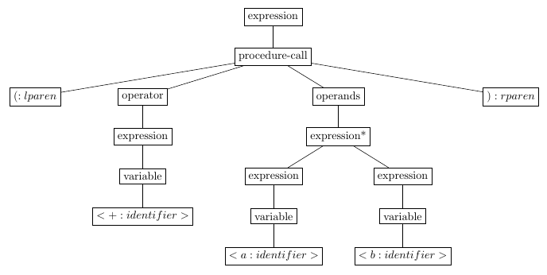
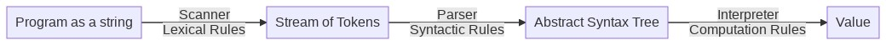
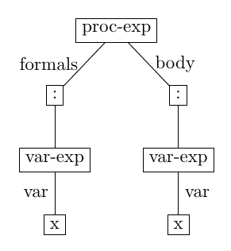
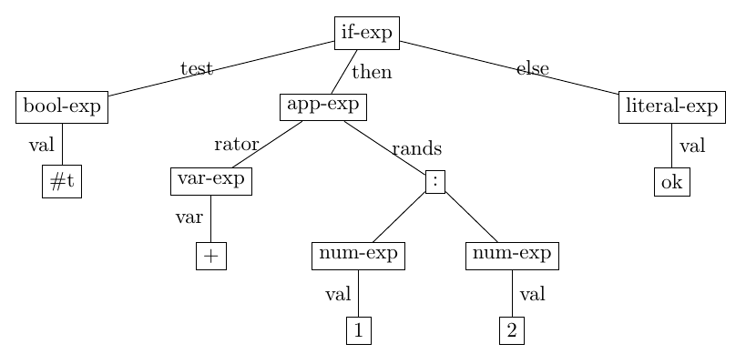

# Syntax
## PPL 2021

In the previous section, we introduced new programming languages by adopting the following method:
* Define the syntax of the language - which defines the set of all possible expressions in the language.
* Define the set of all possible values that can be computed by the language.
* Define the computation rules for each type of expression which map any expression to a value.

This method provides a complete operational semantics procedure for the language by applying the method of **structural induction**: by applying the computation rules over all possible expressions in the language recursively, we can map any expression to a value.  

To describe this process more formally, we must provide a more detailled account of the **syntax** of the language.
This is the topic of this Lecture.

## Syntax: Concrete vs. Abstract

The syntax of a language determines which sequences of tokens form an expression in the language (and which don't).
It also determines how to extract the significant parts of the expression, and what is their function within the larger expression.  

The syntax also has another objective: make it easy for humans to read and understand code and identify the structure
of expressions which form the program. (Recall the distinction between the lambda-application and the let-expression forms we used in the previous lecture -- the motivation for introducing `let` was to make the expression easier to read.)

Accordingly, we distinguish two aspects of the definition of the syntax of a programming language:
* **Concrete syntax**: this determines how expressions "look like" to the programmer.  It includes devices such as keywords to mark the type of the expression, delimiters and punctuation, parentheses, indentation.
* **Abstract syntax**: this is an internal data type representing expressions of the program in a way that is easy to consume by programs operating on expressions - such as interpreters or compilers.  Such data types are called **abstract syntax trees** (AST).

### Many Concrete Syntax Variants can be mapped to the same Abstract Syntax

In general, concrete syntax can be quite varied - according to stylistic preferences.
For example, most languages encode arithmetic operations in infix style as in:

```scheme
1 + 2*3
```

Scheme uses a prefix syntax as in:

```scheme
(+ 1 (* 2 3))
```

which more or less corresponds to the English way of expressing:

```
the sum of 1 and the product of 2 and 3.
```
(the words that denote the operations occur before the words that denote the arguments to the operations).

Similarly, there can be different concrete syntax ways to express the same construct.  In JavaScript, we saw that we can define functions in two ways:
* With the `function` keyword: `function (<params>) <body>;`
* With the fat-arrow construct: `(<params>) => <body>;`

In Scheme, we also saw that different concrete syntax forms are interpreted in the same way - for example:
* `(let ((a 1)) (f a))` is interpreted in the same way as `((lambda (a) (f a)) 1)`.
* `(if (f x) (+ x 1) x)` is interpreted in the same way as `(cond ((f x) (+ x 1)) (else x))`.


### Concrete Syntax can be Ambiguous

In order to interpret concrete syntax, an interpreter must be able to:
* Separate the sub-parts of an expression
* Determine what is the role of each sub-part within the expression

For example, in a JavaScript statement:

```typescript
if (x > 2)
  console.log("big");
else
  console.log("large");
```

the keyword `if` is used to mark the type of the conditional compound statement which has 3 components - the test (`(x>2)`), the consequent statement and the alternative statement.  The keyword `else` is used to separate the consequent from the alternative and to indicate the role that the alternative statement plays with respect to the if-statement of which it is a part.

Sometimes, the relation between embedded components and their parents is ambiguous. 
For example, in the following statement, the place of the `else` statement is ambiguous:


```typescript
{
  let x=3, y=5;
  if (x > 2)
    if (y < 4)
      console.log('mid');
  else
    console.log('large');
}
// --> large
```

We could interpret the syntactic structure in two ways:
* Either it is the `else` part matching the `(x > 2)` test
* Or it is the `else` part matching the `(y < 4)` test

Similarly, in the infix expression:

```typescript
1+3*5
```

The structure could be interpreted as either:
* 1+(3*5) (which reduces to 16)
* (1+3)*5 (which reduces to 20)

These forms of ambiguity are frequent in natural language as well - as in the example:
* *I saw a man on the hill with a telescope.*

which can be interpreted in multiple ways:
* *The man I saw was on the hill and I saw him through a telescope*
* *The man I saw was on the hill and he had a telescope with him*

In natural languages, we rely on the intelligence of the reader to resolve these ambiguities.

In programming languages, in contrast, such ambiguities must be resolved in a unique and deterministic manner - so that the same program is always interpreted in the same manner.  The concrete syntax, therefore, must also provide **precedence rules** to disambiguate such cases.

For example, in infix arithmetic notation, preference rules specify that the operations * and / have higher precedence over operations + and -.  

When multiple operations with the same preference occur, **associativity rules** determine how operations are grouped.
For example, `1 - 3 - 5` is intepreted as `(1-3)-5` (yielding -7) and not as `1 - (3 -5)` (which would yield 3) - because
the infix operator `-` is specified as left-associative.

Parentheses can also be used in most languages to explicitly override or indicate the desired syntactic structure of an expression - as in `1 - (3 - 5)`.

The Scheme concrete syntax does not require such precedence and associativity disambiguation rules, because it requires full parentheses to explicitly encode the structure of expressions.

### Parser

* Concrete syntax is intended to be read by humans
* Abstract syntax is intended to be consumed by programs (interpreter, compiler...).

It is the role of a **parser** to map the input **concrete syntax** (encoded as a string) into ASTs.

To specify how a parser works, we must specify both:
* The rules of the concrete syntax
* The structure of all possible ASTs the parser can construct

A good way to think about the role of the parser is that it is a `factory` to construct ASTs given linear string representations of programs.

## Specifying Concrete Syntax

Concrete syntax is defined as a formal language using grammatical rules.

Programming language specifications have mostly adopted mild variants of **context free languages** (CFG) to specify concrete syntax.  In the hierarchy of formal languages (see [Chomsky Hierarchy](https://en.wikipedia.org/wiki/Chomsky_hierarchy)),  CFGs are right above **regular language** and below Context Sensitive Languages (which are hard to parse).

In programming languages, language designers have adopted the Backus-Naur Form (BNF) notation to specify formally
the rules of concrete syntax.  
For example:
* [R4RS Scheme Grammar](https://www.cs.indiana.edu/scheme-repository/R4RS/r4rs_9.html#SEC76) presents the formal syntax of the R4RS Scheme programming language
* [ECMAScript Grammar](https://262.ecma-international.org/#sec-grammar-summary) presents the formal syntax of JavaScript 2020
* [Java Grammar](https://docs.oracle.com/javase/specs/jls/se15/html/jls-19.html) presents the formal syntax of Java 15.
* [Python Grammar](https://docs.python.org/3/reference/grammar.html) presents the formal syntax of Python.

We confirm in a brief overview the minimalistic approach of Scheme - the full language only needs about 10 keywords and 8 syntactic forms. In comparison, Python has 33 keywords and 110 syntactic forms, and Java has 50 keywords and 133 syntactic forms. 

### BNF Specification

BNF is a meta-syntax used to express context-free grammars: it is a formal way to describe formal languages.
BNF specifications include two types of rules:
* Lexical rules
* Syntactic rules

Lexical rules determine how to tokenize a stream of characters into a stream of significant tokens.
It indicates which delimiters can be skipped (for example, white spaces) and which delimiters indicate the end or
beginning of other tokens (for example, parentheses or punctuation).  Lexical rules also specify the types of tokens 
that can be distinguished - for example, numbers are sequences of digit characters, identifiers are sequences of 
alpha-numeric characters, left parenthesis, right parenthesis etc.

Syntactic rules determine how tokens are combined into significant hierarchical structures which form the expressions of the language.  Syntactic rules refer to the token categories defined by lexical rules.

Usually, lexical rules form a **regular language** - which are powerful enough to describe tokenization.
In contrast, **syntactic rules** form a **context free language** (sometimes BNFs are extended to support mildly more powerful languages than CFGs). 

Because lexical rules and syntactic rules are of different nature, they are processed by different software components:
* The **scanner** turns a stream of characters into a stream of tokens (each tagged by its category)
* The **parser** turns a stream of tokens into a parse tree where each token is a terminal, covered by non-terminal categories.

#### Scheme Lexical Rules

Consider the first few lexical rules in the Scheme specification [R4RS Scheme Grammar](https://www.cs.indiana.edu/scheme-repository/R4RS/r4rs_9.html#SEC76):

```typescript
<token> ==> <identifier> | <boolean> | <number> | <character> | <string> | ( | ) | ' | .
<delimiter> ==> <whitespace> | ( | ) | " | ;
<whitespace> ==> <space or newline>
<comment> ==> ; <all subsequent characters up to a line break>
<identifier> ==> <initial> <subsequent>*
<initial> ==> <letter>
<letter> ==> a | b | c | ... | z
<subsequent> ==> <initial> | <digit>
<digit> ==> 0 | 1 | 2 | 3 | 4 | 5 | 6 | 7 | 8 | 9
<string> ==> " <string element>* "
<string element> ==> <any character other than " or \> | \" | \\
<boolean> ==> #t | #f
```

In BNF notation, categories (non-terminals) are denoted as `<category>`.
Rules are specified as `<lhs> ==> rhs` -- where `lhs` is the left-hand side of the rule, `rhs` the right-hand side.

The LHS of rules is a single `<category>` (which means that the language defined by BNF is CFG or Regular and not Context Sensitive or Recursively Enumerable).

The RHS can be a sequence of terminals (for lexical rules, terminals are characters) or categories, or an alternation of such sequences, indicated by the "\|" special character.  In syntactic rules, terminals are usually marked with quotes around them.

Within the RHS sequences, categories can be followed by the special markers `*` to indicate repetition 0 or more times, `+` to indicate 1 or more times and `?` to indicate optional elements.

Observe in particular that the lexical rules above are **not recursive** (there is no category reachable from the RHS which is on the LHS).  Because lexical rules denote a regular language, we can use **regular expressions** to implement the scanner.

#### Scheme Syntactic Rules

Consider the top-level (slightly simplified) definition of Scheme expressions in the formal syntactic rules for Scheme:

```typescript
<expression> ==> <variable>
     | <procedure call>
     | <lambda expression>
     | <conditional>
     | <literal>
     
<variable> ==> <identifier>
```

These are the different types of syntactic forms that are defined in Scheme - this rule only contains a disjunction.
Each syntactic form is defined in turn:

##### Procedure Call

```typescript
<procedure call> ==> (<operator> <operand>*)
<operator> ==> <expression>
<operand> ==> <expression>
```

An example concrete string that corresponds to this specification of procedure call is:

```scheme
(+ a b)
```

It is *recognized* by first applying lexical rules to turn it into a sequence of tokens:

```scheme
<(:lparen> <+:identifier> <a:identifier> <b:identifier> <):rparen>
```

Each token is annotated by its category as recognized by the scanner.

The concrete parser then turns this stream of tokens into a concrete parse tree:

```scheme
(expression 
  (procedure-call
    (lparen)
    (operator (expression (variable <+:identifier>)))
    (operands ((expression (variable <a:identifier>))
               (expression (variable <b:identifier>))))
    (rparen)))
```

This representation corresponds to the instantiation of the `<expression> ==> <procedure call>` syntactic rule on a specific sequence of tokens. It is a **tree** - with the non-terminal category as its root, and derived categories as children.  There is one child for each element in the RHS of the rules.



The syntactic rule is **recursive** - the category `<expression>` can be derived into an
expression of type `<procedure call>` which in turn, contains in its derivation components of type `<expression>`.
This leads to the observation that the defined language is an infinite set of expressions.

##### Lambda Expression

Lambda expressions are defined by this syntactic rule:

```typescript
<lambda expression> ==> (lambda <formals> <body>)
<formals> ==> (<variable>*)
<body> ==> <sequence>
<sequence> ==> <command>* <expression>
<command> ==> <expression>
```

An example string recognized by this rule is:

```scheme
(lambda (x) x)
```

which is recognized as a lambda-expression through the following derivation parse tree:

```scheme
(lambda-expression
  (lparen)
  (lambda)
  (formals (lparen)
           ((variable <x:identifier>))
           (rparen))
  (body (sequence ((commands ())
                   (expression (variable <x:identifier>)))))
  (rparen))
```

This tree proves that the expression belongs to the `<lambda-expression>` category.
It can be read as a top-down derivation through the rules of the grammar:

```typescript
1. <lambda-expression> ==> (lambda <formals> <body>)
2. <formals> ==> (<variable>*)
3. <variable>* ==> <variable>
4. <variable> ==> <x:identifier>
5. <body> ==> <command>* <expression>
6. <command>* ==> <empty>
7. <expression> ==> <variable>
8. <variable> ==> <x:identifier>
```

##### Conditional Expressions

The concrete syntax of conditional expressions is specified by this rule:

```typescript
<conditional> ==> (if <test> <consequent> <alternate>)
<test> ==> <expression>
<consequent> ==> <expression>
<alternate> ==> <expression>
```

An example expression of this category is:

```scheme
(if (> x 0) x (- x))
```

##### Literal Expressions

Literal expressions are either self-evaluating expressions (boolean, number or string tokens) or quoted expressions:

```typescript
<literal> ==> <quotation> | <self-evaluating>
<self-evaluating> ==> <boolean> | <number> | <string>
<quotation> ==> '<datum> | (quote <datum>)
```

Datum (also called **s-exp** for Symbol-Expressions) plays in Scheme the same role as the JSON notation in JavaScript - it corresponds to the external notation for values that can be read by the `read` primitive procedure (equivalent to the JavaScript JSON.parse primitive) and manipulated as a value. 
Reversely, any value in Scheme can be turned into a well-formed `<datum>` string by using the `format` primitive (equivalent to `JSON.stringify` in JavaScript).

In particular, any string that parses as an `<expression>` will also parse as a `<datum>`.  

```typescript
<datum> ==> <simple datum> | <compound datum>
<simple datum> ==> <boolean> | <number> | <string> |  <symbol>
<symbol> ==> <identifier>
<compound datum> ==> <list>
<list> ==> (<datum>*) | (<datum>+ . <datum>)
```

Examples of literal expressions in Scheme are:

```scheme
1
'1  
#t
#f
"a string"
'symbol
'()
'(1)
'(a 1)
'(a . 1)
'(a b . 1)
```

It is a remarkable property of Scheme that the concrete syntax of the language can be recognized as a literal value.
It makes it possible with little effort to **manipulate programs as data**.  In other words, the concrete syntax of Scheme
is a subset of the S-Expressions.

This is not the case for JavaScript with the JSON notation - JavaScript programs are not JSON literal expressions and cannot be read by a primitive function in the language. For example, the expression `x => x` is a JavaScript expression, but it is not a valid JSON literal value.

## Abstract Syntax

The Abstract Syntax of a language is a way to encode expressions in a way that captures the relevant information in the expressions so that they can be processed by programs.  
The key perspective is that Abstract Syntax considers **programs as data** - so that they can be manipulated by other programs.

Abstract syntax removes details from the concrete syntax and presents the parsed expressions through an abstract interface that can be manipulated by an interpreter or a compiler.  The overall pipeline of modules we have defined at this point is summarized here:



The abstract syntax of a language captures the following two types of relations between expressions and other expressions:
* An expression can be of different types of expressions
* An expression is composed of sub-expressions, each fulfilling a specific role with respect to the parent expression.

For example, in the Scheme abstract syntax, an expression can be of the following types:
```typescript
<expression> ==> <variable>
     | <procedure call>
     | <lambda expression>
     | <conditional>
     | <literal>
```

We call this relation a **disjunction** between different types of expressions.

A specific expression type, such as a lambda-expression, contains sub-expressions:
```typescript
lambda-expression: 
    formals: List(var-expression) 
    body: List(expression)
```

We call this relation a **conjunction** between different sub-expressions.
When we specify a conjunction in abstract syntax, we abstract away the details of the concrete syntax - for example, the fact that the keyword 'lambda' is used to mark this type of expression and the place of parentheses to separate the components of the sub-expressions (formals and body) within the parent expression (the lambda-expression).

We do specify the type of the expected sub-expressions (for example, `formals` is a list of `var-expression` specifically) and their cardinality.

### Abstract Syntax as Disjoint Union Type

Abstract Syntax defines a data type which denotes a set of values: the values representing all legal expressions in the programming language.  

Abstract syntax defines alternative **kinds for expression categories**, and the **components of composite elements**. 
For each component, the abstract syntax defines:
* its **role** in the composite sentence, 
* its **category** and 
* its **cardinality** (how many instances of the component can appear in the parent expression).  
  Specifically, we distinguish single value components and List value components.

We apply the construct of **disjoint union types** (which we introduced in [Chapter 1.4](./1.3TypescriptTypeChecking.html)) 
to define formally the abstract syntax of a language.
The notation we adopt is the following (defined in the book "Essentials of Programming Languages"):

```typescript
<exp> ::= <define> | <cexp>            / def-exp | cexp
<define> ::= ( define <var> <cexp> )   / def-exp(var:varDecl, val:cexp)
<var> ::= <identifier>                 / varRef(var:string)
<binding> ::= ( <var> <cexp> )         / binding(var:varDecl, val:cexp)
<cexp> ::= <number>                    / num-exp(val:number)
  |  <boolean>                         / bool-exp(val:boolean)
  |  <string>                          / str-exp(val:string)
  |  <varRef>                          / varRef(var)
  |  ( lambda ( <varDecl>* ) <cexp>+ ) / proc-exp(params:List(varDecl), body:List(cexp))
  |  ( if <cexp> <cexp> <cexp> )       / if-exp(test: cexp, then: cexp, else: cexp)F
  |  ( let ( binding* ) <cexp>+ )      / let-exp(bindings:List(binding), body:List(cexp))
  |  ( <cexp> <cexp>* )                / app-exp(operator:cexp, operands:List(cexp))
  |  ( quote <sexp> )                  / literal-exp(val:sexp)
```

This definition combines in one notation the concrete syntax syntactic rules as BNF notation and for each rule,
the corresponding abstract syntax type.  

The abstract syntax type is a variant notation of what would be defined as disjoint types in TypeScript as follows:


```typescript
// Disjoint union types
type Exp = DefineExp | CExp;
type CExp = NumExp | BoolExp | StrExp | IfExp | PrimOp | VarRef | ProcExp | AppExp | LitExp | LetExp;

// Composite types
interface Program {tag: "Program"; exps: Exp[]; };
interface DefineExp {tag: "DefineExp"; var: VarDecl; val: CExp; };
interface NumExp {tag: "NumExp"; val: number; };
interface BoolExp {tag: "BoolExp"; val: boolean; };
interface StrExp {tag: "StrExp"; val: string; };
interface PrimOp {tag: "PrimOp"; op: string; };
interface VarRef {tag: "VarRef"; var: string; };
interface VarDecl {tag: "VarDecl"; var: string; };
interface AppExp {tag: "AppExp"; rator: CExp; rands: CExp[]; };
interface IfExp {tag: "IfExp"; test: CExp; then: CExp; alt: CExp; };
interface LitExp {tag: "LitExp"; val: SExp; };
interface LetExp {tag: "LetExp"; bindings: Bindings[]; body: CExp[]; }
interface ProcExp {tag: "ProcExp"; params: VarDecl[]; body: CExp[]; }
```

Given this definition of Abstract Syntax types, the role of the parser is to map concrete expressions (strings) to values of the appropriate type.  For example, the expression:

```scheme
(lambda (x) x)
```

corresponds to the abstract syntax tree:



This tree value is encoded as follows in a Scheme implementation of the AST data type:

```scheme
'(proc-exp ((var-exp x)) ((var-exp x)))
```

In a JSON type corresponding to the TypeScript type definitions above, it is encoded as the following value, in whch we distinguish here between the two roles of variables: variable declarations as VarDecl when they appear in the context of the procedure formal parameters) and variable references as VarRef:

```typescript
{ tag: 'ProcExp',
  params: [ { tag: 'VarDecl', var: 'x' } ],
  body: [ { tag: 'VarRef', var: 'x' } ] }
```

Similarly, the expression:

```scheme
(if #t (+ 1 2) 'ok) 
```

corresponds to the abstract syntax tree:



This tree can be encoded in a Scheme value as follows:

```scheme
'(if-exp (bool-exp #t) (app-exp (var-exp +) ((num-exp 1) (num-exp 2))) (literal-exp ok))
```

And in the following JSON value in TypeScript:

```typescript
{ tag: 'IfExp',
  test: { tag: 'BoolExp', val: true },
  then:
   { tag: 'AppExp',
     rator: { tag: 'PrimOp', op: '+' },
     rands: [ { tag: 'NumExp', val: 1 }, 
              { tag: 'NumExp', val: 2 } ] },
  alt: { tag: 'LitExp', val: ok } }
```

It should be clear that abstract syntax is **not** intended for human consumption.  ASTs are to be consumed by programs that manipulate expressions.

##### Parse Tree vs. AST

In the AST type definitions, disjoint union types (exp, cexp) play the role of **abstract types** (as was defined in Java) - that is, there are no values in the AST of this specific type.  There can only be values of composite types with components.

Compare the AST displayed above with the Parse Tree displayed when we discussed concrete syntax.
The Parse Tree includes trees for `<expression>` - the AST does not.  

These two trees play different functions:
* The AST is a concrete value that will be manipulated by the interpreter.
* The Parse Tree is a proof that a concrete expression belongs to the language.

ASTs are defined for all programming languages, they provide the first part of the formal specification of the language.
You can experiment with ASTs of existing languages in the [AST Explorer](https://astexplorer.net/) site which provides an interactive browser of ASTs for a wide range of programming languages (JavaScript, Scala, Go, SQL and many more).

### Implementing ASTs in TypeScript

Please refer to the code in our [Github](https://github.com/bguppl/interpreters) to review and execute the code of the implementation of ASTs and Parsers in TypeScript.
In this lecture, we will cover the code in the following aspects:
* __[L1/L1-ast.ts](https://github.com/bguppl/interpreters/blob/master/src/L1/L1-ast.ts)__ 
* __[shared/s-expression.d.ts](https://github.com/bguppl/interpreters/blob/master/src/shared/s-expression.d.ts)__
* __[shared/type-predicates.ts](https://github.com/bguppl/interpreters/blob/master/src/shared/type-predicates.ts)__
* __[shared/parser.ts](https://github.com/bguppl/interpreters/blob/master/src/shared/parser.ts)__ 
* __[shared/result.ts](https://github.com/bguppl/interpreters/blob/master/src/shared/result.ts)__


ASTs describe types which correspond directly to Disjoint Union Types.

We implement them in TypeScript in the following manner:

1. For every composite type `CT`, define:
   1. A type definition `interface CT { tag:"CT"; ... }` with a field for each constituent
   1. A value constructor named `makeCT`
   1. A type predicate named `isCT`
2. For every disjoint union type `DT` , define:
   2. A type definition `type DT = CT1 | CT2 | ...` 
   2. A type predicate named `isDT` 

The functions defined by this recipe provide a functional interface which encapsulates the data type definition.

For example, let us consider the following abstract syntax definition.
It specifies infix arithmetic formula, with no parentheses (not Scheme expressions):

```typescript
<E> ::= <number>    / num-exp(val:number)
     |  <E> + <E>   / add-exp(arg1:E, arg2:E)
     |  <E> * <E>   / mul-exp(arg1:E, arg2:E)
```

We derive one disjoint union type (E) and three composite types (num-exp, add-exp and mul-exp).

We define the following AST definition (similar to the more complete definition in __[L1/L1-ast.ts](https://github.com/bguppl/interpreters/blob/master/src/L1/L1-ast.ts)__):


```typescript
// Disjoint type E
type E = NumExp | AddExp | MulExp;
const isE = (x: any): x is E => isNumExp(x) || isAddExp(x) || isMulExp(x);

// For each constituent type define an interface, a constructor and a type predicate.
interface NumExp { tag: "NumExp"; val: number; };
const makeNumExp = (n: number): NumExp => ({ tag: "NumExp", val: n });
const isNumExp = (x: any): x is NumExp => x.tag === "NumExp";

interface AddExp { tag: "AddExp"; left: E; right: E };
const makeAddExp = (left: E, right: E): AddExp => ({ tag: "AddExp", left: left, right: right });
const isAddExp = (x: any): x is AddExp => x.tag === "AddExp";

interface MulExp { tag: "MulExp"; left: E; right: E };
const makeMulExp = (left: E, right: E): MulExp => ({ tag: "MulExp", left: left, right: right });
const isMulExp = (x: any): x is MulExp => x.tag === "MulExp";
```

### Parser as AST Factory

The parser plays the role of a **factory of ASTs** - given a stream of tokens, it returns an AST of the appropriate type.

In the case of working on Scheme, it is convenient to split the work of the parser in 2 stages:
* Stream of tokens to S-exp
* S-exp to AST

This strategy exploits the characteristic property of Scheme that all Scheme expressions are also S-expressions.
For other languages (such as JavaScript or Python), a similar strategy is also often employed.

In TypeScript, we rely on an existing package to parse S-expressions into nested lists of tokens.
This package is installed through npm:

```
> npm install s-expression --save
```

This package performs two functions:
* Scanning
* Token stream to S-exp conversion

The following example illustrates the structure of a parser.
* The type of a parser is [Sexp -> Exp]
* The structure of the parser follows the structure of SExp:
  * Atomic values that are acceptable as Exp
  * List values represent compound Exp
* For compound values, the parser recognizes each of the shapes of the various composite expressions in the grammar.
* At the end of all branches in the logic, appears a constructor for one of the expression types (make-xxx) according to the AST type definition. This is the main property of a parser as a factory function for ASTs.
* The parameters of the constructors are recursive calls to the parser.

### The S-exp Type

The S-expression parser we use from npm is written in JavaScript - it does not specify the type of the value it returns.

We analyzed the code, and inferred manually the precise type returned by this parser and added this type annotation, which we add as the "contract" that we expect from the library and which can be trusted by the TypeScript type checker.  This is achieved by adding a file with extension d.ts in our codebase __[shared/s-expression.d.ts](https://github.com/bguppl/interpreters/blob/master/src/shared/s-expression.d.ts)__:

```typescript
declare module 's-expression' {
    export type SexpString = String;
    export type Token = string | SexpString;
    export type CompoundSexp = Sexp[];
    export type Sexp = Token | CompoundSexp;

    /*
        The types returned by the parser are:
        string - for any token which is not a string,
                 according to the tokenization rules of S-expressions.
        SexpString - for tokens of the form "..."
        Sexp[] - for S-expressions that contain sub-expressions
                 (of the form "(<s-expr1> ... <s-exprn>)")
    */
    export default function parse(x: string): Sexp;
}
```

The S-expression parser interprets all atomic tokens according to Scheme's lexical rules.
In particular, it encodes tokens of type string, which are written as balanced double-quotes `"....."` in a specific TypeScript type called String (with capital-S, which is different from the usual string).  We call this token type a `SexpString` in our type definition.

The structure of the `Sexp` type is the usual disjunction between Atomic tokens and Compound expressions.
Atomic tokens form the base case of the inductive definition. 
Compound expressions are encoded as arrays of embedded expressions.

### Recognizing Token Types

Different types of tokens can be returned by the parser - as indicated by the Scheme lexical rule reviewed above:

```typescript
<token> ==> <identifier> | <boolean> | <number> | <character> | <string> | ( | ) | ' | .
```

The relevant types of tokens must be recognized by analyzing a `Token` value to decide the type of literal value the token represents (boolean, number or string).
We use the following TypeScript type predicates (using the TypeScript type predicate notation `x is <T>`).
These definitions are provided in __[shared/type-predicates.ts](https://github.com/bguppl/interpreters/blob/master/src/shared/type-predicates.ts)__:


```typescript
// ========================================================
// Parsing utilities to distinguish types of tokens
// ========================================================
// Type utilities
export const isArray = Array.isArray;
export const isString = (x: any): x is string => typeof x === "string";
export const isNumber = (x: any): x is number => typeof x === "number";
export const isBoolean = (x: any): x is boolean => typeof x === "boolean";
export const isError = (x: any): x is Error => x instanceof Error;

// A weird method to check that a string is a string encoding of a number
export const isNumericString = (x: string): boolean => JSON.stringify(+x) === x;

// A predicate for a valid identifier
// In Scheme, a valid identifier is a token that starts with an alphabetic letter (a-z or A-Z) followed by any number of letters or numbers.
// As discussed in the Section on Lexical Rules - we use Regular Expressions (regexp) to recognize these.
export type Identifier = string;
export const isIdentifier = (x: any): x is Identifier =>
    /[A-Za-z][A-Za-z0-9]*/i.test(x);
```

The code above corresponds to the TypeScript implementation (our meta-language) of the BNF Lexical Rules discussed above.
We use TypeScript primitives when they exist to distinguish among the various types of tokens (string, number).
For more delicate tests, we rely on Regular Expressions (regexp) - as exemplified in the `isIdentifier` predicate.
You can read more on the important topic of regexp in [Regular Expressions Page](https://developer.mozilla.org/en-US/docs/Web/JavaScript/Guide/Regular_Expressions).

Since we rely on the S-expression external library to parse S-Expressions into TypeScript values, we introduce TypeScript type definitions that reflect the exact types we expect,
in __[shared/parser.ts](https://github.com/bguppl/interpreters/blob/master/src/shared/parser.ts)__. 


```typescript
import p, { Sexp, SexpString, Token, CompoundSexp } from "s-expression";
import { makeFailure, makeOk, Result } from "./result";
import { isString, isArray, isError } from "./type-predicates";
import { allT } from "./list";

// s-expression returns strings quoted as "a" as [String: 'a'] objects
// to distinguish them from symbols - which are encoded as 'a'
// These are constructed using the new String("a") constructor
// and can be distinguished from regular strings based on the constructor.
export const isSexpString = (x: any): x is SexpString =>
    ! isString(x) && x.constructor && x.constructor.name === "String";

export const isSexp = (x: any): x is Sexp => isToken(x) || isCompoundSexp(x);
export const isToken = (x: any): x is Token => isString(x) || isSexpString(x);
export const isCompoundSexp = (x: any): x is CompoundSexp => isArray(x) && allT(isSexp, x);

export const parse = (x: string): Result<Sexp> => {
    const parsed = p(x);
    return isError(parsed) ? makeFailure(parsed.message) : makeOk(parsed);
}
```

The external s-expression parser library can fail when it faces an illegal combination of parentheses or ill-formed tokens.
In this case, it returns a value of type `Error`.  
In the rest of the course, we will use a functional approach to handle errors, based on the `Result<T>` monad.  
Therefore, we wrap the call to the library parser in a function that adapts the `Error` protocol into a `Result<Sexp>`:

```typescript
export const parse = (x: string): Result<Sexp> => {
    const parsed = p(x);
    return isError(parsed) ? makeFailure(parsed.message) : makeOk(parsed);
}
```

## Parsing into an AST

Given a stream of tokens, each one identified as a specific type of Token (number, identifier, boolean) according to the lexical rules of the grammar,
we now construct an AST.  The following code shows how to construct an AST according to the rules of the grammar for the E-expressions shown above:

```typescript
<E> ::= <number>    / num-exp(val:number)
     |  <E> + <E>   / add-exp(arg1:E, arg2:E)
     |  <E> * <E>   / mul-exp(arg1:E, arg2:E)
```

The full code is available in __[L1/E-parser.ts](https://github.com/bguppl/interpreters/blob/master/src/L1/E-parser.ts)__:


```typescript
// --------------------------------------------
// Toplevel function: parse a string into an E expression.
// Since parse can fail, return a Result<E>
// We split the parsing process in 2 stages:
// - Tokenization and embedding with the general S-expression parser.
// - Parsing according to the E-grammar implemented in this package.
// We adopt the Result<T> monad pattern to process errors.
// bind is used to compose functions that return Result<T> values.
// - First invoke parse(x)
// - If the result is a Failure, stop
// - Else we received an Ok<Sexp> value, pass the Sexp result to the next function (parseESexp)
// Once we get used to this notation, we can simplify this type of calls as follows:
// bind(parse(x), parseESexp);
// since the function (s: Sexp) => parseESexp(s); is just parseESexp.
export const parseE = (x: string): Result<E> =>
    bind(parse(x), (s: Sexp) => 
         parseESexp(s));

// ========================================================
// Parsing

const parseESexp = (sexp: Sexp): Result<E> =>
    isEmpty(sexp) ? makeFailure("Unexpected empty") :
    isString(sexp) ? parseEAtomic(sexp) :
    isArray(sexp) ? parseECompound(sexp) :
    // Quoted strings are not legal in the E-expression language
    makeFailure("Expected either a compound expression or a token, got a quoted string");

// Only numeric tokens are ok in this language
// We decided not to refer to "+" and other primitives as distinct atomic expressions.
// The decision is different in Scheme (and L1)
const parseEAtomic = (sexp: string): Result<E> =>
    isNumericString(sexp) ? makeOk(makeNumExp(+sexp)) :
    makeFailure("Bad token " + sexp);

// Compound expressions must be of the form (<exp> <op> <exp>) where op in (*, +)
// This procedure is recursive since the left and right sides can be embedded compound expressions.
const parseECompound = (sexps: Sexp[]): Result<E> =>
    (sexps.length !== 3) ? makeFailure("Wrong length") :
    isString(sexps[1]) ? bind(parseESexp(sexps[0]), (arg1: E) =>
                              bind(parseESexp(sexps[2]), (arg2: E) =>
                                   parseE3(sexps[1], arg1, arg2))) :
    makeFailure("Expected operator, got compound expression");

const parseE3 = (op: Sexp, arg1: E, arg2: E): Result<E> =>
    op === "+" ? makeOk(makeAddExp(arg1, arg2)) :
    op === "*" ? makeOk(makeMulExp(arg1, arg2)) :
    makeFailure("Bad operator " + op);
```

```typescript
console.log(parseE("1"));
-->
{ tag: 'Ok', value: { tag: 'NumExp', val: 1 } }

console.log(parseE("(1 + 2)"));
-->
parseE("(1 + 2)");

{ tag: 'Ok',
  value: { tag: 'AddExp',
           left: { tag: 'NumExp', val: 1 },
           right: { tag: 'NumExp', val: 2 } } }

console.log(parseE("(1 + (2 * 3))"));
-->
parseE("(1 + (2 * 3))")

{ tag: 'Ok',
  value: { tag: 'AddExp',
           left: { tag: 'NumExp', val: 1 },
           right: { tag: 'MulExp',
                    left: { tag: 'NumExp', val: 2 },
                    right: { tag: 'NumExp', val: 3 } } } }
```  

In this example, there is no handling for precedence rules or various associativity.  So that, we do not know how to parse an expression such as "1 + 2 * 3".  This would require explicit handling of a stack to resolve the ambiguous structure into an unambiguous fully parenthesized structure.

This is as much as needed for Scheme parsing - for other languages, more logic would be needed to implement such rules.
You will learn about more complex parsing implementation in the Compilation course.

### Recipe for Processing ASTs

This convention to implement the AST as a disjoint union types with `make`-constructors and `is`-type-predicates determines the **interface between the parser module and the interpreter**.

On the basis of this recipe, we define a recipe to write procedures that process ASTs relying on the disjoint-union type interface.

For example, let us write a function to compute the height of an AST for the simple arithmetic language introduced above.


```typescript
const max = (n1: number, n2: number): number =>
    (n1 > n2) ? n1 : n2;

// Compute the height of an E-AST
const Eheight = (e: E): number =>
    isNumExp(e) ? 0 :
    isAddExp(e) ? max(Eheight(e.left), Eheight(e.right)) + 1 :
    isMulExp(e) ? max(Eheight(e.left), Eheight(e.right)) + 1 :
    0;
```

This typical processor of AST has the following structure:
* The type is [AST -> something]
* The structure of the function is a conditional expression that covers all types of expressions according to the AST disjoint-type definition.
* For each branch in the conditional, the code breaks the AST into its components using the AST accessors for the specific type of the branch. (For example, in the branch for `isAddExp`, we have accessors for `AddExp.left` and `AddExp.right`.)
* Usually, the function is called recursively on each of the components of compound AST values.

The type system of TypeScript infers that the parameter `e` is of type `AddExp` in the clause that follows the `isAddExp` guard, and similarly for `isMulExp` - so that we obtain type-safe code in TypeScript when using this idiom.

## Scheme Abstract Syntax

In the rest of the review of the interpreter we will adopt this syntax for Scheme:

```typescript
;; <program> ::= <exp>+                     / program(exps:List(exp))
;; <exp> ::= <define> | <cexp>              / def-exp | cexp
;; <define> ::= ( define <varDecl> <cexp> ) / def-exp(var:varDecl, val:cexp)
;; <binding> ::= ( <varDecl> <cexp> )       / binding(var:varDecl, val:cexp)
;; <cexp> ::= <number>                      / num-exp(val:number)
;;    |  <boolean>                     / bool-exp(val:boolean)
;;    |  <string>                      / str-exp(val:string)
;;    |  <varRef>                      / varRef(var:string)
;;    |  ( lambda ( <var>* ) <cexp>+ ) / proc-exp(params:List(varDecl), body:List(cexp))
;;    |  ( if <cexp> <cexp> <cexp> )   / if-exp(test: cexp, then: cexp, else: cexp)
;;    |  ( let ( binding* ) <cexp>+ )  / let-exp(bindings:List(binding), body:List(cexp))
;;    |  ( <cexp> <cexp>* )            / app-exp(operator:cexp, operands:List(cexp))
;;    |  ( quote <sexp> )              / literal-exp(val:sexp)
```

The `define` category is defined in a way that define expressions cannot be embedded inside other expressions.
`cexp` correspond to expressions that can be embedded into each other recursively. (C-exp stands for Constituent expressions - that is, expressions which can occur as components of a larger expression.)

## Summary

* The syntax of a language:
  * determines which sequences of tokens form an expression in the language. 
  * determines how to extract the significant parts of an expression, and what is their function within the parent expression.
  * is designed make it easy for humans to read and understand code
* **Concrete syntax** determines how expressions "look like" to the programmer using:
  * keywords to mark the type of the expression, 
  * delimiters and punctuation, parentheses, indentation.
* **Abstract syntax** is an internal data type  called abstract syntax trees (AST) and representing expressions of the program in a way that is easy to consume by programs.
* Many Concrete Syntax Variants can be mapped to the same Abstract Syntax - for example, `cond` and `if` can be mapped to the same abstract syntax.
* Concrete syntax can be ambiguous.  When this is the case, additional rules (precedence, associativity) must be specified to provide a deterministic way to analyze expressions.

* Syntax is specified using **BNF rules**.  
  * **Lexical rules** specify how the character stream is split into tokens of different types (numbers, identifiers, etc).
  * **Syntactic rules** specify how compound expressions are formed from tokens and sub-expressions.
* A **parser** maps concrete syntax (a stream of characters) to abstract syntax (AST values).
  The overall parsing process is split into different sub-modules:
  * A **scanner** implements the lexical rules and outputs a stream of tokens - using regular expressions.
  * A **reader** parses the stream of tokens into a stream of nested S-expressions (S-exp).
  * A **parser** maps S-exps into ASTs.

* ASTs are implemented using the pattern of **disjoint union types**.
  * Each compound expression form is represented by a map-like type which has a distinct tag and a field for each sub-expression.
  * Unions of compound types correspond to the abstract types such as "expression".
  * Such disjoint union types are implemented in TypeScript using a recipe which defines a functional interface for each type:
    * Union types are implemented using a type predicate function `isExp`
    * Compound types are implemented by:
      1. a value constructor `makeC`
      2. a type predicate `isC`
      3. an interface type definition with a field for each sub-expression `c.subexp`
  * The parser is implemented as a factory function to build AST values.

* Functions operating over ASTs operate according to the recipe of **structural induction**:
  They have a structure that reflects the type structure:
  * A conditional for each type of expression (disjunction).
  * In each branch, the sub-expressions are extracted from the expression using the appropriate accessors and processed recursively.
