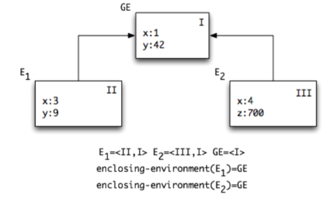
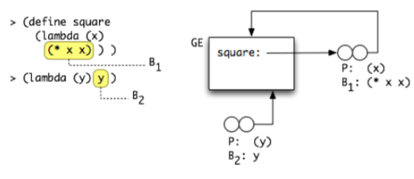
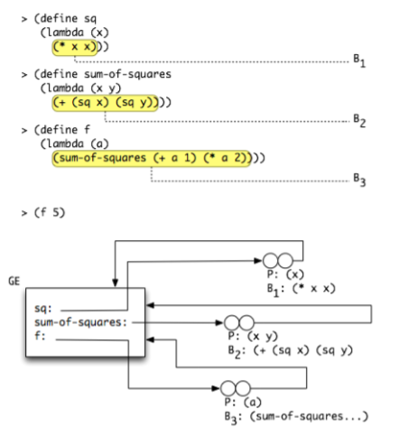
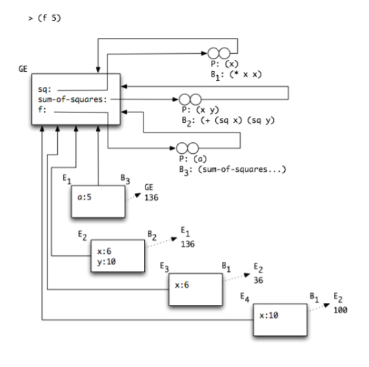

# Environment Model of Operational Semantics
## PPL 2021

In the substitution model we just presented [2.6 Substitution Model](./class_material/2.6SubstitutionModel.html) procedure application involves the following operations:
1. Argument evaluation
2. Renaming
3. Substitution
4. Reduction

The substitution operation applies the pairing of procedure parameters with the corresponding arguments. 
Renaming is an annoying by-product of substitution - and it cannot be "compiled away" easily in this model - we need to
rename the body of the closure each time it is applied (convince yourself of this by finding an example that requires repeated renaming).

The main problem of this approach is that substitution requires repeated analysis of procedure bodies. 
In every application, the entire procedure body is repeatedly renamed, substituted and reduced.  These operations on ASTs 
actually **copy** the structure of the whole AST - leading to extensive memory allocation / garbage collection when dealing
with large programs.  In fact, the substitution interpreter we reviewed is so slow that it is barely usable.

We introduce a new operational semantics model which aims at optimizing the substitution model into an efficient procedure execution algorithm: the **environment based operational semantics model** replaces substitution and renaming by a data structure – the environment – which is associated with every procedure application, is created when a closure is created and accessed when a closure is applied.  We call the procedure that maps expressions to values according to this model `env-eval`.

This model is introduced to be an optimization of the applicative-eval model, but it does **not change the operational semantics** of the language:`env-eval` returns the same values on the same programs as `applicative-eval` and enters into loops on the same programs, and throws exceptions on the same programs.  It does all of this much faster than `applicative-eval`.

The distinction between substitution and environment models is orthogonal to the distinction between applicative and normal evaluation strategies.  We can combine these 2 options independently of each other and obtain 4 distinct evaluation algorithms, which implement two distinct operational semantics (applicative vs. normal).

As we have introduced when presenting the 
[$$L1$$ substitution model](./class_material/2.5OperationalSemantics.html), an environment is a finite mapping from variables (the parameters) to values (the argument values). In the substitution model, we used only a single environment - the global environment.  
In the **environment-based model**, we will manipulate **multiple related environments**.

Consider what the steps performed as part of the `apply-procedure` step of the substitution applicative-order model when we apply a closure to a list of arguments:
* We computed the values of the arguments
* We renamed bound variables in the body
* We replaced all free occurrences of type `VarRef` of the parameters of the body with the computed values.

The objective of this manipulation was to pre-process `VarRef` expressions in the body of the procedure - so that, when we reduce the body (evaluate the body after the substitution step), we do not reach variables such as `x`, but instead find the value to which `x` was bound at the time of the closure application.

The environment-based model turns this process around by making the `VarRef` substitution a **lazy operation**: instead of replacing `VarRef`s before reduction, we start reduction with a substitution object on the side, and if and when we reach a `VarRef`, then we resolve it with the substitution - instead of using the global environment. It turns out that we can use exactly the same environment data structure to keep track of the required lazy substitution as we used to maintain the 
global environment when dealing with $$L1$$.

## Elements of the Environment Model 

The elements of the environment model include:

1. Data structures
    * The environment data structure is organized as a linked list of **frames** - each frame maps variables to values.
      The links in the list of frames correspond to nested invocations of closures.
    * The **closure** data structure is modified to carry an environment.
      The environment associated to the closure remembers the set of variables that were accessible when the closure was created.
  
2. Evaluation rules
    * Expressions are evaluated with respect to an environment. 
      The environment plays the role of a context for the evaluation - 
      so that, the same expression evaluated in different contexts will yield different values.  
      For example, `(* x x)` evaluated in the context of an environment `{x=2}` results in 4, in an environment `{x=3}`, 9.
    * The evaluation rule for procedure application is modified, so to replace substitution (and renaming) by environment creation.

## The Environment Data Structure

### Environment Terminology
1. An environment is a finite sequence of **frames**: `<f1; f2; ... ; fn>`.
2. A frame represents a substitution of variables by values. A variable-value pair in a frame is called a **binding**.
3. Environments can overlap. An environment `<f1; f2; ... ; fn>` includes n embedded environments: `<f1; f2; ... ; fn>`; 
`<f2; ... ; fn>`; ... ; `<fn>`;.
4. The empty sequence of frames is called the **empty environment**.
5. The environment `<fi+1; fi+2; ... ; fn>` is the **enclosing environment** of the frame `fi` in `<f1; f2; ... ; fn>`, and `fi` extends the environment `<fi+1; fi+2; ... ; fn>`.
6. Another form of environment overlapping is **tail sharing**, i.e., environments that share ancestors environment, as in 
`<k; f1; f2; ... ; fn>` and `<l; f1; f2; ... ; fn>`.

### Variable Value Definitions (Apply-env Operation)
1. The value of a variable `x` in a frame `f` is given by `f(x)` (an operation we call `apply-frame(f,x)`).
2. The value of a variable `x` in an environment `E` is the value of `x` in the first frame of `E` in which it is defined. 
If `x` is not defined in any frame of `E`, it is unbound in `E`.
3. Calculating the value of a variable `x` in an environment E is the operation **apply-env(E, x)** - this is a recursive operation across the linked list of frames in the environment.

The interface of the Frame and Environment data types thus includes:

1. Value constructors
    * Frame: `make-frame(vars,vals)` - we will denote frames as `{var=val, ...}`
    * Environment: `make-empty-env()`, `extend-env(env, frame)`
2. Accessors
    * `apply-frame(frame, var)` - which we will denote `frame(var)`
    * `apply-env(env, var)` - which we will denote `env(var)`
    * `env->frame(env)` and `env->enclosing-env(env)`


## Direct Evaluation of Let-expressions

Let us consider an evaluation rule for the direct computation of a let-expression:

```
<let-exp> ::= (let (<binding>*) <cexp>+) // let-exp(bindings:List(Binding), body:List(Cexp))
<binding> ::= (<var> <cexp>) // binding(var:Var-decl, val:Cexp)
```

For example:

```
(let ((x 1) (y 2)) (+ x y))
```

We saw earlier ([rewrite.ts](https://github.com/bguppl/interpreters/blob/master/src/L3/rewrite.ts)) that let-exp can be considered syntactic sugar (or syntactic abbreviation) for procedure application - and hence a syntactic rewrite operation leads us to a form that we know how to evaluate using closure creation and closure application.

We now introduce a direct evaluation rule for let-expressions to illustrate the use of environments.
The two evaluation rules are semantically equivalent - that is, they will always produce exactly the same results.

How do we evaluate the let-expression using environments instead of substitution?

What we want to achieve, is to evaluate the body of the let-expression in a context such that when we ask to compute the VarRef x and y, we obtain the corresponding values (1 and 2).

In order to achieve this goal, we construct a new environment with a frame in which x and y are bound to 1 and 2, and then evaluate the body in this environment: compute(`(+ a b)`, env({a=1, b=2})).

But this is not sufficient. Consider the following program:

```
(let ((a 1))
    (let ((b (+ a a)))
        (+ a b)))
```

There are 2 let-expressions embedded in each other.  By the rule we just presented, we will evaluate the inner-let expression in an environment in which a is bound to 1 - let us denote it env({a=1}).

We first compute the new environment for the inner-let - by computing the expression `(+ a a)` in env({a=1}) - yielding 2.
We then evaluate the inner-let body `(+ a b)` in a new environment env({b=2}).

We realize that it is not sufficient to evaluate the body in an environment that binds the let variables - we also need to **inherit the bindings from the current environment**.  So that the inner-let needs to be evaluated in an environment:

```
eval-env((+ a b), <{b=2};{a=1}>)
```

We generalize from this observation the evaluation rule for let-expressions which crucially relies on **nested-environments**:

### Let Evaluation Rule
```
If exp = let-exp(bindings, body):
  env-eval(exp, env) is computed by:
      let vars = variables in bindings
          vals = value expressions in bindings
          let cvals = eval(val, env) for val in vals
              return eval-sequence(body, 
                                   extend-env(env, make-frame(vars, cvals)))
```

There are two key points to note in this evaluation rule:
* The values of each var in the let declaration are evaluated in the current environment. Thus, they are outside the scope of the new variable declarations - and the variables defined in the let cannot be used in the right-hand side of the bindings.
* The body of the let expression is evaluated in a new environment that has a new frame which represents the new variable declarations bound to their computed values.

## From Let to Closure

Let us recall that a let-expression is semantically equivalent to the construction of a procedure and its application:

```
(let ((a 1) (b 2)) <body>) ~ 
((lambda (a b) <body>)
 1 2)
```

By the same reasoning as for let-expressions, let us try to derive the evaluation rule in env-eval of a procedure application as follows:

### Application Evaluation Rule (Attempt 1)

```
If exp=app-exp(rator, rands):
   env-eval(exp, env) is computed by:
       let proc = env-eval(rator, env)
           args = eval(rand, env) fro rand in rands
           if proc is a closure:
             let params = closure.params(proc)
               body = closure.body(proc)
               return eval-sequence(body,
                                    extend-env(env, make-frame(params, args))) ### !! See below  !!
           else
             return apply-primitive(proc, args)
```

If we try to apply this rule to the following program - all seems to be ok:

```
env-eval[ ((lambda (a b) (+ a b)) 1 2), <> ]
==> env-eval[ (+ a b) , <{a=1, b=2}> ]
==> 3
```

But consider now what happens if we evaluate the following program:

```
(let ((x 1))                       ;; E1
  (let ((p (lambda (y) (+ x y))))  ;; E2
    (let ((x 2))                   ;; E3
      (p x))))
```

The computation of p returns a closure `(closure (y) (+ x y))`.
We then enter the body of the third inner-let and compute `(p x)` in the following environment:

```
E1 = extend-env(empty-env, {x=1}) = <{x=1}>
E2 = extend-env(E1, {p = (closure (y) (+ x y))}) = <{p=(closure..)};{x=1}>
E3 = extend-env(E2, {x = 2}) = <{x=2>;<p=(closure...);{x=1}>
```

In this environment, we compute `(p x)` - which means we apply the application rule we tried to define above and obtain:

```
let proc = (closure (y) (+ x y))
    args = (2)
    let params = (y)
        body = ((+ x y))
        return env-eval-sequence(body, extend-env(E3, {y=2})
```

Eventually, we evaluate `(+ x y)` in an environment E4 = <{y = 2} ; {x = 2} ; { p = ...} ; {x = 1}>

The key observation, is that the inner frame binding x to 2 hides the outer frame binding x to 1.
The result of this reduction is thus 4.

This is **wrong**: this program yields 3 in Scheme and in the applicative-eval substitution model.

### Fixing the Application Evaluation Rule: Enforcing Lexical Scoping

The root of the problem is that the closure that we computed in step 2 must **remember** the bindings of the variables that occur free in its body - not only the bindings of its parameters.

If we look at the procedure p - `(lambda (y) (+ x y))` - it has one **explicit** parameter, y, but it also has an **implicit dependency on the free variable x**.  

Scheme (and most sane programming languages) resolve these implicit dependencies by using the rules of **lexical scoping** which we reviewed in 
[Syntactic Properties of Expressions](./class_material/2.4SyntacticOperations.html) when we defined lexical addressing.

The rule we wrote above does not respect these rules - because it leaves the free variables in the body of the closure free until the moment of the closure application.  This leads to the wrong effect of **variable capture** that we have observed above - where x was captured by the inner let in E3.

To fix this problem, we must **add memory to the closure** data structure: in addition to the list of parameters (which will be bound when the closure is applied to its arguments), we must also remember the **binding of the free variables in the context in which the closure was created**.  In the example above, the closure must remember the binding of x in the context of E1.

**NOTE**: This behavior is what justifies the name of the *closure* - it *closes bindings* inside its memory.

When we evaluate a closure application, we must then use the environment which the closure remembers - **instead of the current environment**.

To fix the evaluation rule, we must therefore:

* Update the definition of the `closure` data structure to include: params, body *and* environment at closure creation time.
* Change the closure application rule to use the closure env as a basis for the extend-env instead of the current env.

**NOTE**: Why didn't we see this problem when we specified the evaluation rule for let-expressions?


### Correct Evaluation Rule for Applications

The closure data-structure is updated to include a new `env` field:
```
<closure> ::= closure(params:List(Var-decl), body:List(CExp), env:Env)
```

The closure.env field is initialized when the closure is **created** - that is, when a proc-exp expression is evaluated:

```
If exp=proc-exp(params, body):
   env-eval(exp, env) is computed by:
       return make-closure(params, body, env)
```

The closure.env field remembers the environment with the bindings for all the variables that may occur free in its body beyond its parameters.  This field is eventually used when the closure is applied:

```
If exp=app-exp(rator, rands):
   env-eval(exp, env) is computed by:
       let proc = env-eval(rator, env)
           args = eval(rand, env) for rand in rands
           if proc is a closure:
             let params = closure.params(proc)
                 body = closure.body(proc)
                 closure-env = closure.env(proc)
               ;; Extend the **closure-env** and **not** the current env
               return eval-sequence(body,
                                    extend-env(closure-env, make-frame(params, args))) 
           else
             return apply-primitive(proc, args)
```

When we apply this new and corrected evaluation rule to the case above, we now obtain the expected result:

```
env-eval [ (let ((x 1))                       ;; E1
             (let ((p (lambda (y) (+ x y))))  ;; E2
               (let ((x 2))                   ;; E3
                  (p x)))), 
           empty-env() ] ==>
           
  env-eval [ (let ((p (lambda (y) (+ x y))))  ;; E2
               (let ((x 2))                   ;; E3
                  (p x))), 
             ext-env({}, {x=1}) ]  ==>
           
    env-eval [ (let ((x 2)) ;; E3
                  (p x)),
               ext-env({}; {x=1}; {p = (closure (y) (+ x y) {};{x=1}) ] ==>   ;; #1: Store env
             
      env-eval[ (p x),
                ext-env({};{x=1};{p=(closure(y)(+ x y) {};{x=1});{x=2} ] ==>
                
        env-eval[ (+ x y),                                                    ;; #2: Use stored env
                  ext-env( {};{x=1};{y=2} ) ] ==> 3
```

As expected, `env-eval` returns the same value as the substitution model (and as Scheme). 

## Env-Eval Interpreter

The env-eval model is implemented in the following code [L4](https://github.com/bguppl/interpreters/tree/master/src/L4):
* AST for L4 with let and letrec expressions: [L4-ast.ts](https://github.com/bguppl/interpreters/blob/master/src/L4/L4-ast.ts)
* Immutable environment data type - empty-env, extend-env: [L4-env.ts](https://github.com/bguppl/interpreters/blob/master/src/L4/L4-env.ts)
* Values datatype for L4 with Closures that include a reference to environment: [L4-value.ts](https://github.com/bguppl/interpreters/blob/master/src/L4/L4-value.ts)
* Environment-based interpreter: [L4-eval.ts](https://github.com/bguppl/interpreters/blob/master/src/L4/L4-eval.ts)
* Tests: [L4-eval.tests.ts](https://github.com/bguppl/interpreters/blob/master/test/L4/L4-eval.test.ts)

The interpreter is **identical** to that of the substitution model for L3 we reviewed previously except for the following places:
* Support for direct evaluation of let-exp expressions with extend-env.
* An expanded version of the closure data structure with the env field.
* The evaluation rule for proc-exp which stores the current env in the created closure.
* The procedure apply-proc.

## Visual Notation for the Environment Model

To properly understand the process of expression evaluation using the environment model, we develop a visual notation to trace the development of environments and their relation.  As a program evaluation proceeds, multiple environments are created, with various relations between them:

* When a closure is created, the closure refers to the environment in which it was created.
* When a closure is applied, a new environment is created which extends the closure environment.
  The new closure also refers to the current environment (in which the application is evaluated) - this reference is called 
  the **return control** relation.
* When a let-expression is evaluated, a new environment is created which extends the current environment.

A frame is represented as a box containing bindings - denoted var:val.

An environment is represented as a frame which links to its enclosing environment as a chain of frame boxes.




The environment diagrams display all the environments constructed over the process of an expression evaluation using env-eval.
Each environment is identified by a unique name and a serial number in the order of environment construction.
By convention, we use the names E1, E2, ..., where the environment named Ei is the i-th in the construction order. 
The global environment is named GE.

Each environment is associated with a lexical block in the evaluated code, and its code.

Each environment has a return control link and a return value. 
The return control link points to the environment where computation continues, once the evaluation of the code of the environment is over. The return value is the value of the evaluation of the code of the environment.

### Scoping and Control

* The tree structured lexical scopes of the program are reflected in the tree structure of frames in an environment diagram. 
* The sequential computation is reflected in the linear order of frames.

Therefore, the environment links (from environment to enclosing environment) – create a tree structure, while the return control links create a linear order.

### Visual Representation of Closures

The visual notation for a closure includes is a double circle - the left circle is annotated with the params and body of the closure; the right circle is an arrow which points to the environment in which the closure was created.



When the diagram refers to source code, we identify the lexical blocks in the source code with identifiers such as B1, B2.

Consider the source code:

```
(define sq (lambda (x) (* x x)))
(define sum-of-square (lambda (x y) (+ (sq x) (sq y))))
(define f (lambda (a) (sum-of-squares (+ a 1) (* a 2))))
```

The corresponding environment diagram showing the 3 created closures (sq, sum-of-squares and f) is:



When we evaluate the program `(f 5)` - the resulting environment diagram is:




**NOTES**:
1. The environments E1, E2, E3 and E4 are created each time a closure is applied.
2. The block of code associated to each environment is written as B3, B2, B1 (for example, E1 results from the application of the closure `f` - whose body is B3.
3. These environments extend the environment in which the applied closure was created - in this case, all 4 environments refer to the Global Environment GE.
4. The return control arrow indicates for each environment to which environment it returns once its body computation completes, and which value the body reduction returns.

Learn to draw such environments from code and to retrieve code from an environment.

### Historical Note: Dynamic Scoping

The distinction we made above between using the *current environment* or the *closure environment* when applying a procedure was clarified only in the late 1970s (between 1975 and 1980).  The confusion was caused by the fact that in most programming languages there was no first class functions, and only the restricted form of let-expressions known as local variables. As we have noted above, in the case of let-expression, the closure-env and the current-env happen to be the same.

The first interpreters of the Lisp-family languages used a scoping policy called **dynamic scoping** which consists of using the current env instead of the closure env when applying a closure.  This is in contrast to the **lexical scoping** discipline we just described.

In general, using dynamic scoping is not a good idea - as it makes it creates unexpected dependencies between unrelated variables and functions which only appear at runtime.

## Using Closures

The environment model refined our understanding of closures.  
Closures capture a reference to bindings in the environment in which they are created.

We will now explore programming techniques which exploit this property of features.

### Frames Lifecycle in the presence of closures

Consider the case in which we construct a closure in the scope of a variable, and then exit this scope.

```
(let ((a 1))            ;; E1
  (lambda (x) (+ x a)))
```

When we exit the scope of the let-expression, the environment E1 is usually discarded.
This is what happens in the usual stack-management of frames as was discussed in SPL: 
when the process enters a block which defines local variables, we allocate a frame on the stack.  
When the process exits the block, the frame is discarded (popped from the stack).

When a closure is created within this scope though, the frame may need to be kept accessible for a longer period.
Consider this configuration:

```
(let ((f (let ((a 1))               ;; E1: <{a=1}>
            (lambda (x) (+ x a))))) 
    (f 10))                         ;; E2: <{f=(closure (x) (+x a) E1)}>
```

The body of the closure f is evaluated in the environment <{x=10};{a=1}> - even though the environment E1 has already been exited and is not accessible anymore.  To wit, if we were to compute:

```
(let ((f (let ((a 1))               ;; E1: <{a=1}>
            (lambda (x) (+ x a))))) 
    a)                         ;; E2: <{f=(closure (x) (+x a) E1)}>
```

we would obtain a variable undefined error - because a is not accessible anymore in the environment E2.

Following this analysis, we conclude that the lifecycle of frames in the presence of closures must take into account the references that closures keep to frames.

### Closure Factories

The following program pattern exploits the environment memory in closures to create *objects* with their private environment.

In general - we will understand the evaluation of a lambda-expression (a procedure) as the construction of a closure.

We can thus write "closure maker" functions which, given parameters, construct a closure which remembers these parameters.
For example:

```
(define make-adder
  (lambda (a)           ;; Parameters to the closure maker
    (lambda (x)         ;; Construction of the closure
      (+ a x))))        ;; Body of the closure - refers to the private environment of the closure
      
(define a3 (make-adder 3)) ;; This adder has a private state a=3
(define a5 (make-adder 5)) ;; a5 has a private state a=5

(a3 2) => 5
(a5 2) => 7
((make-adder 1) 2) => 3
```

We constructed various instances of the general adder function - each with its own private state.
The returned object is a closure, which is a procedure and that we use as a regular function.

### Using Closures to Implement Compound Data Structures

We can then exploit this pattern to represent compound data structures in a purely functional manner - without requiring 
primitives to construct compound data structures such as pairs or lists or maps.

Here is a closure-based implementation of the pair data structure:

```
;; Purpose: closure-based pair value constructor
;; Signature: make-pair(a,b)
;; Type: [T1 * T2 -> Closure-Pair(T1,T2)]
(define make-pair
  (lambda (a b)                        ;; Parameters of the pair constructor
    (lambda (msg)                      ;; Interface of the pair object
      (cond ((eq? msg 'car) a)         ;; Dispatch method for the pair object
            ((eq? msg 'cdr) b)))))

(let ((p1 (make-pair 1 2))
      (p2 (make-pair 3 4)))
   (+ (p1 'car) (p2 'cdr)))
=> 5
```

We consider a pair as the aggregation of two values a and b of types T1 and T2.
We construct a closures which remembers the two provided values in a private environment with bindings for variables a and b.

We must next think of a way to provide access to these values according to the functional interface of the Pair data type.
We achieve this by writing the body of the closure as a **message-dispatch** pattern: the closure receives as an argument the name of the operation we want to achieve on the pair data structure, and the message dispatch logic computes the operation in the context in which a and b are accessible.

In the case of the Pair datatype, the functional interface we want to expose is `car` to access the `a` member and `cdr` to access the `b` member.  We thus implement a message dispatch which knows to receive the `messages` `car` and `cdr` and routes them to the right branch in the cond which executes the right code (retrieve the value of `a` or `b`).

Assume now we want to extend the functional interface of this compound data type with a method `sum` to compute `a+b`.
The direct approach consists of extending the dispatch method:

```
;; Purpose: closure-based pair value constructor with add support
;; Signature: make-adder-pair(a,b)
;; Type: [Number * Number -> Adder-Pair]
(define make-adder-pair
  (lambda (a b)                        ;; Parameters of the pair constructor
    (lambda (msg)                      ;; Interface of the pair object
      (cond ((eq? msg 'car) a)         ;; Dispatch method for the adder-pair object
            ((eq? msg 'cdr) b)
            ((eq? msg 'add) (+ a b))
            ))))

(let ((p1 (make-adder-pair 1 2))
      (p2 (make-adder-pair 3 4)))
   (+ (p1 'add) (p2 'add)))
=> 10
```

How would we handle the case of a method in the data structures which requires a parameter?

There are different ways to support this case - we present here one technique which exploits closures again:

For example, let us extend the adder-pair interface with a method `scale` which takes a parameter `k` and returns a new pair `[k*a, k*b]`.

```
;; Purpose: closure-based pair value constructor with scale
;; Signature: make-scale-pair(a,b)
;; Type: [Number * Number -> Scale-Pair]
(define make-scale-pair
  (lambda (a b)                        ;; Parameters of the pair constructor
    (lambda (msg)                      ;; Interface of the pair object
      (cond ((eq? msg 'car) a)         ;; Dispatch method for the adder-pair object
            ((eq? msg 'cdr) b)
            ((eq? msg 'scale)          ;; Method with a parameter k
             (lambda (k) (make-scale-pair (* k a) (* k b))))
            ))))

(let ((p1 (make-scale-pair 1 2)))
   (let ((kp1 ((p1 'scale) 3)))         ;; Observe how the parameter k is passed to the method scale
     (kp1 'cdr))) 
=> 
6
```

To receive a parameter to the method, we actually construct a method closure from within the pair dispatcher.
Because this closure is constructed in a closure which is activated in the environment in which a and b are accessible,
the returned closure also has access to the private a and b state binding of the object.  The client code can then
use this returned closure and pass it the required parameter k.

### Functional Selectors for Closure-based Compound Data Structures

Instead of adding a new branch in the message-dispatch cond of the closure body, we can generalize the access pattern to the
fields of a closure-based compound data structure by accepting a functional parameter.

Consider this alternative implementation of the closure-based pair data structure:

```
;; Purpose: value constructor for pair-sel data structure
;; Signature: make-pair-sel(a,b)
;; Type: [T1 * T2 -> Pair-Sel(T1,T2)
(define make-pair-sel
  (lambda (a b)         ;; parameters to the constructor
    (lambda (sel)       ;; closure constructor
      (sel a b))))      ;; body of the closure - general selector application

;; Purpose: access the first element in a pair-sel
;; Signature: pair-first(pair-sel)
;; Type: [Pair-sel(T1, T2) -> T1]
(define pair-first
  (lambda (pair)
    (pair (lambda (a b) a))))   ;; Pass the a selector
    
;; Purpose: access the second element in a pair-sel
;; Signature: pair-second(pair-sel)
;; Type: [Pair-sel(T1, T2) -> T2]
(define pair-second
  (lambda (pair)
    (pair (lambda (a b) b))))
    
(let ((p1 (make-pair-sel 1 2))
      (p2 (make-pair-sel 3 4)))
   (+ (pair-first p1) (pair-second p2)))
=> 5

(let ((p3 (make-pair-sel 5 6)))
  (p3 (lambda (a b) (+ a b))))
=> 11

;; Scale pair - as above, the selector constructs a closure method
;; which accepts the k parameter.
(let ((p4 (make-pair-sel 7 8)))
  (let ((p5-scale (p4 (lambda (a b) 
                        (lambda (k) 
                          (make-pair-sel (* k a) (* k b)))))))
    (pair-first (p5-scale 2))))
=> 14    
```

We observe that this functional accessor method generalizes the variants we have observed above.
It allows the client to pass to the data structure a method which will be invoked in the context of the data structure.

This technique is a variant of the [**visitor** design pattern](https://en.wikipedia.org/wiki/Visitor_pattern).


### Comparison Closure-based Techniques with Object Oriented Programming

The closure-based functional techniques we have just reviewed as closely related to the paradigm of Object-oriented programming.
(See this [entertaining Zen story](http://people.csail.mit.edu/gregs/ll1-discuss-archive-html/msg03277.html) about this comparison.)

The key similarity is that a closure with its private environment is similar to an object with its private state.

The closure exposes a limited functional interface (it can be applied), while an object can expose an interface with multiple methods.

We also did not discuss the aspects of inheritance, composition and interface extension in the closure-based techniques above.  These are all important aspect of OO programming.

Finally, we did not discuss ways in which the syntax of the programming language can make using such techniques easy and approachable.

## Summary

1. The environment model is an optimization of the substitution applicative model of the operational semantics.
2. The optimization consists of avoiding the cost of substitution and renaming when applying closures to their arguments - and instead delay the decision of how to map variable references to their value; to allow this decision an environment data structure is maintained and passed to the eval procedure.
3. The environment structure is made up of frames which are linked in a list structure.  Each frame contains bindings of variables to values.
4. When a closure is constructed, a new field in the closure remembers the environment that was active when the closure was created.
5. When a closure is applied to arguments, the body of the closure is evaluated in the environment which extends the closure env with the frame mapping the parameters of the closure to the values of the arguments.
6. Dynamic scoping is a different, unattractive, method to maintain the environment structure - which leads to a **different** operational semantics for a given language.  In dynamic scoping, closures do not remember their environment, and when they are applied, they are applied in the current environment.

1. Environment diagrams illustrate the structure of lexical scopes, the bindings of variables and the control order of environments creation.

1. Closures can be used to remember bindings and maintain private state.
2. Invoking a lambda expression in the context of a function consists of constructing a new closure (make-adder example).
3. Compound data structures can be implemented using closures with a message dispatch pattern (make-pair example).
4. Compound data structures can also be implemented using closures and a functional selector pattern (make-pair-sel example).
