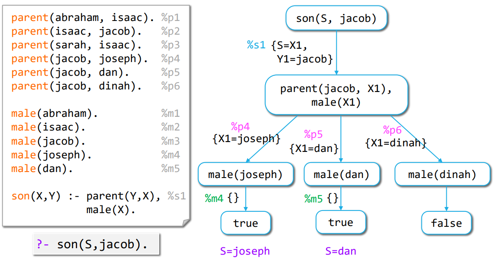

# Relational Logic Programming

## PPL2023

### Sources

[Principles of Programming Languages, Mira Balaban, 2017 (7.1)](https://www.cs.bgu.ac.il/~mira/ppl-book-full.pdf)

[Learn Prolog Now](http://lpn.swi-prolog.org/lpnpage.php?pageid=online) is an interactive textbook to learn Prolog.
(You can run Prolog inside your browser to run the examples and the exercises - like in a notebook.)
We cover in our lectures the material from Chapter 1 to 4 in this textbook.
It is recommended to work on their exercises:
* [1.3 Exercises](http://lpn.swi-prolog.org/lpnpage.php?pagetype=html&pageid=lpn-htmlse3) on facts, rules.
* [2.3 Exercises](http://lpn.swi-prolog.org/lpnpage.php?pagetype=html&pageid=lpn-htmlse7) on unification.
* [3.3 Exercises](http://lpn.swi-prolog.org/lpnpage.php?pagetype=html&pageid=lpn-htmlse11) on recursion.
* [4.4 Exercises](http://lpn.swi-prolog.org/lpnpage.php?pagetype=html&pageid=lpn-htmlse16) on list processing.


### Introduction

Logic Programming (LP) is one the three major programming paradigms - in addition to procedural and functional programming.
It emerged in the 1970s, from the work of Kowalski and Colmerauer in automatic theorem proving.
The following article provides a good historical review of how Prolog was designed: [The Birth of Prolog](http://alain.colmerauer.free.fr/alcol/ArchivesPublications/PrologHistory/19november92.pdf) by Colmerauer and Roussel, 1992.

Usually, a logical axiom `H <- B1 and B2... and Bn` can be interpreted in a logical declarative manner:
*When B1 and ... and Bn are true, then H is also true.*

The first key observation at the basis of the logic programming paradigm is to read such a logical statement in a procedural manner: *In order to prove that H is true, you must prove that B1 and ... and Bn are true.*  The basic step in this procedural reading is the step of *proving that a predicate Bi is true*.  

The second key observation in LP is that quantified variables in a logical statement such as the following:
$$\forall x \in R, \exists y \in R, p(x,y) \Rightarrow q(y)$$ can be understood as the parameters of procedures, passing information into the procedure.

In this chapter, we introduce Logic Programming - first as users of the Prolog language, then as implementers of an interpreter for Prolog.  We use the same methodology we employed when implementing an interpreter for a functional language: define the abstract syntax and the operational semantics of the language.  

Even though the language we implement *feels* very different from those we studied earlier, we discover that the same tools appear in the description of its operational semantics as those we introduced in earlier chapters: substitution, unification and lazy evaluation.  In our implementation of a Logic Programming interpreter, we reuse much of the tools we developed when implementing a functional language interpreter and the type inference system.

## Three Subsets of Logic Programming

We define three subsets of different complexity in the LP domain:
* Relational LP (also called Datalog)
* Pure Prolog - including recursive data structures (called functors in Prolog).
* Full Prolog - including types, arithmetic, introspection primitives, backtracking control with the cut operator and self-modifying code.

We will review in the course the first two subsets of Prolog.

## Logic Programming as a Programming Language

The way we have described programming languages since the beginning of the course is to identify:
* The syntax (concrete and abstract) of the language
* The operational semantics of the language which consists of the specification of the values computed by the language and the specification of the mapping from expressions to values as a structural inductive process.
* A set of primitive operations and primitive data types - which can be combined through the syntax of the language into compound operations (procedures) and compound data types.

In the case of Logic Programming, the following key decisions specify the programming language:
* **Syntax**: a restricted subset of predicate calculus: A logic program is a set of formulas
(classified into rules and facts), with a single head and only conjunction on the right-hand-side, 
defining known relationships in the problem domain.
* **Semantics**: the computed values are sets of answers to queries:
  * A program is triggered by invoking a goal (query) logic statement. 
  * The goal might include variables.
  * The computed values are sets of answers to goal queries. 
    * If a goal includes variables, the answers are substitutions (instantiations) for the variables in the query.
    * Else the answers are true/false values.
* **Operational semantics**: Program execution is an attempt to prove a goal statement.
  * The proof tries to instantiate the variables (provide values for the variables), such that the goal becomes true.
  * A computation of a logic program consists of exploring the consequences of the program, in order to reach the given goal.
  * The operational semantics is a proof algorithm: It is based on two essential mechanisms:
    * **Unification**: The mechanism for parameter passing. 
    * **Backtracking**: The mechanism for searching for a proof within the set of all consequences of the program.
* **Primitives**: 
  * In relational LP and pure LP, primitive expressions include *predicates* (which are characterized by a symbol) and *symbols* which can be compared through unification (meaning an equality operator between symbols is defined).  Two predefined values - `true` and `false` - are also defined.  They are returned when a goal with no variables is executed.  
  * In Pure Prolog, the set of expressions is extended with *functors*, which can be nested recursively.  Variables can be bound to either symbols or functors. A computed value is either the true/false primitive value, or a set of substitutions mapping variables to symbols or functors.
  * In Full Prolog, primitive types are extended with numbers and strings and corresponding primitive operations to manipulate them (arithmetic, string operations).  In addition, primitive procedures are introduced to explicitly manipulate programs at runtime.

## Relational Logic Programming

### Syntax

The expressions in RLP include:
* Atomic expressions: 
  * Terms
    * Symbols - correspond to constants - start with lowercase
    * Variables - symbol starting with Uppercase or with _
  * Predicates - correspond to names of procedures - start with lowercase
* Compound expressions:
  * Atomic Formula - expression of the form $$predicate(term_1, ..., term_n)$$
  * Facts - rule containing a single atomic formula.
  * Rules - rule containing: a left-hand-side with a single atomic-formula and a right-hand-side which is a list of atomic formula, interpreted as a conjunction.
  * Queries - a list of atomic formula.
  * Program - a collection of facts and rules.

Here is an example of a program written according to the Prolog concrete syntax:
```prolog
parent(abraham, isaac).
parent(isaac, jacob).
parent(sarah, isaac).
parent(jacob, joseph).
male(abraham).
male(isaac).
male(joseph).
female(sarah).
```

In this program, the symbol `parent` is a **predicate**.  It is part of the predicate definition that it expects two parameters - hence we will refer to it as `parent/2`. Similarly, `male/1` and `female/1` are also predicates.

The symbols `abraham, isaac, jacob, sarah, joseph` are all symbol terms.

The expression `parent(abraham, isaac)` is an atomic formula.

The expression `parent(abraham, isaac).` (with a dot at the end) is a fact.  It is an assertion that an atomic formula is true.

We run a query on this program in the following manner:

```prolog
?- parent(abraham, X)
```

The query is understood as a question: is there a value for the variable `X` which makes the atomic formula `parent(abraham, X)` true? 

This triggers an execution of the program for this goal query - where the intepreter tries to prove the goal.

In this case, the answer set is a set with a single substitution:

```
X = isaac;
```


### Procedures in RLP

A procedure in RLP is defined by providing in the program a collection of facts and rules for a given predicate.
For example, the following code defines the `mother` procedure:

```
mother(X, Y) :- parent(X, Y), female(X).
```
This procedure is read as follows:
* For any individuals X and Y, in order to prove that the relation `mother(X,Y)` holds, we must prove that `parent(X,Y)` holds and that `female(X)` holds.  
* We call the left-hand side of the rule the **Head**, and the right-hand side is the **Body** of the procedure.
* We observe that the variables are universally quantified in this procedure.

In the previously shown program, the four following facts define the `parent` procedure:
```
parent(abraham, isaac).
parent(isaac, jacob).
parent(sarah, isaac).
parent(jacob, joseph).
```
The simplest possible procedure is this:

```
true.
```
This procedure is defined by a single fact, for the predicate `true/0` of no parameters - and which immediately succeeds when it is invoked.

Procedures can be defined recursively, as in the following case:
```
% Signature: ancestor(Ancestor, Descendant)/2
% Purpose: Ancestor is an ancestor of Descendant.
ancestor(A,D) :- parent(A,D).                  %1
ancestor(A,D) :- parent(A,P), ancestor(P,D).   %2
```

This procedure computes the transitive closure of the `parent/2` relation.  It is read as follows:
* For any individuals A and D, in order to prove that the relation `ancestor(A,D)` holds, we must prove that:
  * Either `parent(A,D)` holds
  * Or there exists an individual P such that we can prove `parent(A,P)` holds and `ancestor(P,D)` holds.
  
Observe the following distinctions:
* When a variable occurs *only* in the Body of a procedure, it is understood to be existentially quantified ($$\exists X, q(X)$$)

* When the body of procedure contains multiple atomic formula, we understand the formula are in conjunction. (Must prove p **and** prove q).
* When a procedure contains multiple rules (for example, rule %1 and rule %2 in the procedure `ancestor`), we understand that the rules form a disjunction. (In order to prove `ancestor(A,D)` prove %1 **or** prove %2.)

In terms of programming languages, the **scope** of a variable is a single rule.
Variables in different rules are unrelated: Variables are bound only within a rule. 
Therefore, variables in a rule can be consistently renamed (compare with the Renaming principle in functional languages for a procedure).

When we invoke the procedure ancestor/2, we obtain multiple answers:
```
?- ancestor(abraham, D)
D = isaac;
D = jacob;
D = joseph;
false;
```

#### Facts are Simple Rules

Facts can be considered as simple rules, where the body is the true formula. In other words:
```
male(abraham).
```
is equivalent to:
```
male(abraham) :- true.
```

In terms of operational semantics, a procedure is an **ordered** list of rules (or facts).  
When trying to prove the head of a procedure, the different rules are tried in order, and within each rule, each atomic formula in the body is proved in order from left to right. (These two strategies are the default strategy in Prolog - we will discuss ordering strategies later.)

#### Left and Right Recursion

Care must be taken when defining recursive procedures. Consider the following variant of the `ancestor/2` procedure where we swapped the two atomic formula in the body of the second rule.  This rule is now left-recursive (as opposed to the right-recursive case above).

This inversion leads to infinite loops in the proof algorithm:
```
% ancestor2(Ancestor, Descendant)
ancestor2(A, D) :- parent(A, D).
ancestor2(A, D) :- ancestor2(P, D), parent(A, P).

?- ancestor2(A,isaac)
A = abraham ;
A = sarah ;
ERROR: stack overflow
```

The difference between the `ancestor/2` and `ancestor2/2` procedures is that the first one is tail-recursive (the recursion occurs in tail position), whereas the second one is not.  This leads to a blind-search procedure when trying to find the value of the `P` variable and to an infinite loop.

### Queries

A query is a list of atomic formula, which triggers the execution of a program - $$af_1, ..., af_n$$.

A good way to understand the execution of a query is to read it as follows:
* Given all the facts and rules asserted in a program
* Can we prove each of the atomic formula in the query $$af_i$$

When variables occur in a query, their scope is shared -- they are all defined for the whole execution of the program on this query.

Variables are understood as existentially quantified when they appear in a query - that is a query $$?- pred(X)$$ is understood as:
* Does a constant value `v` exist such that `pred(X) o {X = v}` can be proven true. (Where `E o s` is the `apply substitution` operator over atomic formula.)

A query with multiple variables looks for all substitutions in which the variables hold in the described relation.
For example, given the program above - the query `parent(X,Y)` returns a list of substitutions for the pair (X,Y):
```
?- parent(X,Y)
X = abraham,
Y = isaac;

X = isaac,
Y = jacob;

X = sarah,
Y = isaac;

X = jacob,
Y = joseph
```

A query with multiple atomic formula with shared formula defines a complex relation.  For example, in the following example, the variable Y is shared between the two atomic formula.  
```
?- parent(X,Y), parent(Y,Z)
X = abraham,
Y = isaac,
Z = jacob;

X = isaac,
Y = jacob,
Z = joseph;

X = sarah,
Y = isaac,
Z = jacob
```

The query is read as: "find triplets (X,Y,Z) where X is the grand-parent, Y the parent, Z the child."

### Summary

* A rule is a conditional formula of the form $$H :- B_1, ...., B_n.$$. $$H$$ is called the head
and $$B_1, ..., B_n$$ the body of the rule. $$H, B_1, ..., B_n$$ are atomic formulas.
* The symbol `:-` stands for "if" and the symbol "," stands for "and".
* The primitive predicate symbols true, = cannot be defined by rules (cannot appear in rule heads). true is a primitive proposition, and = is the binary unification predicate.
* A rule is a lexical scope: The variables in a rule are bound procedure variables.
  * They are universally quantified ($$\forall$$) over the entire rule.
  * Variables that appear only in the rule body are existentially quantified ($$\exists$$) over the rule body.
  * Variables in different rules reside in different lexical scopes.
* Rules cannot be nested.


## Prolog Syntax

We review the syntax of RLP described above in an informal manner by introducing its BNF format and the corresponding abstract syntax. This syntax corresponds to a subset of the Prolog programming language.

The concrete syntax of RLP defines a program as a non empty set of procedures, each consisting of an ordered set of rules and facts, having the same predicate and arity.

```
<program> -> <procedure>+
<procedure -> (<rule> | <fact>)+ with identical predicate and arity
<rule> -> <head> ’:-’ <body> ’.’
<fact> -> <head> ’.’
<head> -> <atomic-formula>
<body> -> (<atomic-formula> ’,’)* <atomic-formula>
<atomic-formula> -> <constant> | <predicate>’(’(<term>’,’)* <term>’)’
<predicate> -> <constant>
<term> -> <constant> | <variable>
<constant> -> A string starting with a lower case letter.
<variable> -> A string starting with an upper case letter.
<query> -> ’?-’ (<atomic-formula>’,’)* <atomic-formula> ’.’
```

The corresponding abstract syntax specifies the following AST types:
```
Program: {procedures: Procedure[];}
Procedure: {rules: (Rule | Fact)[]; }  // at least one rule or fact.
Fact: {head: AtomicFormula;}
Rule: {head: AtomicFormula; body: AtomicFormula[];}
AtomicFormula: {predicate: Constant; terms: Term[];}
Term: Constant | Variable
Constant: {val: string | number;} // string must start with lowercase letter
Variable: {variable: string;}     // string must start with uppercase letter
```

In the spirit of Scheme, Prolog adopts a minimalistic syntax.

## RLP Operational Semantics

The operational semantics of logic programming is based on two mechanisms: 
* Unification
* Search and backtracking

### Unification for Logic Programming

Unification in Logic Programming is exactly the same operation as that we discussed in [Chapter 3](https://www.cs.bgu.ac.il/~ppl192/wiki.files/class/notebook/3.2TypeInference.html#Definition:-Unification-of-Type-Expressions)
but applied to atomic formulas and logic variables instead of type expressions and type variables.  It relies on the exact same definition of the mathematical object of **substitution**.

Unification is the operation of making atomic formulas identical by substituting expressions for variables.
For example, the atomic formulas `p(3, X)` and `p(Y, 4)` can be unified by the substitution `{X = 4, Y = 3}`.
Similarly, `p(X, 3, X)` and `p(Y, Z, 4)` can be unified by the substitution: `{X = 4, Z = 3, Y = 4}`.

#### Formal Definition of Unification

**Definition**: A substitution $$s$$ in logic programming involves *logic variables* as variables and *logic terms* as values, such that $$s(X) \neq X$$. A substitution is applied to *atomic formula* (and later we will extend it to rules, facts, procedures and programs).

A pair `⟨X, s(X)⟩` is called a binding, and written $$X = s(X)$$.

**Example:**

* `{X = 4, Z = 3, U = X}` and `{X = 4, Z = 3, U = V}` are substitutions
* `{X = 4, Z = 3, Y = Y }` and `{X = 4, Z = 3, X = Y }` are **not** substitutions.

**Definition**: The application of a substitution $$s$$ to an atomic formula $$A$$, denoted $$A ○ s$$ 
replaces the terms for their variables in $$A$$. The replacement is simultaneous.

For example,
* `p(X, 3, X,W) ○ {X = 4, Y = 4} = p(4, 3, 4,W)`
* `p(X, 3, X,W) ○ {X = 4,W = 5} = p(4, 3, 4, 5)`
* `p(X, 3, X,W) ○ {X = W,W = X} = p(W, 3,W, X)`

**Definition**: An atomic formula $$A'$$ is *an instance of* an atomic formula $$A$$, if there exists a substitution $$s$$ such that 
$$A ○ s = A$$.

$$A$$ is *more general than* $$A'$$, if $$A'$$ is an instance of $$A$$.

**Example:**

* `p(X, 3, X, W)` is more general than `p(4, 3, 4, W)`, which is more general than `p(4, 3, 4, 5)`
* `p(X, 3, X, W)` is more general than `p(W, 3, W, W)`, which is more general than `p(5, 3, 5, 5)`
* `p(X, 3, X, W)` is more general than `p(W, 3, W, X)`, which is more general than `p(X, 3, X, W)`

**Definition**: A *unifier of atomic formulas $$A$$ and $$B$$* is a substitution $$s$$, such that $$A ○ s = B ○ s$$.

**Example:** 
The following substitutions are unifiers of `p(X, 3, X, W)` and `p(Y, Z, 4, W)`:
* `{X = 4, Z = 3, Y = 4}`
* `{X = 4, Z = 3, Y = 4,W = 5}`
* `{X = 4, Z = 3, Y = 4,W = 0}`

**Definition:** A *most general unifier (mgu)* of atomic formulas $$A$$ and $$B$$ is a unifier $$s$$ of $$A$$ and $$B$$, 
such that $$A ○ s = B ○ s$$ is more general than all other instances of $$A$$ and $$B$$ that are obtained by applying a unifier of $$A$$ and $$B$$. 

That is, for every unifier $$s′$$ of $$A$$ and $$B$$, there exists a substitution $$s''$$ such that $$A ○ s ○ s'' = A ○ s'$$.

If $$A$$ and $$B$$ are unifiable, they have an mgu (unique up to renaming).

**Example:** 
* `{X = 4, Z = 3, Y = 4}` is an mgu of `p(X, 3, X, W)` and `p(Y, Z, 4, W)`.

**Definition: Combination of substitutions** 
The combination of substitutions $$s$$ and $$s'$$ denoted $$s ○ s'$$, is defined by:
1. $$s'$$ is applied to the terms of $$s$$, *i.e.,* for every variable $$X$$ for which $$s(X)$$ is defined, occurrences of variables $$X'$$ in $$s(X)$$ are replaced by $$s'(X')$$.
2. A variable $$X$$ for which $$s(X)$$ is defined, is removed from the domain of $$s'$$, *i.e.,* $$s'(X)$$ is not defined on it any more.
3. The modified $$s'$$ is added to $$s$$.
4. Identity bindings, *i.e.*, $$s(X) = X$$, are removed.

**Example:**
* `{X = Y, Z = 3, U = V } ○ {Y = 4,W = 5, V = U, Z = X} = {X = 4, Z = 3, Y = 4,W = 5, V = U}`

#### Unification Algorithm

The method introduced in Chapter 3 for solving type equations is a unification algorithm for any kind of expressions, that computes an mgu. We repeat this algorithm here, replacing the types of the objects manipulated to the context of the AST of logic programming:

Given atomic formulas `A`, `B` they can be unified following these steps:
```
unify(A,B): Substitution | Fail 
Initialization: sub: Substitution = {} // Empty substitution
                equations: Equation[] = (A = B)
1. While (equations is not empty):
2.   Let equation_1 = pop(equations)
3.   Let eq'_1 = equation_1 ○ sub
4.   If one side in eq'_1 is a variable X:
4.1    If the other side is not the same variable: i.e., eq'_1 = {X = term}
4.2     then sub = sub o {X = term}
4.3     else if the other side is the same variable: i.e., eq'_1 = {X = X}
4.4       continue
5.   else if both sides in eq'_1 are atomic, then:
6.     if both sides are the same constant symbol then continue, else return FAIL.
7.   else if the predicate symbols and the number of arguments are the same: eq'_1 = (p(t_1,...,t_n) = p(s_1, ..., s_n)):
8.     split eq'_1 into equations: equations = equation U (t_i = s_i) for i=1..n, continue. 
9.   else return FAIL.
```

### answer-query: An abstract interpreter for Logic Programming

The computation of a Prolog program is triggered by a query.  It builds a proof-tree to establish whether the query holds given the program.  If such a proof-tree can be constructed, then answers can be read off the tree, in the form of substitutions.

A query has the following form:
`Q = ?- G1, ..., Gn`

The query components are called **goals**. 
The interpreter tries all possible proofs for the query, and computes a set of answers, i.e., substitutions to the variables in the query.  Each answer corresponds to a proof of the query. If the query cannot be proved, then the set is the empty set.

#### Facts as Rules
To simplify the description of the algorithm, we note that Facts can be treated as Rules, whose body is the single atomic formula true.  For example, the fact
`r(baz, bar).`
is equivalent to the rule:
`r(baz,bar) :- true.`

#### Goal and Rule Selection

Each proof is a repeated effort to prove:
* A selected goal
* Using a selected rule

If the selected rule does not lead to a proof, the next selected rule is tried. This is the backtracking mechanism of the interpreter. If no rule leads to a proof, the computation fails. 

Rule selection is performed by unification between the selected goal and the head of the selected rule. 
Therefore, the algorithm has two points of **non deterministic choice**: goal and the rule selections.
We will refer below to the selections of goals and rules with two procedures `Gsel` for goal selection `Rsel` for rule selection.

**Goal selection**: Gsel is a selection function defined on tuples of goals. That is, $$Gsel(G_1, ... , G_n) = G_i, n ≥ 1, 1 ≤ i ≤ n$$, such that $$Gi \neq true$$.

**Rule selection**: Rsel is a function which for a given goal $$G$$ and a program $$P$$ (a sequence of rules) creates a sequence of all rule-substitution pairs such that:
* $$Rsel(G, P) = (⟨R, σ⟩)_{R∈P, G ○ σ = head(R) ○ σ}$$. 

That is, for every rule $$R ∈ P$$, if $$R = A:- B1, . . . , Bn., n ≥ 1$$, and $$unify(A, G) = σ$$ succeeds with the unifying substitution (mgu) $$σ$$, then $$⟨R, σ⟩ ∈ Rsel(G, P)$$.

In Prolog, GSel and RSel are defined as follows:
* Goal selection as the left most goal which is different from true. That is: 
  $$Gsel_{Prolog}(G_1, ... , G_n) = G_1$$, provided that $$G_1 \neq true$$.
* Rule selection according to the procedure rule ordering: if the rules in $$P$$ are ordered as $$R_1, ... , R_n$$, then 
  $$Rsel_{Prolog}(G, P) = (⟨R_{i_1}, σ_{i_1}⟩, ... ,⟨R_{i_m}, σ_{i_m}⟩)$$, such that $$i_j < i_{j+1}$$, for $$1 ≤ j ≤ m$$.


#### The answer-query algorithm 

The answer-query algorithm builds a proof tree and then collects the answers from its leaves. 
The proof tree is a tree with labeled nodes and edges. It is defined as follows:
1. The nodes are labeled by queries, with a marked goal in the query (the selected goal).
2. The edges are labeled by substitutions and rule numbers.
3. The root node is labeled by the input query and its selected goal.
4. The child nodes of a node labeled $$Q$$ with a marked goal $$G$$ represent all possible successive queries, obtained by applying all possible rules to $$G$$. The child nodes are ordered by Rsel, where the leftmost child corresponds to the first selected rule.

The Tree operations used in the proof-tree algorithm are:
1. Constructors:
  * `make_node(label)`: Creates a node labeled label (labels in our case are collections of Atomic Formulas).
  * `add_branch(tree, edge_label, branch)`: Adds branch as a right branch to the root node of tree, with an edge labeled by `edge_label`.
2. Accessors: 
  * `label(node)` selects the label of node.
  
#### Proof Tree Example

The following diagram illustrates the structure of a proof tree:



* Each node contains a query
* Each edge is labeled by a reference to a rule (or fact) and a substitution.
* Leaves are nodes that cannot be expanded anymore (in general, they correspond to the atomic formula `true` or `false`).
* Answers are read off this tree by collecting the substitutions from the leaves marked as `true` and up to the root.


**The answer-query algorithm: `answer-query(Q, P, Gsel, Rsel)`**

**Input:**
  * `Q: Query = ?- G1, . . . , Gn`, where Gi, i = 1..n are atomic formula
  * `P: Program`, with numbered rules (denoted by number(R))
  * A goal selection rule `Gsel`
  * A rule selection rule `Rsel`
  
**Output:** A set of substitutions for variables of Q (not necessarily for all variables).

**Method:**
1. `answers = {}`
2. `PT = proof-tree(make_node(Q))`. 
3. Return `{s ∣ s ∈ answers/Q(PT)}` where `answers/Q` computes the restriction of the substitutions read out in the proof tree leaves to the variables of `Q`.

`answer-query` can return the following types of results:
1. An empty set answer (no substitutions) marks a failure of the interpreter to find a proof.
2. An answer with empty substitutions marks success proofs with no variables to substitute (*e.g.,* when the query is ground).
3. An answer with non-empty substitutions marks success proofs that require substitutions to the query variables.

**Procedure proof-tree**: `proof-tree(node)`. node is a tree node with label query, which is an ordered list of atomic formulas, called goals.

**Input:** A tree node node

**Output:** A proof tree rooted in node. 

**Method:**
```
if label(node) is ?- true, ... , true then 
  1. Mark node as a Success node (leaf). A success backtracking point.
  2. answers = answers ∪ {s1 ○ s2 ○ ... ○ sn}, where s1, ... , sn are the substitution labels
     of the path from the tree-root to node. Mark node with this substitution.
else
  1. Goal selection: G = Gsel(label(node)). G ≠ true since Gsel does not select a true goal.
  2. Variables renaming: Rename variables in every rule and fact of P
  3. Rule selection: rules = Rsel(G, P) = (⟨R, σ⟩) s.t. R ∈ P, G ○ σ = head(R) ○ σ
  4. apply-rules(node, G, rules)
```  
  
**Procedure apply-rules:** `apply-rules(node, G, rules)`

**Input:** 
  * `node` is the root-node of a proof-tree, with label query, which is a tuple of atomic formulas; 
  * `G` is an atomic formula (≠ true) included in a query;
  * `rules` is a sequence of rule-substitution pairs $$(⟨R, σ⟩)_{R ∈ P, G ○ σ = head(R) ○ σ}$$.

**Output:** The proof tree rooted in node, extended with proof-trees created by the application of the rules in rules to the selected goal G.

**Method:** 

```
if empty?(rules) then 
  output = node, // the tree rooted at node. This is a failure backtracking point.
else let ⟨R, σ⟩ = first(rules):
  1. new_query = (replace(label(node), G, body(R))) ○ σ
     That is, if label(node) = G1, ..., Gn, n ≥ 1, G = Gi, and 
                 body(R) = B1, ... , Bm, m ≥ 1, then 
                 new_query = (G1, ... , Gi−1, B1, ... , Bm, Gi+1, ... , Gn) ○ σ.
  2. New query expansion:
     add_branch(node, ⟨σ, number(R)⟩, proof-tree(make_node(new_query)), )
  3. Application of other selected rules: apply-rules(node, G, tail(rules))
end
```

**NOTES**

* In the rename step, the variables in the rules are renamed by new names. This way the program variables in every binding step are different from previous steps. Since variables in rules are bound procedure variables they can be freely renamed. By convention, in every recursive call, increase some auxiliary counter, such that variables `X, Y,...` are renamed as `X1, Y1,...` at the first level, `X2, Y2,...` at the second level, etc.
* When computing substitutions in RSel: prefer to produce substitutions of the form {$$Var_{goal} = Var_{head}$$} instead of the opposite.  This way the query variables are kept in the substitutions produced in a proof branch. 

### Types of Proof Trees

* A path from the root in the proof tree corresponds to a computation of answer-query.
* A finite root-to-leaf path with a leaf marked `Success` is a successful computation path. 
* A tree with a successful computation path is a **success tree**. 
* A successful computation path corresponds to a successful computation of answer-query. 

**Definition: [Provable query]**
A query $$Q$$ is provable from a program $$P$$, denoted $$P ⊢ Q$$, iff for some goal and rule selection rules Gsel and Rsel, the proof tree algorithm for `answer-query(Q, P, Gsel, Rsel)` computes a success tree.

A finite root-to-leaf path with a non Success marked leaf is a **finite-failure computation path**.

A proof tree where all the paths are failed computation paths is a **(finite) failure tree**.

An infinite computation path is an **infinite path**. Infinite computations can be created by recursive rules (direct or indirect recursion).

Significant kinds of proof trees:
1. **Finite success proof tree**: A finite tree with a successful path.
2. **(Finite) failure proof tree**: A finite tree with no successful path.
3. **Infinite success proof tree**: An infinite tree with a successful path. In this case it is important not to explore an infinite path. In Prolog: Tail recursion is safe, while left recursion is dangerous.
4. **Infinite failure proof tree**: An infinite tree with no successful path. Dangerous to explore.

The proof tree above is a finite success tree. 
We read the answer off this tree for each successful computation path: 

*Left path:*: `{S=X1, Y1=jacob} ○ {X1=joseph}`, which is the substitution `{X1=joseph, Y1=jacob, S=joseph}`. 
The restriction to the query variables yields the single substitution: `{S=joseph}`.

*Middle path:* `{S=X1, Y1=jacob} ○ {X1=dan}`, which is the substitution `{X1=dan, Y1=jacob, S=dan}`. 
The restriction to the query variables yields the single substitution: `{S=dan}`.

*Right path:* is a failure path, hence no answer is found.

The resulting answer set of the computation is: `{ {S=joseph}, {S=dan} }`.

### Properties of the answer-query Algorithm

1. **Proof tree uniqueness**: The proof tree for a given query and a given program is unique, for all goal and rule selection procedures (up to sibling ordering).  As a consequence: the set of answers is independent of the concrete selection procedures for goals and rules (GSel and RSel).
2. **Performance**: Goal and rule selection decisions have impact on performance. 
  * The rules of a procedure should be ordered according to the rule selection procedure. Otherwise, the computation might get stuck in an infinite path, or try multiple failed computation paths.
  * The atomic formulas in a rule body should be ordered according to the goal selection procedure.
  * As an example, consider the case of `ancestor/2` and `ancestor2/2` discussed above.  They only differ in terms of goal selection.  
3. Soundness and completeness:
  * Definition: [logical implication] A query $$Q$$ is logically implied from a program $$P$$, denoted $$P ⊧ Q$$, if $$Q$$ is true whenever the program $$P$$ is true.
  * Completeness: $$P ⊧ Q$$ implies $$P ⊢ Q$$. That is, if a query is logically implied from a program, then it is also provable by answer-query.
  * Soundness: $$P ⊢ Q$$ implies $$P ⊧ Q$$. That is, if a query is provable by answer-query, then it is logically implied from the program.

### Properties of Relational Logic Programming

**Decidability:**
Given a program $$P$$ and a query $$Q$$, the problem "*Is Q provable from P*", denoted $$P ⊢ Q$$, is decidable.

**Proof**. The proof tree consists of nodes that are labeled by queries, *i.e.*, sequences of atomic formulas. The atomic formulas consist of predicate and individual constant symbols that occur in the program and the query, and from variables. Therefore, (1) the number of atomic formulas is finite, up to variable renaming, and (2) the number of different selected goals in queries on a path is finite (up to variable renaming). Consequently, every path in the proof tree can be decided to be a success, a failure or an infinite computation path. 

Note that all general purpose programming languages are only partially decidable (the halting problem). Therefore, relational logic programming is less expressive than a general purpose programming language.

**Question**: If relational logic programming is decidable, does it mean that all relational logic programming proof trees are finite?

### Relational Logic Programming and SQL Operations

How useful is the relational logic programming we just defined?

We just saw that its semantics is decidable - meaning it is strictly less expressive than the $$L2$$ functional language we defined in Chapter 2.  Can it still express *interesting* programs?

Relational logic programming is the basis for the DataLog language, which is a logic based language for database processing. DataLog is relational logic programming + arithmetic + negation + some database related restrictions. The operational semantics of DataLog is defined in a different way (bottom up semantics).

DataLog is more expressive than SQL. The relational algebra operations include: Union, Cartesian product, diff, projection, selection, and join.  These can all be implemented in relational logic programming. In addition, recursive rules (like computing the transitive closure of a relation) cannot be expressed in SQL (at least not in the traditional SQL) but **can be computed** in RLP.

The following schema illustrates how relational algebra operations are modeled in RLP:

**Union**
```
r_union_s(X1, ..., Xn) :- r(X1, ..., Xn).
r_union_s(X1, ..., Xn) :- s(X1, ..., Xn).
```

**Cartesian product**
```
r_X_s(X1, ..., Xn, Y1, ..., Ym) :- r(X1, ..., Xn ), s(Y1, ..., Ym).
```

**Projection**
```
r1(X1, X3) :- r(X1, X2, X3).
```

**Selection**
```
r1(X1, X2, X3) :- r(X1, X2, X3), X2 \= X3.
```

**Natural Join**
```
r_join_s(X1, ..., Xn, X, Y1, ..., Ym) :-
r(X1, ..., Xn, X ), s(X, Y1, ..., Ym).
```

**Intersection**
```
r_meets_s(X1, ..., Xn) :- r(X1, ..., Xn ), s(X1, ..., Xn).
```

**Transitive closure of a binary relation `r`**
```
tr_r(X, Y) :- r(X, Y).
tr_r(X, Y) :- r(X, Z), tr_r(Z, Y).
```

For example, if `r` is the parent relation, then `tr-parent` is the ancestor relation.

