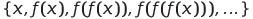
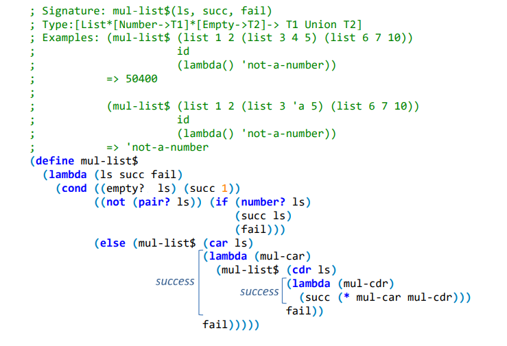
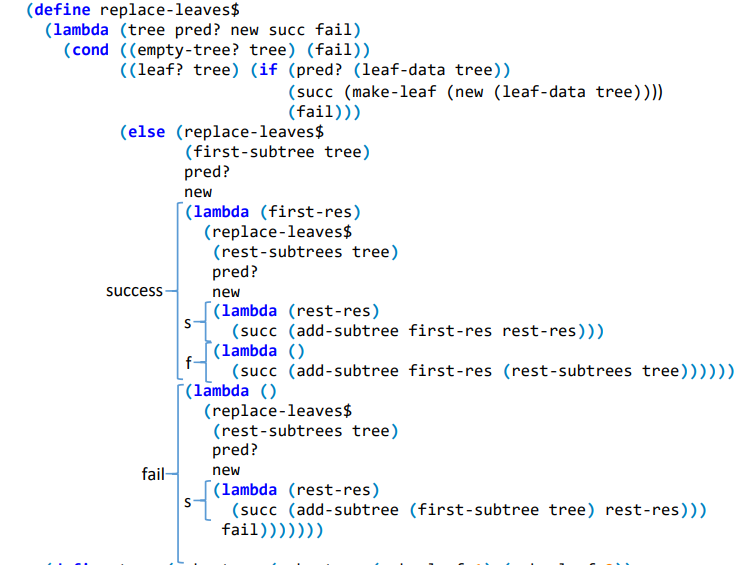
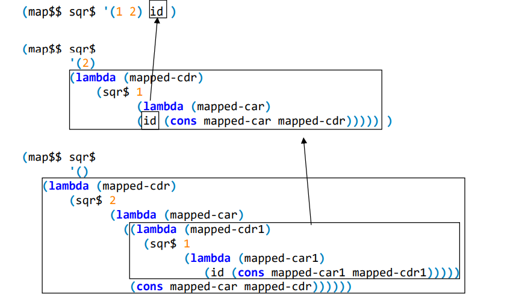

<h1><b>Lazy-Lists and Continuation Passing Style (CPS)</b></h1>

<h2><b>Practical Session - Week #10</b></h2>

# Lists-Lazy

תזכורת: רשימות עצלות הן מבני נתונים סדרתיים המאפשרים דחייה של חישוב ושמירה של איברים מתוכם.
היתרונות בשימוש בהן:
* אין צורך לאחסן בזיכרון את כל איברי הרשימה. בעזרת רשימות עצלות ניתן לייצג אף סדרות אינסופיות.
* דחיית חישוב איברים ברשימה לזמן בו נדקק להם – ייתכן שלא נזדקק לכל איברי הרשימה.

נגדיר את ערכי הטיפוס של רשימות עצלות באופן רקורסיבי:

```typescript
LzL = { empty-lzl } ∪ (Scheme-Type × [Empty → LzL])
```
זהו ADT עבור רשימות עצלות (המימוש מופיע בספר הקורס):

```typescript
; Signature: cons-lzl(x, f)
; Type: [T * [Empty -> LzL] -> LzL]

; Signature: head(lz-list)
; Type: [LzL -> T]
; Pre-condition: non-empty LzL

; Signature: tail(lz-list)
; Type: [LzL -> LzL]
; Pre-condition: non-empty LzL

; Signature: empty-lzl?(exp)
; Type: [T -> Boolean]

; Signature: nth(lz-list, n)
; Type: [LzL * Number -> T]

; Signature: take(lz-list, n)
; Type: [LzL * Number -> List]
```

## שאלה 1 – השערת קולץ
נגדיר את הפונקציה:


{: .c}

השערת קולץ גורסת כי לכל n>1 מתקיים כי הסדרה n,f(n),f(f(n)),f(f(f(n)))… תמיד מתכנסת ב-1. 
למשל עבור n=563: 

563 -> 1690 -> 845 -> 2536 -> 1268 -> 634 -> 317 -> 952 -> 476 -> 238 -> 119 -> 358 -> 179 -> 538 -> 269 -> 808 -> 404 -> 202 -> 101 -> 304 -> 152 -> 76 -> 38 -> 19 -> 58 -> 29 -> 88 -> 44 -> 22 -> 11 -> 34 -> 17 -> 52 -> 26 -> 13 -> 40 -> 20 -> 10 -> 5 -> 16 -> 8 -> 4 -> 2 -> 1

נרצה להגדיר את הרשימה העצלה המכילה את סדרת קולץ עבור n כלשהו.

```typescript
; Signature: lzl-collatz(n)
; Type: [Number -> LzL(Number)]
; Purpose: Generate the (possibly infinite) series { n, f(n), f(f(n)), ... },
; where f(n) is collatz function
; Pre-condition: n is a natural number greater than zero
(define lzl-collatz
    (lambda (n)
        (if (< n 2)
            (cons-lzl n (lambda () empty-lzl))
            (cons-lzl n
                (lambda ()
                    (if (= (modulo n 2) 0)
                        (lzl-collatz (/ n 2))
                        (lzl-collatz (+ (* 3 n) 1))))))))
> (take (lzl-collatz 563) 44)
'(563 1690 845 2536 1268 634 317 952 476 238 119 358 179 538 269 808 404 202
101 304 152 76 38 19 58 29 88 44 22 11 34 17 52 26 13 40 20 10 5 16 8 4 2 1)
```
מה הטיפוס של lzl-collatz? האם הפרוצדורה היא well-typed? האם ```(head (lzl-collatz n))``` עבור n טבעי כלשהי תמיד תצליח?


## שאלה 2 – סדרת ההפעלות העצמיות

בהינתן פונקציה  וערך  , נגדיר את סדרת ההרכבות העצמיות להיות  . הסדרה
יכולה להיות סופית, או אינסופית. נרצה לייצר את הרשימה העצלה שאיבריה הם איברי הסדרה. הרשימה תיגמר כאשר
הגיעה לנקודת שבת, כלומר כאשר הערך המוחזר מהפעלת  הוא אותו הערך שעליו  הופעלה.

```typescript
; Signature: lzl-apply(f, x)
; Type: [[T -> T] * T -> LzL]
; Purpose: Generate the self-application series of f on x
(define lzl-apply
    (lambda (f x)
        (let ((fx (f x)))
            (if (= fx x)
                (cons-lzl x (lambda () empty-lzl))
                (cons-lzl x (lambda () (lzl-apply f fx)))))))
> (take (lzl-apply (lambda (x) (+ 1 (/ 1 x))) 1.0) 100)
'(1.0 2.0 1.5 1.6666666666666665 1.6 1.625 ... 1.6180339887498951)
                             𝑙𝑒𝑛𝑔𝑡ℎ = 38

> (take (lzl-apply (lambda (x) x) 1) 100)
'(1)

```
# Continuation Passing Style (CPS) 

פרדיגמה תכנותית בה לכל פרוצדורת משתמש ניתן פרמטר נוסף שהינו פרוצדורה, אשר מהווה את המשך החישוב שיש לבצע בתום פעולת פרוצדורת המשתמש (ועל כן נקרא הפרמטר continuation). חלק מן המוטיבציה לשימוש בפרדיגמת תכנות זו היא השליטה שהיא מאפשרת בבקרה של התוכנית:

1.	במהלך כתיבת פרוצדורות משתמש בשיטת CPS, כל קריאה רקורסיבית נכתבת כך שהיא בעמדת זנב. לכן, מעצם השימוש בשיטה, הפרוצדורה תייצר תהליך איטרטיבי.
2. שיטת	CPS מאפשרת לשלוט בסדר לפיו התוכנית תחשב ביטויים. למשל, אם נממש חיפוש בעץ, נוכל לבחור אם לחפש קודם בענף הימני או בשמאלי (לעומת זאת, ללא CPS נהייה תלויים בסדר הערכת הביטויים המובנה ב-interpreter).
3.	השליטה בבקרת התוכנית מאפשרת לנקוט בפעולה שונה במקרה של הצלחה / כישלון או יציאה ישירה (exception) במהלך רקורסיה (או איטרציה) וכן מאפשרת להחזיר כמה ערכים ביחד. 

## שאלה 1 – אופן פעולת פרוצדורה בגרסת CPS והוכחת נכונות

ניזכר במימוש של הפרוצדורה fact ללא שימוש ב-CPS:


```typescript
; Type: [Number -> Number]
; Purpose: To calculate the factorial of n.
(define fact
    (lambda (n)
        (if (= n 0)
            1
            (* n (fact (- n 1))))))
```
כעת, נממש את fact בשיטת CPS ונמחיש את אופן הפעולה שלה:
```typescript
; Type: [Number * [Number->T1] -> T1]
; Purpose: Returns the application of the
; continuation c on the factorial of n.
(define fact$
    (lambda (n c)
        (if (= n 0)
            (c 1)
            (fact$ (- n 1)
                (lambda (fact_n-1)
                    (c (* n fact_n-1)))))))
> (fact 5)
120
> (fact$ 5 add1)
121
```
דיון: מדוע התוצאות אינן זהות? כיצד נרצה לקבוע בדרך כלל את פרוצדורת ה-continuation שנעביר לקריאה הראשונה?

### הוכחת נכונות:
 לאחר המרת פרוצדורה לגרסת ה-CPS שלה, נדרשת הוכחת נכונות. הנכונות נשענת על הצגת שקילות בין שתי הגרסאות, במובן הבא: בהפעלת האלגוריתם applicative-eval על קריאה מתאימה לכל אחת מן הגרסאות, החישוב יסתיים ויוחזר ערך זהה. לשם כך, נזדקק להגדרת השקילות הבאה:

הגדרה: פרוצדורה \$f שקולה-CPS לפרוצדורה f אם לכל ערכי קלט x1,x2,…,x3 ולכל continuation המסומן cont, מתקיים:
```typescript
(f$ x1 … xn cont) = (cont (f x1 … xn))
```
טענה: הפרוצדורה \$fact שקולה-CPS לפרוצדורה fact. כלומר, לכל מספר טבעי, n, ולכל continuation, אשר יסומן על ידי c, מתקיים:  
```typescript
(fact$ n c) = (c (fact n))
```
הוכחה: כיוון שהפרוצדורה fact היא רקורסיבית, ההוכחה מתבצעת על ידי שימוש באינדוקציה.

בסיס האינדוקציה: n=0
```typescript
a-e[ (fact$ 0 c) ] ==>* a-e[ (c 1) ] = a-e[ (c (fact 0)) ]
```
(הסימון a-e הוא קיצור עבור applicative-eval)

הנחת האינדוקציה: עבור n=k∈ N הטענה מתקיימת לכל k≥i. כלומר
```typescript
(fact$ i c) = (c (fact i))
```
צעד האינדוקציה: יהא n=k+1,k∈N, אזי:
```typescript
a-e [ (fact$ n c) ] ==>*
a-e [ (fact$ (- n 1) (lambda (res) (c (* n res)))) ] ==>*
```

מהנחת האינדוקציה, נקבל:
```typescript
a-e [ ((lambda (res) (c (* n res))) (fact (- n 1))) ] ==>*
a-e [ (c (* n (fact (- n 1)))) ] =
a-e [ (c (fact n)) ]
```


## כללי אצבע להמרת פרוצדורה רקורסיבית לפרוצדורה שקולה-CPS:

בהינתן פרוצדורה רקורסיבית, f, עם הפרמטרים הפורמאליים x1,…,xn, פרוצדורה שקולה-CPS לה תסומן \$f ותופעל על ארגומנט נוסף, c, ה-continuation. העקרונות שינחו אותנו בכתיבת \$f הם כדלקמן:

א. נפעיל את c על ערכים מוחזרים (כחלק ממקרה הבסיס, או בתוך continuation הנוצר במהלך הריצה). 

ב.	נקפיד לכתוב כל קריאה לפרוצדורת משתמש בתוך \$f כך שהקריאה תהיה בעמדת זנב.

ג.	כתיבת ה-continuation:

    a. כשנבצע בתוך \$f קריאה רקורסיבית כלשהי  עם ארגומנטים x1,…,xn, נתבסס על הנחת האינדוקציה (המקטינה את הבעיה). כלומר, נניח כי התשובה עבור הבעיה המוקטנת מתקבלת כארגומנט של
ה-continuation.

    b. בכתיבת ה-continuation, נקיים את צעד האינדוקציה ונפעל על הפתרון עבור הבעיה המוקטנת כדי לקבל את הפתרון לבעיה הגדולה יותר.

ד.	בכתיבת פרוצדורה בשיטת CPS, נקפיד שכל פרוצדורת משתמש (לא פרימיטיבית) המשמשת את \$f תהיה גם היא כתובה בשיטת CPS.

ה.	בדרך כלל, לא נרצה לבצע מניפולציה על הערך המוחזר של הפונקציה ולכן נשתמש בפונקציית הזהות id
כ-continuation ההתחלתי.

## שאלה 2 – פונקציות CPS מסדר גבוה

נמיר את הפונקציה foldr ל-CPS. תזכורת:


```typescript
(foldr op initial (list x1 x2 ... xn))
                ⇕
(op x1 (op x2 (op ... (op xn initial))))
```


```typescript
; Signature: foldr(op, initial, sequence)
; Type: [ [ T1 * T2 -> T2 ] * T2 * List(T1) -> T2 ]
; Example: (foldr + 0 (list 1 2 3 4 5)) => 15
(define foldr
  (lambda (op initial sequence)
    (if (empty? sequence)
        initial
        (op (car sequence)
            (foldr op initial (cdr sequence)))))) 

; Signature: foldr$(op, initial, sequence, c)
; Type: [ [T1 * T2 -> T2] * T2 * List(T1) * [T2 -> T3] -> T3 ]
; Example: (foldr$ * 1 (list 1 2 3 4 5)
;                  (lambda (result) (cons 'the-product result)))
 ;          => '(the-product . 120)
(define foldr$
  (lambda (op initial sequence c)
    (if (empty? sequence)
        (c initial)
        (foldr$ op
                initial
                (cdr sequence)
                (lambda (acc-cdr-res)
                  (c (op (car sequence) acc-cdr-res)))))))

; Signature: foldr$$(op$, initial, sequence, c)
; Type: [ [T1 * T2 * [T2->T3] -> T3] * T2 * List(T1) * [T2->T3] -> T3 ]
; Example: (foldr$ +$ 0 (list 1 2 3 4 5) 
;                 (lambda (result) (cons 'the-sum result)))
;           => '(the-sum . 15)
(define foldr$$
  (lambda (op$ initial sequence c)
    (if (empty? sequence)
        (c initial)
        (foldr$$ op$ 
                 initial
                 (cdr sequence)
                 (lambda (acc-cdr-res)
                   (op$ (car sequence) acc-cdr-res c))))))

```
 

נשים לב: מדוע לא יכולנו להפעיל את c על תוצאת \$op במקום להעביר לה את c כארגומנט? ראשית, לו עשינו כך, הקריאה לא הייתה בעמדת זנב. בנוסף, הבעיה המהותית יותר היא שבמקרה כזה היינו מאבדים את השליטה על תהליך החישוב המגולמת בתוך ה-continuation. 

## שאלה 3 – עצירת החישוב
הפונקציה \$mul-list מקבלת רשימה של רשימות ומחזירה מכפלה של כל המספרים ברשימה. אם יש מופע אטומי
שאינו מספר אז יש לעצור את החישוב.



## שאלה 4 – שימוש במספר continuations

לצורך הפשטת העבודה מול רשימות, נשתמש ב-ADT עבור עצים (המימוש מופיע בספר הקורס). כפי שכבר ראינו בעבר עבור רשימות ורשימות עצלות, גם עץ מוגדר בצורה רקורסיבית:
1.	Empty-Tree is a Tree
2.	if t is a Tree, than for every e: the value of  (add-subtree (make-leaf e) t) is a Tree

ממשק ה-ADT:

```typescript
; Signature: make-tree(1st, ..., nth)
; Type: [Tree * ... * Tree -> Tree]

; Signature: add-subtree(subtree, tree)
; Type: [Tree * Tree -> Tree]

; Signature: make-leaf(data)
; Type: [T -> Tree]

; Signature: empty-tree
; Type: Empty-Tree

; Signature: first-subtree(tree)
; Type: [Tree -> Tree]

; Signature: rest-subtrees(tree)
; Type: [Tree -> Tree]

; Signature: leaf-data(leaf)
; Type: [Tree -> T]

; Signature: composite-tree?(e)
; Type: [T -> Boolean]

; Signature: leaf?(e)
; Type: [T -> Boolean]

; Signature: empty-tree?(e)
; Type: [T -> Boolean]

```

הפונקציה \$replace-leaves מקבלת עץ הומוגני, פרדיקט (שאינו כתוב בגרסת CPS), ביטוי new מטיפוס עלי העץ ושני continuations: אחד עבור הצלחה והשני עבור כישלון. המטרה היא להחליף את כל העלים אשר מקיימים את הפרדיקט, בביטוי new. נשים לב שניתן להכליל את הקוד ע"י העברת פרוצדורה בתור new ולשנות את העלה בצורה דינמית.
 


```typescript
> (define tree (make-tree (make-tree (make-leaf 1) (make-leaf 2))
                          (make-tree (make-leaf 3) (make-leaf 4)
                                     (make-tree (make-leaf 5)))))

> (replace-leaves$ tree even? 42 (lambda (x) x) (lambda () tree))
'((1 42) (3 42 (5)))

```

הערה: יכולנו במקום succ ו-fail להעביר פרוצדורות שמבצעות מניפולציות אחרות על התוצאה – כל זאת מבלי לשנות שורה אחת בקוד הקיים של \$replace-leaves. לדוגמה:

```typescript
> (replace-leaves$ tree
                   (lambda (x) (> x 100))
                   42
                   (lambda (x) x)
                   (lambda ()
                     (replace-leaves$ tree
                                      odd?
                                      0
                                      permutations
                                      (lambda () 'I-give-up))))
'(((0 2) (0 4 (0))) ((0 4 (0)) (0 2)))

```

```typescript
> (replace-leaves$ tree
                    (lambda (x) (> x 100))
                    (lambda(x)x)
                    (lambda (x) x)
                    (lambda ()
                        (replace-leaves$ tree
                            odd?
                            (lambda(x)(+ 1 x))
                            (lambda(x)(rest-subtree x)
                            (lambda()'failled)
                        )
)
'((4 4) (6)))
```

```typescript
> (replace-leaves$ tree
                (lambda (x) (> x 100))
                (lambda(x)(* 2 x))
                (lambda (x) x)
                (lambda ()
                    (replace-leaves$ tree
                        zero?
                        (lambda(x)(+ 1 x))
                        (lambda(x)(rest-subtree x)
                        (lambda() (error "failled to replace anyting"))
                    )
)
This raise exception
Error "failed to replace anything"
```


## שאלה 5 – continuation עם מספר ארגומנטים

פרוצדורות ה-CPS  שאנו יוצרים, למעשה אינן בעצמן מחשבות את התוצאה, אלא מייצרות (על ידי יצירת continuations) פרוצדורה המהווה את תהליך החישוב. אם נקפיד לייצר continuations אשר מקבלים מספר ארגומנטים ובאופן עקבי נפעיל אותם על אותו מספר של ארגומנטים, נוכל לומר שתהליך החישוב שנייצר "מחזיר" מספר ערכים. 

נראה להלן פרוצדורה בה תכונה זו שימושית. הפרוצדורה מפצלת רשימה נתונה לשתי רשימות לפי פרדיקט פרימיטיבי, pred. ה-continuation מקבל שני ארגומנטים: רשימת האיברים מן הבעיה המוקטנת אשר קיימו את הפרדיקט ורשימת אלו שלא. על שתי הרשימות יתבצע המשך החישוב.

```typescript
; Signature: split$(pred lst c)
; Type: [ [T1->Boolean] * List(T1) * [List(T1) * List(T1) -> T2] -> T2 ]
; Purpose: Returns the application of the continuation c on two lists:
;          1. A list of members for which the predicate holds. 
;          2. A list of members for which it doesn't.
; Examples: (split$ even? '(1 2 3 4 5 6 7)
;                         (lambda (x y) (list x y)))
;           => '((2 4 6) (1 3 5 7))
(define (split$ pred lst c)
  (if (empty? lst) 
      (c lst lst)
      (split$ pred
              (cdr lst)
              (lambda (cdr-yes-list cdr-no-list)
                (if (pred (car lst))
                    (c (cons (car lst) cdr-yes-list) 
                       cdr-no-list)
                    (c cdr-yes-list 
                       (cons (car lst) cdr-no-list)))))))

> (split$ even?
        '(1 2 3 4 5)
        (lambda (evens odds) (- (foldr + 0 evens) (foldr + 0 odds))))
-3

```

# דוגמאות נוספות לעיון

## שאלה 1 – "7 בום"

נייצר את הרשימה העצלה שאיבריה מתאימים לחוקי המשחק 7 בום:


```typescript
; Signature: seven-boom(n)
; Type: [Number -> LzL(Number)]
; Pre-condition: n is a natural number
(define seven-boom
  (lambda (n)
    (cons-lzl (cond ((= (modulo n 7) 0) 'boom)
                    ((has-digit? n 7) 'boom)
                    ((= (modulo (sum-digits n) 7) 0) 'boom)
                    (else n))
              (lambda ()
                (seven-boom (+ n 1))))))

> (seven-boom 1)
'(1 . #<procedure>)

> (take (seven-boom 1) 7)
'(1 2 3 4 5 6 boom)

```

## שאלה 2 – רקורסיה הדדית עם CPS

```typescript
; Signature: even?(n)
; Type: [Number -> Boolean]
; Purpose: Returns true if the number n is even, and false otherwise.
; Pre-condition: n >= 0
(define even?
  (lambda (n)
    (if (zero? n)
        #t
        (odd? (sub1 n)))))

; Signature: odd?(n)
; Type: [Number -> Boolean]
; Purpose: Returns true if the number n is odd, and false otherwise.
(define odd?
  (lambda (n)
    (if (zero? n) 
        #f
        (even? (sub1 n)))))

> (even? 7)
#f

```

כאשר נרצה להמיר פונקציות רקורסיביות הדדיות ל-CPS, נמיר את כולן ל-CPS.

```typescript
; Signature: even?$(n, c)
; Type: [Number * [Boolean->T1] -> T1]
; Purpose: Returns the application of the continuation c on true if the 
;          number n is even, and the application of
;          c on false otherwise.
(define even?$
  (lambda (n c)
    (if (zero? n) 
        (c #t)
        (odd?$ (sub1 n) c))))

; Signature: odd?$(n, c)
; Type: [Number * [Boolean->T1] -> T1]
; Purpose: Returns the application of the continuation c on true if the 
;          number n is odd, and the application of
;          c on false otherwise.
(define odd?$
  (lambda (n c)
    (if (zero? n) 
        (c #f)
        (even?$ (sub1 n) c))))

> (even?$ 6 id)
#t

```

נשים לב: על שתי הפונקציות להיות כתובות בצורת CPS .אם היינו משתמשים ב-\$?even יחד עם odd שאינה כתובה כ-
CPS (ובהנחה ש-odd שוב קוראת ל-\$?even), היינו "זורקים" את ה-continuation שהצטבר בכל פעם שהיינו קוראים ל-
\$?even מתוך odd (כיוון ש-odd אינה כתובה בצורת CPS ,היא אינה מקבלת continuation כארגומנט ולכן גם לא
מעבירה continuation).

## שאלה 3 – גרסת CPS  עבור פרוצדורה למציאת מחלק משותף מקסימאלי (gcd)

נתחיל בבחינת הפרוצדורה בה תהליך החישוב הוא איטרטיבי: 
 
```typescript
; Signature: gcd(n, m)
; Type: [Number * Number -> Number]
; Purpose: Returns the greatest common divider of n and m.
(define gcd
  (lambda (n m)
    (if (zero? m)
        n
        (gcd m (modulo n m)))))

```
כתיבת גרסת ה-CPS היא מידית: ה-continuation יוכל להישאר id (כלומר ללא שינוי) לאורך כל החישוב. זאת, כיוון ש-n משמש כ-"צובר" לתשובה במקרה זה. נבחין כי למעשה איננו מרחיבים את הפונקציה "הנשלחת" כ - continuation במהלך ריצת \$gcd:

```typescript
; Signature: gcd$(n, m)
; Type: [Number*Number*[Number->T1] -> T1]
; Purpose: Returns the application of the continuation
;          c on the greatest common divider of n and m.
(define gcd$
  (lambda (n m c)
    (if (zero? m)
        (c n)
        (gcd$ m (modulo n m) c))))

> (gcd$ 6 9 sqr)
9

```

## שאלה 4 – גרסת CPS עבור פרוצדורה לחישוב אורך רשימה

נבחן תחילה את המימוש של length, המחשבת את אורכה של רשימה:

```typescript
; Signature: length(lst)
; Type: [List -> Number]
; Purpose: Returns the length of the list lst.
(define length
  (lambda (lst)
    (if (empty? lst)
        0
        (+ 1 (length (cdr lst))))))

> (length '(a b c d))
4

```

ובגרסת CPS:

```typescript
; Signature: length$(lst, c)
; Type: [List*[Number->T1] -> T1]
; Purpose: Returns the application of the continuation
;          c on the length of the list lst.
(define length$
  (lambda (lst c)
    (if (empty? lst)
        (c 0)
        (length$ (cdr lst) 
                 (lambda (cdr-length) 
                   (c (+ cdr-length 1)))))))

> (length$ '(a b c d) id)
4

```
הרעיון הוא להניח כי אל המשתנה cdr-length "יוכנס" האורך של זנב הרשימה (זאת כיוון שקראנו רקורסיבית לפונקציה \$length עם (cdr lst)). כלומר אנו מניחים כי cdr-length חושב וכל שנותר הוא להפעיל את ה-continuation על התוצאה שהיא אורך הרשימה כולה (אורך זנב הרשימה + 1). נבחין כי בכל שלב באיטרציה נוצרת פונקציית continuation חדשה (מורחבת) פרט לשלב האחרון (מקרה הבסיס). 

נשים לב: השימוש ב-CPS אינו חוסך באופן כללי את הזיכרון הנדרש, אלא רק חוסך את השימוש במקום על המחסנית. למעשה, העברנו את השימוש בזיכרון בכל איטרציה מן המחסנית אל ה-heap (ה-continuations הם closures והם מיוצרים על ה-heap). 

## שאלה 5 – גרסת CPS עבור פרוצדורות מסדר גבוה (\$\$map)

```typescript
; Signature: map(f, lst)
; Type: [[T1->T2] * List(T1) -> List(T2)]
; Purpose: Returns the list that results of applying
;          f to the members of lst.
; Example: (map - '(1 2 3 4 5)) => '(-1 -2 -3 -4 -5)
(define map
  (lambda (f lst)
    (if (empty? lst)
        lst
        (cons (f (car lst)) (map f (cdr lst))))))

```

אם אנו מניחים כי פרוצדורות המיפוי f המתקבלת כארגומנט היא פרימיטיבית (ואינה כתובה בצורת CPS):

```typescript
; Signature: map$(f, lst, c)
; Type: [ [T1->T2] * List(T1) * [List(T2)->T3] -> T3 ]
; Purpose: Returns the application of the continuation c on the list
;          that results of applying f to all the members of lst.
(define map$
  (lambda (f lst c)
    (if (empty? lst)
        (c lst)
        (map$ f (cdr lst)
              (lambda (mapped-cdr)
                (c (cons (f (car lst)) mapped-cdr)))))))

> (map$ - '(1 2 3 4 5) reverse)
'(-5 -4 -3 -2 -1)

```

כיוון שהפרוצדורה f אינה כתובה בגרסת CPS, הפעלנו את c על (cons (f (car lst)) mapped-cdr). כעת, נניח כי f אינה פרימיטיבית, ולכן הומרה לגרסת ה CPS שלה, \$f. נראה כיצד לכתוב את גרסת ה-CPS  של map, כאשר הפרוצדורה אותה מפעילים על כל אחד מאיברי הרשימה, \$f, נתונה בעצמה בגרסת CPS:
 
```typescript
; Signature: map$$(f$, lst, c)
; Type: [ [T1 * [T2->T3] -> T3] * List(T1) * [List(T3)->T4] -> T4 ]
; Purpose: Returns the application of the continuation c on 
;          the list that results of applying f to all the 
;          members of lst from the end to the start
(define map$$
  (lambda (f$ lst c)
    (if (empty? lst)
        (c lst)
        (map$$ f$ 
               (cdr lst) 
               (lambda (mapped-cdr)
                 (f$ (car lst)
                     (lambda (mapped-car)
                       (c (cons mapped-car mapped-cdr)))))))))

> (map$$ sqr$ '(1 2 3 4 5) id)
'(1 4 9 16 25)

``` 

נתבונן ב-continuation שנבנה לאורך החישוב:


        

 	
הפרוצדורה \$\$map מפעילה את \$f על אברי הרשימה מהסוף להתחלה (בדוגמה 5 → 4 → 3 → 2 → 1).  הפעלת f והקריאה ל-map אינן תלויות (אינן מקוננות זו בזו) ולכן ניתן לבחור מה יתרחש קודם בגרסת ה CPS. כך נקבע את הסדר בו תופעל \$f על אברי הרשימה (מההתחלה לסוף או להיפך). הגרסה הבאה מפעילה את \$f על אברי הרשימה לפי הסדר הרגיל של מההתחלה לסוף:

 ```typescript
(define map$$
  (lambda (f$ lst c)
    (if (empty? lst)
        (c lst)
        (map$$ f$ 
               (car lst) 
               (lambda (mapped-cdr)
                 (f$ (cdr lst)
                     (lambda (mapped-car)
                       (c (cons mapped-car mapped-cdr)))))))))

> (map$$ sqr$ '(1 2 3 4 5) id)
'(1 4 9 16 25)

```

<link rel='stylesheet' type='text/css' href='resources/ps10/style.css' media='all'/>
