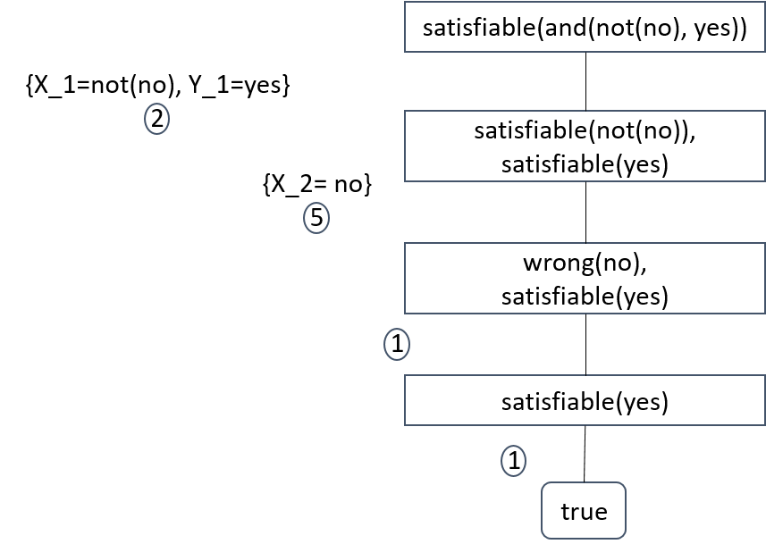

# עקרונות שפות תכנות – אביב 2021<br/>תרגול 11. תכנות לוגי – חלק א'
{::options parse_block_html="true" /}

- [0. שימוש ב-SWI פרולוג](#0-שימוש-ב-swi-פרולוג)
- [1. מבוא לתכנות הלוגי הרלציוני](#1-מבוא-לתכנות-הלוגי-הרלציוני)
- [2. סמנטיקה: אלגוריתם יוניפיקציה, עצי הוכחה](#2-סמנטיקה-אלגוריתם-יוניפיקציה-עצי-הוכחה)
	- [2.1 אלגוריתם יוניפיקציה עבור תכנות לוגי רלציוני](#21-אלגוריתם-יוניפיקציה-עבור-תכנות-לוגי-רלציוני)
	- [2.2 עצי הוכחה (הפעלת האלגוריתם answer-query)](#22-עצי-הוכחה-הפעלת-האלגוריתם-answer-query)
	- [2.3 סוגי הרקורסיה](#23-סוגי-הרקורסיה)
- [3. Logic Programming](#3-logic-programming)

**נושאים:**
1. מבוא לתכנות הלוגי הרלציוני.
2. סמנטיקה: אלגוריתם יוניפיקציה, עצי הוכחה.
3. תכנות לוגי, פנקטורים.

## 0. שימוש ב-SWI פרולוג
בחלק הזה של הקורס תשתמשו בתוכנת SWI, אינטרפרטר של שפת תכנות Prolog. תוכלו
[להוריד](http://www.swi-prolog.org/download/stable)
אותה מהרשת ולהריץ התקנה אוטומטית. לאחר הפתיחה תראו את המסך הבא:


{: .c}
שם ניתן להקליד שאילתות. כדי לטעון קובץ, ניתן להשתמש בתפריט File -> Consult. קיימת גם סביבת עבודה גרפית, אותה ניתן להוריד באתר הקורס.

עבודה בפרולוג נעשית באמצעות תוכנת read-evaluate-print בשם swi. ניתן למצוא פרטי התקנה באתר, בעמוד Software. למטרות דיבוג ניתן להשתמש בפרוצדורה `writeln`, שמקבלת פרמטר אחד – תוכן להדפסה. למשל, כדי לדעת מהו הערך של משתנה X בנקודה מסויימת בתוכנית, מוסיפים שם `writeln(X)`.

## 1. מבוא לתכנות הלוגי הרלציוני
**<u>מושגים:</u>**
1. <u>פרוצדורה</u> היא קבוצה סדורה של אקסיומות (עובדות וכללים) עם חתימה זהה, הכוללת את שם הפרדיקט ומספר הפרמטרים (arity).
1. <u>תוכנית לוגית</u> היא קבוצה לא סדורה של פרוצדורות (פרדיקטים), המגדירות יחסים בתחום ההגדרה של התוכנה.
1. האינטרפרטר של פרולוג עובד בלולאת read-eval-print. בהינתן שאילתה, הוא מנסה להוכיח אותה על סמך התוכנית:
	* אם נכשל, עונה False (או No).
	* אם הצליח, והשאילתה לא כוללת משתנים, התשובה היא True (או Yes). (למשל, בשאילתה "טעינת קובץ".)
	* אם הצליח, והשאילתה כוללת משתנים, מציג את כל ההצבות של המשתנים של השאילתה שחושבו בבניית ההוכחה.

**דוגמה 1: תזכורת.**  
נזכר תחילה בדוגמה שראינו בכיתה. נתונה תוכנית
```prolog
parent(abraham, isaac).
parent(isaac, jacob).
parent(sarah, isaac).
parent(jacob, joseph).

male(abraham).
male(isaac).
male(joseph).

female(sarah).

mother(X, Y) :- parent(X, Y), female(X).

% Signature: ancestor(Ancestor, Descendant)/2
% Purpose: Ancestor is an ancestor of Descendant.
ancestor(A,D) :- parent(A,D).                  %1
ancestor(A,D) :- parent(A,P), ancestor(P,D).   %2
```

נריץ בפרולוג את השאילתות הבאות:

```prolog
?- parent(abraham, X).
X = isaac.

?- ancestor(abraham, D)
D = isaac;
D = jacob;
D = joseph;
false
```

**דוגמה 2:**  
תוכנית למידול מעגלים לוגיים חשמליים. אנו נמדל מעגלים לוגיים באמצעות שימוש בנקודות החיבור כ"אובייקטים" (קבועים ומשתנים) בתוכנית. בתכנות לוגי מטרתנו איננה חישוב תוצאה של פונקציה, אלא בדיקת שאילתות: למשל, האם יש מעגל מסוים במערכת, ואם כן, אילו נקודות הוא כולל.


{: .c}

<u>הגדרות:</u>
1. <u>רכיב חשמלי</u> הוא התקן פרימיטיבי במערכת, שמחבר מספר נקודות. נשתמש בשני סוגי רכיבים חשמליים: נגד וטרנזיסטור.
1. <u>נקודת חיבור</u> היא נקודה שאפשר לחברה לרכיב חשמלי. ישנם שלושה סוגי נקודות חיבור: נקודת הלחמה (שמקשרת שני רכיבים), נקודת מתח ונקודת הארקה. למשל, הציור לעיל מראה נקודות הלחמה n₁,&rlm; ...,&rlm; n₅, שתי נקודות מתח ושתי נקודות הארקה.
1. <u>נגד</u> (resistor) הוא רכיב בעל שני חיבורים. הוא סימטרי, לכן אין משמעות לסדר החיבורים. בציור מודגש באליפסה נגד המחבר נקודת מתח ונקודה n₂.
1. <u>טרנזיסטור</u> הוא רכיב בעל שלושה חיבורים, כשלכל חיבור משמעות מיוחדת. אנו נתייחס לחיבורים בסדר ימין-למטה-למעלה בציור. למשל, בטרנזיסטור המוקף בעיגול, הסדר הוא ,n₂ אז ground, ובסוף n₁.
1. <u>מעגל לוגי</u> הוא חיבור של כמה רכיבים חשמליים, המממש פונקציה לוגית.

כדי למדל את הבעיה באמצעות יחסים בתכנות לוגי, נשתמש בשיטה הידועה
כ-"Components and connectors modeling". בעצם, התוכנית שאנו כותבים תייצג גרף כבסיס נתונים, ללא קשר למשמעות החשמלית של הדוגמה.

המערכת כוללת שני סוגי components: נגד וטרנזיסטור. ה-connectors הם power, ground, n1, n2, n3, n4, n5. נגד הוא component שכוללת שני connectors, ואנו מתארים אותה בתור יחס:
```prolog
resistor(End1, End2)
```

טרנזיסטור הוא component המשלב 3 connectors, כשכל אחד משחק תפקיד משלו, ואנו מתארים אותו בתור יחס:
```prolog
transistor(Gate, Source, Drain)
```

את כל התמונה ניתן להציג באמצעות תוכנית:
```prolog
% Signature: resistor(End1, End2)/2
% Purpose: resistor gate
resistor(power, n1).                %1
resistor(power, n2).                %2
resistor(n1, power).                %3
resistor(n2, power).                %4
```

מכיוון שנגד הוא יחס סימטרי, מייצגים כל נגד באמצעות שתי עובדות, אחת לכל כיוון.
```prolog
% Signature: transistor(Gate, Source, Drain)/3
% Purpose: transistor gate
transistor(n2, ground, n1).             %1
transistor(n3, n4, n2).                 %2
transistor(n5, ground, n4).             %3
```

<div class=av>
**<u>תזכורת להגדרות והסברים:</u>**
1. כל פרוצדורה מתחילה בחוזה המכיל שני חלקים: חתימה (הכוללת ***arity***) ומטרה.
1. power,&rlm; n1,&rlm; ground הם ***קבועים***. עליהם להתחיל באות קטנה.
1. resistor הוא ***שם הפרדיקט***. הוא מגדיר ***יחס*** בין שני הארגומנטים שלו. גם הוא קבוע.
1. ***נוסחה אטומית*** היא מבנה בצורה `predicate(t₁, …, tₙ)`, כאשר $$t_i$$ הוא ***term*** (קבוע או משתנה).
1. אם n=0, נוסחה ללא משתנים, לא כותבים גם את הסוגריים. שתי דוגמאות לנוסחה כזאת הן מובנות בשפה (built-in): true – תמיד מצליח, false – תמיד נכשל.
1. ***כלל*** הוא נוסחה שמגדירה יחס התלוי בתנאים מסוימים, כלומר, הכלל "$$head\;:-\;body.$$" שקול לגרירה head←body.
1. ***עובדה*** היא הגדרת יחס שנכון ללא כל תנאי. עובדה היא מקרה פרטי של כלל: כאשר הגוף תמיד נכון, הנוסחה האטומית true וסימן הגרירה -: לא נכתבים.
1. ***שאילתה*** היא סדרה של נוסחאות אטומיות.

<div class=pr>
```prolog
?- resistor(power, n1), resistor(n2, power).
true ;
false
```


{: .s1}
אין יותר תשובות
{: .s2}
</div></div>

<ol start=9><li markdown=1>
***משתנים*** מתחילים באותיות גדולות. משתנה בשם _ הינו משתנה חד פעמי (wildcard).
</li></ol>

```prolog
?- resistor(power, X).
X = n1 ;
X = n2
```

*"האם קיים X, כך שהזוג (power, X) יכול להתאים ליחס הנגד?"*
{: .ind}

נוסחה בשאילתה יכולה להצליח (אם יש לפחות הצבה אחת שמתאימה להוכחה), או להיכשל.
כל עוד קיימות אפשרויות, פרולוג עונה תשובה אחת. המשתמש יכול ללחוץ ";" כדי להמשיך לתשובה הבאה, או "Enter" כדי לסיים.  
המשתנים בשאילתה מכומתים כמשתני "קיים" (**existentially quantified**).

**מעגלים לוגיים.**

חיבור כמה רכיבים בדרך מסוימת יוצר מעגל לוגי. למשל, מעגל לוגי not:


{: .c}

<div class=av>
הוא נוצר ע"י חיבור נגד עם טרנזיסטור בדרך המצוינת בציור. הנקודה n2 היא קלט, n1 היא פלט.
מעגל לוגי מממש פונקציה בוליאנית שערכה נקבע על ידי צירופים של טרנזיסטורים, נגדים ומעגלים. אפשר לתארו כיחס בין נקודות קלט ופלט. ערך נקודת הפלט נקבע על ידי ערך נקודות הקלט, ומבנה הצירופים במעגל. כל מבנה של צירופים קובע סוג של מעגל. לכן, אפשר לתאר כל סוג של מעגל כיחס התלוי במבנה הצירופים. בפרולוג זה מתואר על ידי כללים. אנו מבחינים ביחס חדש בין קלט לפלט:

<div class=pr>
```prolog
% Signature: not_circuit(Input, Output)/2
% Purpose: logic circuit of not.
not_circuit(Input, Output) :-                                    %1
	transistor(Input, ground, Output),
	resistor(power, Output).
```


{: .s3}

{: .s4}
***גוף*** הכלל:  
"," פרושו "וגם"
{: .s5}
***ראש*** הכלל – נוסחה אטומית
{: .s6}
</div></div>

<br/>המשתנים בכלל מכומתים על ידי "לכל" (**universally quantified**) על טווח כל הכלל.

*"לכל Input ולכל Output, הזוג (Input, Output) מקיים יחס not_circuit, אם השלישייה (Input, ground, Output) מקיימת יחס טרנזיסטור והזוג (power, Output) מקיים יחס נגד."*

בציור הראשון קיים רק מעגל אחד כזה:
```prolog
?- not_circuit(X, Y).
X = n2,
Y = n1
```
מעגל לוגי nand מתואר בציור הבא (קלטים מימין, פלט משמאל).


{: .c}

אנו מבחינים ביחס חדש בין שני קלטים לפלט:

```prolog
% Signature: nand_circuit(Input1, Input2, Output)/3
% Purpose: logic circuit of nand
nand_circuit(Input1, Input2, Output) :-                %1
	transistor(Input1, X, Output),
	transistor(Input2, ground, X),
	resistor(power, Output).
```

ניתן להתייחס למשתנים המופיעים רק בגוף הכלל כמשתני "קיים" (**existentially quantified**)  
*"כל Input1, Input2 ו-Output מקיימים יחס של מעגל לוגי nand_circuit אם <u>קיים</u> X כך ש..."*  
נוכל לבדוק האם קיים יחס and במערכת:

```prolog
?- not_circuit(X, Y), nand_circuit(In1, In2, X).
X = n2,
Y = n1,
In1 = n3,
In2 = n5 ;
false
```

ניתן להריץ בתוכנת SWI סביבת דיבוג גרפי, למשל
```prolog
?- gtrace, not_circuit(X, Y), nand_circuit(In1, In2, X).
```

בסיום העבודה ניתן לכבותה באמצעות הפקודה
```prolog
?- nodebug.
```

ייתכן כי בעתיד נצטרך להריץ שאילתה כזאת שוב, על קלט אחר. לכן כדאי להפוך אותה לכלל:
```prolog
% Signature: and_circuit(Input1, Input2, Output)/3
% Purpose: logic circuit of and
and_circuit(Input1, Input2, Output) :-                   %1
	not_circuit(X, Output),
	nand_circuit(Input1, Input2, X).
```


{: .c}

## 2. סמנטיקה: אלגוריתם יוניפיקציה, עצי הוכחה
### 2.1 אלגוריתם יוניפיקציה עבור תכנות לוגי רלציוני

כדי למצוא הוכחה אפשרית לשאילתה, האלגוריתם answer-query עושה ניסיונות מרובים להפעיל כללים על יעד נבחר (goal). זה נעשה בעזרת אלגוריתם יוניפיקציה, Unify, על ראש הכלל והיעד.

**<u>הגדרות:</u>**
- ***binding*** הוא ביטוי לא מעגלי מהסוג `X=t`, כאשר X הוא משתנה, t הוא term,&rlm; t אינו כולל את X.
- ***הצבה*** (substitution) היא פונקציה מקבוצה סופית של משתנים לקבוצה סופית של ביטויים (terms). (אפשר לחשוב על הצבה כעל קבוצה סופית של bindings ללא חזרות של משתנים).
- ***הפעלה*** של הצבה על נוסחה אטומית:
```
A = not_circuit(I, I) , B = not_circuit(X, Y), s={I=X}:
A ∘ s = not_circuit(I, I) ∘ s = not_circuit(X, X)
B ∘ s = not_circuit(X, Y)
```
- ***הרכבה*** של הצבות:
```
s = {I=X} ∘ {X=Y} = {I=Y, X=Y}
```
- הצבה s נקראת ***unifier*** של נוסחאות A,&rlm; B, אם הפעלתה על שתיהן נותנת תוצאה זהה. לדוגמה:
```
s = {I=Y, X=Y}
A ∘ s = not_circuit(Y, Y)
B ∘ s = not_circuit(Y, Y)
```

אלגוריתם Unify שנלמד בהרצאה מקבל שתי נוסחאות אטומיות ומחזיר unifier כללי ביותר שלהן (mgu, most general unifier).  
במקרה הנ"ל, נקבל `s={I=Y, X=Y}`. קיימות אפשרויות נוספות, כלליות פחות, כמו `s={I=5, X=5, Y=5}`.

דוגמה נוספת:  
```
A = some(B, 3, C), B = some(A, B, D), s={A=3, B=3, C=D}.
```

יש לשים לב, שמספר הוא סמל קבוע, ואיננו מחושב כמספר. מבחינת המשמעות, 345 הוא סמל (שם) ולא מספר.

<div class=av>
### 2.2 עצי הוכחה (הפעלת האלגוריתם answer-query)
האינטרפרטר מחפש הוכחה לשאילתה נתונה באמצעות בנייה וסקירה של עץ ההוכחה, בו כל האפשרויות נלקחות בחשבון.
</div>
מבנה העץ תלוי במדיניות בחירת המטרה ובחירת הכלל. תיאור האלגוריתם מופיע בספר, כשחלקו אפשר לראות כאן:

***
<div class=l>
proof-tree:
{: .courier}
**if** *label(node)* is *?- true, . . . , true.*  
**then**
   1. Mark **node** as a **Success** node (leaf). A **success backtracking point**.
   2. *answers* := *answers* ∪ {*s₁* ○ *s₂* ○ ... ○ *sₙ*}, where *s₁*, ... , *sₙ* are the substitution labels of the path from the tree-root to *node*. Mark *node* with this substitution.

**else**
   1. **Goal selection**: *G = Gsel(label(node))*. *G ≠ true* since *Gsel* does not select a *true* goal.
   2. **Variables renaming**: Rename variables in every rule and fact of P (justified since all variables are universally quantified, i.e., bound).
   3. **Rule selection**: $$rules \mathrm{= Rsel(G,P) = (⟨R,σ⟩)_{R∈P G○σ=head(R)○σ}}$$  
   **apply-rules**(node, G, rules)

**end**
</div>
***
<div class=l>
apply-rules:
{: .courier}
**if** *empty?(rules)*  
**then output** = *node*, i.e., the tree rooted at *node*. A **failure backtracking point**.

**else** assume that the first element in *rules* is ⟨R,σ⟩.
   1. **New query construction**:  
        *new_query* = (**replace**(*label(node)*, *G*, *body(R)*)) ○ σ.  
        That is, if $$label(node) = G₁, ... ,G_n, \mathrm{n\geq1}, G = G_i$$,  
        and *body(R) = B₁, ..., Bₘ,* m≥1, then  
        *new_query* = $$(G_1, ... ,G_{i-1}, B_1, ..., B_m, G_{i+1}, ..., G_n)○σ$$.
   2. **New query expansion**:  
        **add_branch**(*node*, ⟨*σ*, *number(R)*⟩,  
        **proof-tree**(*make_node*(*new_query*))
   3. **Application of other selected rules**:  
        **apply-rules**(*node*, *G*, *tail*(*rules*))

**end**
</div>
***

**דוגמה 3**: עצי הוכחה למעגלים לוגיים.

```prolog
?- nand_circuit(In1, In2, Out).
```


כל ענף הצלחה מהווה תשובה, שמתקבלת ע"י הרכבה של כל ההצבות על המסלול המוביל אל העלה, לפי הסדר.

בעלה ההצלחה קיבלנו:
```
{In1=Input1_1, In2=Input2_1, Out=Output_1}
	∘ {Input1_1=n3, X_1=n4, Output_1=n2}
	∘ {Input2_1=n5}
= {In1=n3, In2=Input2_1, Out=n2, Input1_1=n3, X_1=n4, Output_1=n2}
	∘ {Input2_1=n5}
= {In1=n3, In2=n5, Out=n2, Input1_1=n3, X_1=n4, Output_1=n2, Input2_1=n5}
```
בוחרים רק את המשתנים שמופיעים בשאילתה:  
`{In1=n3, In2=n5, Out=n2}` היא תשובה אפשרית (ויחידה) לשאילתה.

הסבר על הצלעות היוצאות מן השורש:
1. עבור nand_circuit נעשה rename, באמצעות הוספת מספר הגדל בכל שלב:
```prolog
nand_circuit(Input1_1, Input2_1, Output_1) :-
	transistor(Input1_1, X_1, Output_1),
	transistor(Input2_1, ground, X_1),
	resistor(power, Output_1).
```
2. נעשה Unify של `nand_circuit(Input1_1, Input2_1, Output_1)` עם המטרה הנוכחית `nand_circuit(In1, In2, Out)`. התוצאה היא
```
mgu={In1=Input1_1, In2=Input2_1, Out=Output_1}
```
3. גוף הכלל אחרי ההחלפה התווסף <u>בראש</u> המטרה הנוכחית:
```prolog
transistor(Input1_1, X_1, Output1),
transistor(Input2_1, ground, X_1),
resistor(power, Output_1)
```

<div class=av>
### 2.3 סוגי הרקורסיה

**הגדרות**:
- **עץ הצלחה** הוא עץ הוכחה שיש בו לפחות מסלול הצלחה אחד.
- **עץ כישלון** הוא עץ הוכחה שכל המסלולים בו הם מסלולי כישלון.
- **עץ אינסופי** הוא עץ הוכחה שיש בו לפחות מסלולי אינסופי אחד. לדוגמה, באמצעות הכלל
</div>
```prolog
p(X) :- p(Y), q(X, Y).
```
השאילתה
```prolog
?- p(A).
```
תכנס ללולאה אינסופית כתוצאה מכלל הבחירה של סדר ה-goals בפרולוג.
- אחרת מדובר ב**עץ סופי**.
ניתן לנסות להימנע מיצירת מסלולים אינסופיים, לדוגמה:
```prolog
p(X) :- q(X, Y), p(Y).
```
המקרה הראשון נקרא "רקורסיה שמאלית". אין ליצור אותה בתוכניות פרולוג. המקרה השני נקרא "רקורסיית זנב".
לדוגמה, העץ המצויר לעיל הוא עץ סופי, עץ הצלחה, שיש בו מסלול הצלחה אחד ושני מסלולי כישלון.

**הערה**: מכיוון שלא ניתן לדעת האם כל המסלולים בעץ אינסופי הם מסלולי כישלון, לא קיים עץ כישלון אינסופי.  
**שאלה**: איך ישפיע שינוי סדר בחירת הכללים או בחירת ה-goals או הכללים על הרקורסיה הנ"ל?

**חומר השלמה**:  
**דוגמה 4**. SQL in Relational Logic Programming  
נציג את יחסי נגד וטרנזיסטור כשתי טבלאות:

|**Table name**: resistor<br/>**Schema**: End1, End2<br/>**Data**:<br/>&nbsp;&nbsp;&nbsp;&nbsp;&nbsp;&nbsp;(power, n1),<br/>&nbsp;&nbsp;&nbsp;&nbsp;&nbsp;&nbsp;(power, n2),<br/>&nbsp;&nbsp;&nbsp;&nbsp;&nbsp;&nbsp;(n1, power),<br/>&nbsp;&nbsp;&nbsp;&nbsp;&nbsp;&nbsp;(n2, power).|**Table name**: transistor<br/>**Schema**: Gate, Source, Drain<br/>**Data**:<br/>&nbsp;&nbsp;&nbsp;&nbsp;&nbsp;&nbsp;(n2, ground, n1),<br/>&nbsp;&nbsp;&nbsp;&nbsp;&nbsp;&nbsp;(n3, n4, n2),<br/>&nbsp;&nbsp;&nbsp;&nbsp;&nbsp;&nbsp;(n5, ground, n4).|
{: .l}

**<u>SQL Operations:</u>**
{: .l}
**1) Join**
{: .l}
הפעולה מאחדת שתי טבלאות על סמך עמודות משותפות.

```prolog
% Signature: res_join_trans(End1, X, Source, Drain)/4
% Purpose: join between resistor and transistor according
%          to End2 of resistor and Gate of transistor.
res_join_trans(End1, X, Source, Drain) :-            %1
	resistor(End1, X),
	transistor(X, Source, Drain).
?- res_join_trans(End1, X, Source, Drain).
End1 = power,
X = n2,
Source = ground,
Drain = n1 ;
false.
```

**2) Transitive closure of the resistor relation**
{: .l}
```prolog
% Signature: res_closure(X, Y)/2
res_closure(X, Y) :- resistor(X, Y).            %1
res_closure(X, Y) :- resistor(X, Z),            %2
                     res_closure(Z, Y).
?- res_closure(X, Y).
X = power,
Y = n1 ;
X = power,
Y = n2 ;
X = n1,
Y = power ;
X = n2,
Y = power ;
X = power,
Y = power ;
X = power,
Y = n1 ;
X = power,
Y = n2 ;
X = power,
Y = power ;
X = power,
Y = n1 ;
...
```
קיבלנו את אותן תוצאות אינספור פעמים, בגלל הסימטריות של נגד.

**3) Projection.**
{: .l}
למצוא רק חלק מהמשתנים.
```prolog
% Signature: resistor_end1(End)/1
% Purpose: Find all options of the first resistor's end.
resistor_end1(End1) :- resistor(End1, _).           %1
?- resistor_end1(End1).
End1 = power ;
End1 = power ;
End1 = n1 ;
End1 = n2.
```

**4) Selection.**
{: .l}
למצוא פתרונות כשערכו של אחד מהמשתנים כבר ידוע.

```prolog
% Signature: tr_ground_source(X1, X2, X3)/3
% Purpose: Select all transistors with ground sources.
tr_ground_source(X1, ground, X3) :-
	transistor(X1, X2, X3),
	X2 = ground.              %1
```
או, פשוט:
```prolog
tr_ground_source(X1, ground, X3) :-
	transistor (X1, ground, X3).
```
**הערה**: אופרטור שווה מתפקד כאופרטור יוניפיקציה בפרולוג.
```prolog
?- tr_ground_source(Y1, Y2, Y3).
Y1 = n2,
Y2 = ground,
Y3 = n1 ;
Y1 = n5,
Y2 = ground,
Y3 = n4.
```

## 3. Logic Programming

Relational logic programming משמש לתיאור טיפוסים אטומיים. על מנת לתאר טיפוסים מורכבים מוסיפים סימני פונקציות, הנקראים ***פנקטורים*** (functors).

**דוגמה 5**: נבנה עץ בינארי ונחפש איבר מסוים בו. נייצג קדקוד בצורה tree(Node, Left, Right). עלה הוא קדקוד ששני הענפים שלו לא קיימים (nil).
```prolog
% Signature: tree_member(Element, Tree)/ 2
% Purpose: Testing tree membership, checks if Element is
%          an element of the binary tree Tree.
tree_member(X, tree(X, _Left, _Right)).             %1
tree_member(X, tree(_Y, Left, _Right)) :-           %2
	tree_member(X, Left).
tree_member(X, tree(_Y, _Left, Right)) :-           %3
	tree_member(X, Right).
```
כאן tree_member הוא ***שם הפרדיקט***, tree הוא ***פנקטור*** המופעל על שלושה ביטויים. הם נראים זהים אך נבדלים במיקום ומטרה: פרדיקט מופיע בראש נוסחה אטומית, פנקטור הוא בנאי ערך המופיע כחלק מהנוסחה. פנקטור יכול להיות מקונן, פרדיקט לא.  
יכולנו להשתמש באותו שם בדיוק עבור שניהם, וזאת לא הייתה טעות. למשל:
```prolog
in_tree(X, in_tree(X, _Left, _Right)).
```
התפקיד של in_tree נקבע כל פעם לפי מיקומו.

א. **יוניפיקציה בתכנות הלוגי**. עקב קיום הפנקטורים האלגוריתם דורש יותר עבודה. לדוגמה, שלב אחרי שלב: Unify(A, B), כאשר
```
A = tree_member(tree(X, 10, f(X)), W)
B = tree_member(tree(Y, Y, Z), f(Z))
```
```
1. s={X=Y}                              A⚬s= tree_member(tree(Y, 10, f(Y)), W)
                                        B⚬s= tree_member(tree(Y, Y, Z), f(Z))
2. s={X=10, Y=10}                       A⚬s= tree_member(tree(10, 10, f(10)), W)
                                        B⚬s= tree_member(tree(10, 10, Z), f(Z))
3. s={X=10, Y=10, Z=f(10)}              A⚬s= tree_member(tree(10, 10, f(10)), W)
                                        B⚬s= tree_member(tree(10, 10, f(10)), f(f(10)))
4. s={X=10, Y=10, Z=f(10), W=f(f(10))}  A⚬s= tree_member(tree(10,10, f(10)), f(f(10)))
                                        B⚬s= tree_member(tree(10,10,f(10)), f(f(10)))
```
במהלך האלגוריתם יש להפעיל occurs check, לבדיקה שהקשירות אינן מעגליות, כמו בקשירה X = f(X). אם ננסה להפעיל את האלגוריתם עבור
```
A = tree_member(tree(X, Y, f(X)), X)
B = tree_member(tree(Y, Y, Z), f(Z))
```
נקבל {X=Y, Z=f(Y), Y= f(f(Y))}, וההצבה לא אפשרית.

ב. **חישובי שאילתות:**
```prolog
?- tree_member(1, tree(1, nil, nil)).
true
?- tree_member(2, tree(1, tree(2, nil, nil),
   tree(3, nil, nil))).
true.
?- tree_member(1, tree(3, 1, 3)).
false.
?- tree_member(X, tree(1, tree(2, nil, nil),
   tree(3, nil, nil))).
X=1;
X=2;
X=3;
false
```


<div class=av>
```prolog
?- tree_member(1, T).
```
<pre>
T = tree(1, _G445, _G446) ;
T = tree(<b>_G444</b>, tree(1, _G449, _G450), _G446) ;
T = tree(<b>_G444</b>, tree(_G448, tree(1, _G453, _G454), _G450), _G446) ;
...
</pre>
</div>
נקבל את התשובה התחתונה בעץ המתקבל בעזרת ההרכבה:
```
{X_1=X, _Y_1=1, _Left_1=tree(2, nil, nil), Right_1=tree(3, nil, nil)}
	∘ {X_2=3, X=3, _Left_2=nil, _Right_2=nil}
= {X_1=3, _Y_1=1, _Left_1=tree(2, nil, nil), Right_1=tree(3, nil, nil), X_2=3, X=3,
	_Left_2=nil, _Right_2=nil}
```
בוחרים את X:&rlm; {X = 3}.

להשוואה, נבדוק את הקוד התואם ב-Scheme. ניתן לראות שנצטרך כמה פרוצדורות שונות כדי לקבל פונקציונליות שקולה. למשל,
```scheme
(define tree-member?
  (lambda (x t)
    (cond ((empty? t) #f)
          ((pair? t)
           (or (eq? x (car t))
               (tree-member? x (cadr t))
               (tree-member? x (caddr t))))
               (else (eq? x t)))))
```
תטפל רק במקרה ש-x הוא משתנה ו-t נתון.

כשאנו מנסים למצוא את כל העלים שכוללים את 1, נקבל עץ הצלחה אינסופי, כשהתשובות ידועות חלקית (partially instantiated).  
ניתן לראות את פעולת ה-backtracking שבה האינטרפרטר מוצא פתרון נוסף לבן שמאלי.  
**הערה**: קיימים שני סוגי backtracking – הצלחה וכישלון. במקרה של הצלחה, האלגוריתם מגיע לעלה הצלחה וחוזר כדי להמשיך בחיפוש הוכחות נוספות. במקרה של כישלון, האלגוריתם לא יכול להמשיך הוכחה כי לא ניתן לעשות יוניפיקציה של ה-goal הנבחר עם אף ראש כלל, והאלגוריתם חוזר לחיפוש נתיבי הוכחה אחרים.

שימוש בכלל שדורש קלט מוגדר עם משתנים מצליח לפעמים ליצור את כל התשובות האפשריות. במקרה כזה אנו אומרים כי מדובר בכלל generator.  
כשאנו נזכרים בקוד של רקורסיה שמאלית
```prolog
p(X) :- p(Y), q(X, Y).
```
ניתן להבין כי p/1 למעשה הופך ל-generator, כאשר נקרא באמצעות שאילתה ללא משתנה קשור, אם כי הוא לא מצליח ליצור אפילו את התשובה הראשונה:
```prolog
? - p(A).
```
**הערה נוספת**: נשים לב לחשיבות פעולת ה-rename. אם היינו בוחרים להריץ את שאילתת ה-generator הנ"ל בצורה הבאה:
```prolog
?- tree_member(1, X).
```
מבלי לבצע rename, לא היינו יכולים לקבל אף הוכחה עקב בעיית יוניפיקציה – X היה עץ עם פנקטור tree ומספר 1 בו זמנית.

**חומר השלמה:**

**דוגמה 6.**  
בהינתן נוסחה לוגית יש לבדוק האם היא נכונה, כלומר ערכה הוא אמת או שקר. ניתן לייצג נוסחה ע"י פרימיטיביים yes, no (המיוצגות ע"י קבועים), ופעולות and, or, not (המיוצגות ע"י יחסים). נקבל רקורסיה הדדית:
```prolog
% Signature: satisfiable(Formula) / 1
% Purpose: There is a true instance
%          of the Boolean formula.
satisfiable(yes).                               %1
satisfiable(and(X, Y)) :- satisfiable(X),       %2
                          satisfiable(Y).
satisfiable(or(X, _)) :- satisfiable(X).        %3
satisfiable(or(_, Y)) :- satisfiable(Y).        %4
satisfiable(not(X)) :- wrong(X).                %5
```
```prolog
% Signature: wrong(Formula) / 1
% Purpose: There is a false instance
%          of the Boolean formula (De Morgan's laws).
wrong(no).                              %1
wrong(or(X, Y)):- wrong(X),             %2
                  wrong(Y).
wrong(and(X, _)) :- wrong(X).           %3
wrong(and(_, Y)) :- wrong(Y).           %4
wrong(not(X)) :- satisfiable(X).        %5
```


{: .c}
<link rel='stylesheet' type='text/css' href='resources/ps11/style.css' media='all'/>
