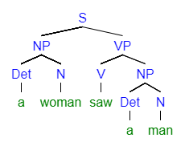
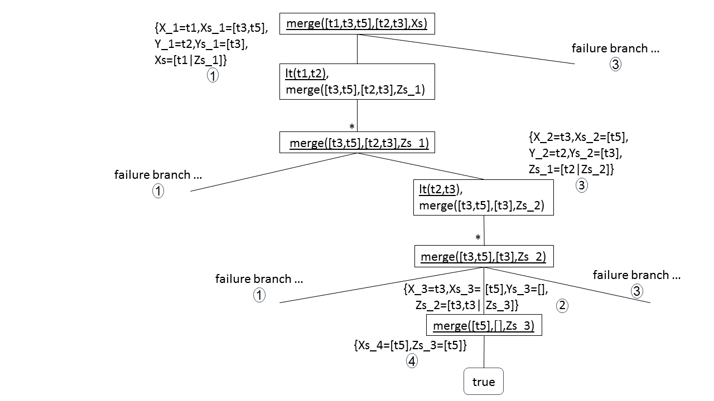

# עקרונות שפות תכנות – אביב 2021<br/>תרגול 12. תכנות לוגי – חלק ב'
{::options parse_block_html="true" /}

- [1. רשימות](#1-רשימות)
- [2. LP-interpreter – System description](#lp-interpreter--system-description)
  - [LP-AST](#lp-ast)
  - [Substitution-ADT](#substitution-adt)
  - [Term-equation-ADT](#term-equation-adt)
  - [Unify](#unify)
  - [Lazy-Tree-ADT](#lazy-tree-adt)
  - [Answer-query](#answer-query)

**נושאים:**
1. רשימות.
2. Scheme LP interpreter.

## 1. רשימות

רשימות בפרולוג: מיוצגות באמצעות functor, השקול לבנאי cons של Scheme.
1. `[]` – הוא קבוע המייצג את הרשימה הריקה.
2. `[X|Xs]` - הוא ביטוי (term) המייצג רשימה ש-X הוא האיבר הראשון שלה, ו-Xs מייצג רשימה הכוללת את שאר האיברים.
3. רשימות באורך ידוע אפשר לייצג על ידי פירוט הביטויים המייצגים את אבריהן. למשל,
`[X,2,f(Y)]` מייצג רשימה בת שלושה איברים: משתנה X, קבוע 2, וביטוי `f(Y)`.
4. הסימנים pipe ( `|` ), פסיק וסוגריים מרובעים מהווים חלק מ"toString" של הרשימות. למשל, `[a|A]` הוא "toString" של רשימה שהאיבר הראשון שלה הוא a והזנב הוא רשימת A. את הרשימה &lrm;`[3, 5]` ניתן להציג בצורת &lrm;`[3| [5| []] ]`.

**דוגמה 1**: מימוש דקדוק חסר הקשר בפרולוג. נתבונן בדקדוק הבא:
<pre>
S --> NP VP                       % Sentence
NP --> Det N                      % Noun Phrase
VP --> V NP | V                   % Verb Phrase
Det --> <i>the</i> | <i>a</i>     % Determiner
N --> <i>woman</i> | <i>man</i>   % Noun
V --> <i>saw</i>                  % Verb
</pre>
**שאלה**: מהי השפה המוגדרת על ידי דקדוק זה?

לדוגמה, נוכל לגזור את המשפט *"a woman saw the man"*:
```
S --> NP VP --> Det N VP --> a N VP --> a woman VP --> a woman V NP -->
--> a woman saw NP --> a woman saw Det N --> a woman saw the N -->
--> a woman saw the man
```
נמדל את הדקדוק באופן הבא: כל טרמינל יהפוך לקבוע, כל נון טרמינל למשתנה. רצף קטגוריות ייוצג כרשימה. כל קטגוריה הופכת לפרדיקט בן פרמטר אחד – הטקסט שניתן לגזור בקטגוריה. את הטקסט עצמו נממש באמצעות רשימה של מילים (terminals).
```prolog
s(Z) :- np(X),
        vp(Y),
        append(X,Y,Z).

np(Z) :- det(X),
         n(Y),
         append(X,Y,Z).

vp(Z) :- v(X),
         np(Y),
         append(X,Y,Z).
vp(Z) :- v(Z).

det([the]).
det([a]).

n([woman]).
n([man]).

v([saw]).
```
אנו משתמשים בפרדיקט `append/3` של פרולוג, המתאר את יחס השרשור בין שלוש רשימות – האחרונה היא השרשור של שתי הראשונות.  
כדי להשתמש בתוכנית לגזירה, ניצור שאילתה מתאימה. למשל,
```prolog
?- s([a,woman,saw,a,man]).
true
```
כאשר ניתן לייצג את התהליך באמצעות עץ הגזירה


{: .c}

"האם קיים משפט השייך לשפה של הדקדוק?":
```prolog
?- s(X).
X = [the, woman, saw, the, woman] ;
X = [the, woman, saw, the, man] ;
X = [the, woman, saw, a, woman] ;
X = [the, woman, saw, a, man] ;
X = [the, woman, saw];
...
```
כלומר, אם השאילתה כוללת רק משתנים, החישוב מתפקד כ-generator של כל התשובות האפשריות. עבור שאילתה זו יש 20 משפטים, מהם ראינו את חמשת הראשונים.
```prolog
?- s([the,man|X]).
X = [saw, the, woman] ;
X = [saw, the, man] ;
X = [saw, a, woman] ;
...
```
נניח שהדקדוק כולל מספר כללים נוספים (השינויים מודגשים בקו תחתון):
<pre>
S --> NP VP
NP --> Det N | <b><u>Det Adj N</u></b>
<u><i>Adj</i> --> <i>vicious</i> | <i>marvelous</i></u>
VP --> V NP | V
Det --> <i>the</i> | <i>a</i>
N --> <i>woman</i> | <i>man</i>
V --> <i>saw</i>
</pre>
נוסיף את הכלל והעובדות הבאים:
```prolog
np(Z) :- det(X),
         adj(W),
         n(Y),
         append([X,W,Y],Z).

adj([vicious]).
adj([marvelous]).
```
השתמשנו בפרדיקט `append/2` של פרולוג, המתאר את יחס השרשור בין רשימות. הפרמטר הראשון הוא רשימה של רשימות, והשני – רשימה שמחברת את כל הרשימות הללו, לפי הסדר.
למשל:
```prolog
alist([1, 2, 3, 4, 5]).
?- alist(L), append([[1, 2], X, Y, [5]], L).
L = [1, 2, 3, 4, 5],
X = [],
Y = [3, 4] ;
L = [1, 2, 3, 4, 5],
X = [3],
Y = [4] ;
L = [1, 2, 3, 4, 5],
X = [3, 4],
Y = [] ;
false.
```

**דוגמה 2**: השוואת שעות בשבוע.  
דוגמה זו עוסקת בהשוואת זמנים המצוינים על ידי שעה ביממה ויום בשבוע. נציג ADT (Abstract Data Type, כלומר טיפוס חדש) המייצג זמן. נבנה שלושה ערכים: שעה, יום וזמן. נשתמש בפנקטורים בתור בנאי ערך: `h(Hour)`,&rlm; `d(Weekday)`,&rlm; `time(Hour, Weekday)` בהתאם.  
לצורך ההשוואה נספק רשימות סדורות של שעות ושל ימים. יחס הקדימות בין זמנים יקבע על פי מקומם ברשימות המסודרות של הזמנים. הפרדיקטים `weekday_list`,&rlm;&nbsp; `hour_list` יתארו את הסדרים של ימי השבוע ושעות ביממה, בהתאמה.  
בתכנות הלוגי, בשונה משפות תכנות אחרות, לסמלים הדקדוקיים אין ערך. כלומר, הסמלים 2 ו-9 נקראים כשמות, ואינם קשורים למספרים 2 ו-9. מסיבה זו, אי אפשר להסתמך על יחס > בין מספרים. אילו היה מדובר ביחס סופי, אפשר היה לספק את כל העובדות עבורו (למשל, `(0,3)>`, `(0,2)>`, `(0,1)>`, אבל אנו נצטרך אינסוף עובדות בשביל כל המספרים האפשריים. לכן סדר השעות נקבע על ידי מיקומן ברשימת השעות.  
**הערה**: שפת פרולוג, בשונה מתכנות הלוגי, כוללת מרכיב א-לוגי של אריתמטיקה, המאפשר הכרה בסמלי מספרים כמספרים, ומאפשר חישובים אריתמטיים.

<table class=ll><tr><td markdown=1>
```prolog
% Type: Hour.
% Constructor: functor h/1.
% Signature: h(Hour)/1.
% Example: h(18).

% Identifier: is_hour/1
% Set of elements: hour_list/1
% Order: hour_order/2
```
</td></tr><tr><td markdown=1>
```prolog
% Signature: is_hour(Hour)/1
% Purpose: Succeeds iff Hour is an hour of weekday.
is_hour(h(H)) :- hour_list(Hour_list),
                 member(h(H),Hour_list).

% Signature: hour_list(List)/1
% Purpose: Holds the ordered list of weekday hours.
hour_list([h(0),h(1),h(2),h(3),h(4),h(5),h(6),h(7),h(8),h(9),h(10),h(11),h(12),
           h(13),h(14),h(15),h(16),h(17),h(18),h(19),h(20),h(21),h(22),h(23)]).

% Signature: hour_order(H1,H2)/2
% Purpose: hour H1 precedes the hour H2 in some weekday.
hour_order(h(H1),h(H2)) :- is_hour(h(H1)),
                           is_hour(h(H2)),
                           hour_list(Hour_list),
                           precedes(h(H1),h(H2),Hour_list).
```
</td></tr></table>

הפרדיקט `precedes` מוגדר על ידי שימוש ביחס השרשור הרב מקומי הבנוי בפרולוג:
```prolog
% Signature: precedes(A,B,List)/3
% Purpose: The element A precedes the element B in the List.
precedes(A,B,List) :- append([_,[A],_,[B],_],List).
```
הפרדיקט מזהה את כל האפשרויות על ידי unification, גם כש-A, B לא נתונים.  
אנו יכולים להוסיף גם equals?:
```prolog
equals(X, X).
```

<table class=ll><tr><td markdown=1>
```prolog
% Type: Weekday.
% Constructor: functor d/1.
% Signature: d(Weekday)/1.
% Example: d(tue).

% Identifier: is_weekday/1
% Set of elements: weekday_list/1
% Order: weekday_order/2
```
</td></tr><tr><td markdown=1>
```prolog
% Signature: is_weekday(Weekday)/1
% Purpose: Succeeds iff Weekday is a day of the week.
is_weekday(d(D)) :- weekday_list(Weekday_list),
                    member(d(D),Weekday_list).

% Signature: weekday_list(List)/1
% Purpose: Holds the ordered list of week days.
weekday_list([d(sun),d(mon),d(tue),d(wed),d(thu),d(fri),d(sat)]).

% Signature: weekday_order(Weekday1,Weekday2)/2
% Purpose: Weekday1 precedes Weekday2 in some week.
weekday_order(d(D1),d(D2)) :-
                    is_weekday(d(D1)),
                    is_weekday(d(D2)),
                    weekday_list(Weekday_list),
                    precedes(d(D1),d(D2),Weekday_list).
```
</td></tr></table>
&nbsp;
<table class=ll><tr><td markdown=1>
```prolog
% Type: Time.
% Constructor: functor time/2.
% Signature: time(Hour,Weekday)/2.
% Example: time(h(18),d(tue)).

% Identifier: is_time/1
% Order: time_order/2
```
</td></tr><tr><td markdown=1>
```prolog
% Signature: is_time(Time)/1
% Purpose: Succeeds iff Time is an hour of some weekday.
% Example: ?- is_time(time(h(1),d(sun))).
%          true
is_time(time(h(H),d(D))) :- is_hour(h(H)),
                            is_weekday(d(D)).

% Signature: time_order(T1,T2)/2
% Purpose: The time T1 precedes the time T2 in the week.
% Example: ?- time_order(time(h(5),d(mon)),
%                        time(h(1),d(tue))).
%          true
time_order(time(h(H1),d(D1)),time(h(H2),d(D2))) :-          %1
                             is_time(time(h(H1),d(D1))),
                             is_time(time(h(H2),d(D2))),
                             weekday_order(d(D1),d(D2)).
time_order(time(h(H1),d(D)),time(h(H2),d(D))) :-            %2
                             is_time(time(h(H1),d(D))),
                             is_time(time(h(H2),d(D))),
                             hour_order(h(H1),h(H2)).
```
</td></tr></table>

מימשנו שלושה טיפוסים סופיים (24, 7, 168 ערכים בהתאמה). נשתמש בממשק הזה בהמשך.

**דוגמה 3 (חומר העשרה)**: מחיקת איבר מרשימה.  
נממש פרוצדורה המגדירה את היחס של מחיקת כל ההופעות של ביטוי מרשימה. `=\` הוא פרדיקט הבנוי בפרולוג ופירושו שלילת = (המסמן unification). כלומר ערכו true אם יוניפיקציה נכשלת.
```prolog
% Signature: delete(List,X,HasNoXs)/3
% Purpose: The list HasNoXs is the result of removing all
%          occurrences of X from the List.
% Precondition: List should be bound.
% Example: ?- delete([2,3,2,4,5,2,4],2,X).
%          X = [3, 4, 5, 4]
delete([],_,[]).
delete([X|Xs],Z,[X|Ys]) :- X \= Z,
                           delete(Xs,Z,Ys).
delete([X|Xs],X,Ys) :- delete(Xs,X,Ys).
```

**דוגמה 4**. מיזוג רשימות.
נגדיר ממשק סדר של טיפוס מסוים, less than:
```prolog
% Signature: lt(Obj1,Obj2)/2
% Purpose: The object Obj1 precedes the object Obj2
%          by some comparison criteria.
```
למשל, נוכל לממש,
```prolog
lt(Time1,Time2) :- time_order(Time1,Time2).       %1
```
נשתמש בממשק לבניית פרוצדורת לקוח למיזוג רשימות ממוינות של ביטויים שקיים ביניהם יחס סדר (למשל, כאחת מפעולת ה-mergesort):
```prolog
% Signature: merge(Xs,Ys,Zs)/3
% Purpose: Zs is the sorted merge of the sorted lists Xs and
%          Ys. The assumption is that there is a predicate
%          "lt" of order between the elements of Xs and Ys.
merge([X|Xs],[Y|Ys],[X|Zs]) :- lt(X,Y),
                               merge(Xs,[Y|Ys],Zs).      %1
merge([X|Xs],[X|Ys],[X,X|Zs]) :- merge(Xs,Ys,Zs).        %2
merge([X|Xs],[Y|Ys],[Y|Zs]) :- lt(Y,X),
                               merge([X|Xs],Ys,Zs).      %3
merge(Xs,[ ],Xs).                                        %4
merge([ ],Ys,Ys).                                        %5
```
```prolog
?- merge([time(h(1),d(sun)),time(h(3),d(wed)), time(h(5),d(sat))],
         [time(h(2),d(sun)),time(h(3),d(wed))],
         Xs).
Xs = [time(h(1), d(sun)), time(h(2), d(sun)), time(h(3), d(wed)),
time(h(3), d(wed)), time(h(5), d(sat))];
false
```
```prolog
?- merge([time(h(5),d(sun)),time(h(5),d(mon))],
         X,
         [time(h(2),d(sun)),time(h(5),d(sun)), time(h(5),d(mon))]).
X = [time(h(2),d(sun))]
```
נסמן:
```
t1 = time(h(1), d(sun))
t2 = time(h(2), d(sun))
t3 = time(h(3), d(wed))
t5 = time(h(5), d(sat))
```



נבנה את התשובה מענף ההצלחה:
<pre>
{X_1=t1, Xs_1=[t3, t5], Y_1=t2, Ys_1=[t3], <b>Xs=[t1|Zs_1]</b>} º
    {X_2=t3, Xs_2=[t5], Y_2=t2, Ys_2=[t3], <b>Zs_1=[t2|Zs_2]</b>} º
    {X_3=t3, Xs_3=[t5], Ys_3=[], Zs_2=[t3, t3|Zs_3]} º
    {Xs_4=[t5], Zs_3=[t5]} <sub>/Xs</sub> =
= {X_1=t1, Xs_1=[t3, t5], Y_1=t2, Ys_1=[t3], <b>Xs=[t1|[t2|Zs_2]]</b>,
    X_2=t3, Xs_2=[t5], Y_2=t2, Ys_2=[t3], Zs_1=[t2|Zs_2]} º
    {X_3=t3, Xs_3=[t5], Ys_3=[], <b>Zs_2=[t3, t3|Zs_3]</b>} º
    {Xs_4=[t5], Zs_3=[t5]} <sub>/Xs</sub> =
= {X_1=t1, Xs_1=[t3, t5], Y_1=t2, Ys_1=[t3], <b>Xs=[t1|[t2|[t3, t3|Zs_3]]]</b>,
    X_2=t3, Xs_2=[t5], Y_2=t2, Ys_2=[t3], Zs_1=[t2|[t3, t3|Zs_3]],
    X_3=t3, Xs_3=[t5], Ys_3=[], Zs_2=[t3, t3|Zs_3]} º
    {Xs_4=[t5], <b>Zs_3=[t5]</b>} <sub>/Xs</sub> =
= {X_1=t1, Xs_1=[t3, t5], Y_1=t2, Ys_1=[t3], <b>Xs=[t1|[t2|[t3, t3|[t5]]]]</b>,
    X_2=t3, Xs_2=[t5], Y_2=t2, Ys_2=[t3], Zs_1=[t2|[t3, t3|[t5]]],
    X_3=t3, Xs_3=[t5], Ys_3=[], Zs_2=[t3, t3|[t5]], Xs_4=[t5], Zs_3=[t5]} <sub>/Xs</sub>  
= {Xs=[t1|[t2|[t3, t3|[t5]]]]}  
= {Xs=[t1, t2, t3, t3, t5]}
= {Xs=[time(h(1), d(sun)), time(h(2), d(sun)), time(h(3), d(wed)),
       time(h(3), d(wed)), time(h(5), d(sat))]}
</pre>

**דוגמה 5 (חומר העשרה)**: בחירת איבר ברשימה.  
פרוצדורה המגדירה את היחס של מחיקת הופעה אחת של ביטוי מרשימה.
```prolog
% Signature: select(X,HasXs,OneLessXs)/3
% Purpose: The list OneLessXs is the list X without
%          one occurrence of X.
select(Element, HasXs, OneLessXs) :-
              append([Prefix, [Element], Suffix], HasXs),
              append(Prefix, Suffix, OneLessXs).
```
```prolog
?- select(4,[2,3,2,4,5,2,4],X).
X = [2, 3, 2, 5, 2, 4];
X = [2, 3, 2, 4, 5, 2];
false
```
**דוגמה 6 (חומר העשרה)**: החלפת ערך בעץ.  
החלפת תוויות בעץ בינארי.


{: .c}

```prolog
% Signature: replace(From,To,TreeFrom,TreeTo)/4
% Purpose: The binary tree TreeTo is result of replacing all
%          occurrences of From in binary tree TreeFrom by To.
replace(_,_,void,void).
replace(From,To,tree(Node,Lft,Rht),
                   tree(Node1,Lft1,Rht1)) :-
    replace_help(From,To,Node,Node1),
    replace(From,To,Lft,Lft1),
    replace(From,To,Rht,Rht1).

% Signature: replace_help(From,To,NodeF,NodeT)/4
% Purpose: If (NodeF = From) then NodeT is To
%          else NodeT is NodeF).
replace_help(From,To,From,To).
replace_help(From,_,NodeF,NodeF) :- From \= NodeF.
```
```prolog
?- replace(2,4,tree(2,tree(3,void,void),tree(2,void,void)),X).
X = tree(4, tree(3, void, void), tree(4, void, void))

?- replace(b,X,tree(a,tree(b,void,void),
                      tree(c,tree(b,void,void),void)),
               tree(a,tree(c,void,void),
                      tree(c,tree(c,void,void),void))).
X = c
```
אם נרצה להציג עץ בינארי כרשימה, נעשה את השינויים הבאים:  
העץ במקום `tree(Node, Left, Right)` ייראה בתור `[Node, Left, Right]`, `void` יהפוך להיות `[]`.

אם נרצה עץ n-ארי ולא בינארי, נחליף את הקטע בקוד `(Left, Right)` ב-`Children` לרשימה של כל הילדים. נצטרך להוסיף פרוצדורה למעבר על העץ.

לסיום: בחזרה לדיבוג. יש להיות זהירים מאוד בכתיבת הקוד, כי המשתנים בתכנות לוגי לא מוגדרים בשום מקום, ושימוש במשתנה לא מוגדר לא יגרור אזהרה. למשל, כתיבת תוכנית פשוטה
```prolog
find([Elem|Rest], Elem).
find([Something|My_List], Elem) :- find (My_list, Elem)
```
יכולה לגרום לבעיות, אם לא נזהר ונפספס כי `My_List`, `My_list` הם שני משתנים שונים לגמרי. כדאי להשתמש בדיבוג (הדפסות ו-trace). במקרים שאינכם מבינים למה התוכנית לא עובדת.

<div class=l>
## 2. LP-interpreter – System description

The system consists of files (modules) in three layers: Syntax, ADTs, LP-solver.


The overall system architecture is given in the following architecture diagram.
1. Syntax: This layer includes, so far, only an abstract syntax module LP-AST, which defines a convenient interface to all syntactic elements in an LP program.
2. ADTs: The LP related ADTs are Substitution and Term-equation, which are used for implementing a unification operation in Unify. lazy-Tree-ADT is an ADT of an n-ary labeled tree (has labels on internal nodes), whose depth might be not finite. Therefore, the constructor of such trees wraps the child-branches of a node with a lambda abstraction that enables laziness: Delays the construction of child-branches until requested.
3. LP-solver: The Answer-Query module, defines the LP Gsel and Rsel, and the algorithm for proof-tree construction and search.

### LP-AST

A programs is represented as a list of the abstract representations of its procedures. Note that this list actually represents a set. For example, the program:

**Example1**:
```prolog
% Signature: append(List1, List2, List3)/3
% Purpose: List3 is the concatenation of List1 and List2.
append([], Xs, Xs).
append([X|Xs], Y, [X|Zs] ) :- append(Xs, Y, Zs).

member(X, Ys) :- append(Zs, [X|Xs], Ys).
```
Is represented as the list:
```scheme
( ((append 3) (0 ((append empty (var Xs) (var Xs))
                  true))
              (1 ((append (cons (var X) (var Xs))
                          (var Y)
                          (cons (var X) (var Zs)))
                  (append (var Xs) (var Y) (var Zs)))) )
  ((member 2) (0 ((member (var X) (var Ys))
                  (append (var Zs)
                          (cons (var X) (var Xs))
                          (var Ys)) ))) )
```
**Example2**:
```scheme
;% Signature: part(Name).
;part(a).
;part(b).
;part(c).
(define parta (make-fact '(part a)))
(define partb (make-fact '(part b)))
(define partc (make-fact '(part c)))
(define part-proc (make-procedure (list parta partb partc)))

;red(a).
;green(b).
;yellow(c).
(define reda (make-fact '(red a)))
(define red-proc (make-procedure (list reda)))
(define greenb (make-fact '(green b)))
(define green-proc (make-procedure (list greenb)))
(define yellowc (make-fact '(yellow c)))
(define yellow-proc (make-procedure (list yellowc)))

(define part-prog (make-program (list part-proc red-proc green-proc yellow-proc)))
```
**Queries**:
```scheme
; ?- part(X)
(define query-partX (make-query (list '(part (var X)))))
; ?- red(X)
(define query-redX (make-query (list '(red (var X)))))
; ?- part(X), red(X)
(define query-part-redX (make-query (list '(part (var X)) '(red (var X)))))

; ?- part(X), yellow(X)
(define query-part-yellowX
  (make-query (list '(part (var X)) '(yellow (var X)))))
```
For every syntactical category, the file includes an abstract-syntax ADT. For example, the compound-term abstract-syntax interface is:
```scheme
(define term->vars
  (lambda (term)
    (cond ((variable? term) (list term))
          ((atomic-term? term) empty)
          ((compound-term? term)
           (flatmap term->vars (compound-term->args term))))))
```
You can compare it with this equivalent Typescript code.
```typescript
import { chain } from "ramda";

interface Variable {
    tag: "Variable";
    name: string;
}

interface AtomicTerm {
    tag: "AtomicTerm";
    value: string;
}

interface CompoundTerm {
    tag: "CompoundTerm";
    functor: string;
    args: Term[];
}

type Term = Variable | AtomicTerm | CompoundTerm;

const makeVariable = (name: string): Variable =>
    ({ tag: "Variable", name: name });
const makeAtomicTerm = (value: string): AtomicTerm =>
    ({ tag: "AtomicTerm", value: value });
const makeCompoundTerm = (functor: string, args: Term[]): CompoundTerm =>
    ({ tag: "CompoundTerm", functor: functor, args: args });

const isTerm = (x: any): x is Term => isVariable(x) || isAtomicTerm(x)
|| isCompoundTerm(x);
const isVariable = (x: any): x is Variable => x.tag === "Variable";
const isAtomicTerm = (x: any): x is AtomicTerm => x.tag === "AtomicTerm";
const isCompoundTerm = (x: any): x is CompoundTerm => x.tag === "CompoundTerm";
```

we can write
```typescript
const termVars = (term: Term): Variable[] =>
    isVariable(term) ? [term] :
    isAtomicTerm(term) ? [] :
    isCompoundTerm(term) ? chain(termVars, term.args) :
    term;
```

For example,
```javascript
const term = makeCompoundTerm("time", [makeAtomicTerm("monday"),
makeVariable("X"), makeVariable("Y")]);
console.dir(termVars(term), { depth: null });
```

### Substitution-ADT

The Substitution ADT and its operations: An adaptation of the substitution-ADT module from the type inference system. The ADT consists of:  
**Constructor**: `make-sub(variables,terms)`, which also checks for circularity.  
**Getters**: `sub->variables`, `sub->terms`, `sub->get-var(sub,var)` which returns the value of `var`, if defined, or error otherwise.  
**Predicates**: `sub?`, `empty-sub?`, `non-empty-sub?`, `sub-equal?`  
**Operations**:
1. `extend-sub(sub,var,term)` which extends sub with the binding `var=term`,
2. Application of a substitution to LP terms, atomic formulas and queries:
`sub-apply(sub,term)`, `sub-apply-atomic-formula`,
`sub-apply-query`, `sub-apply-rule`
3. Restriction of a substitution: `sub-restrict(sub, vars)`
4. Substitution combination: `sub-combine(sub1,sub2)`

**Examples**:
```scheme
> (sub-combine
   (make-sub '((var T7) (var T8))
             '(Number [f (m (var T5) Number) (var T3)]))
   (make-sub '((var T5) (var T8))
             '((var T7) Boolean)))
'(sub ((var T5) (var T7) (var T8))
      ((var T7) Number (f (m (var T7) Number) (var T3))))

> (sub-apply (make-sub '((var X)) '(1))
             (make-compound-term 'f '((var X))))
'(f 1)
```

### Term-equation-ADT

The term-equation ADT and its operations: An adaptation of the equation-ADT module from the type inference system. The ADT consists of:  
**Constructor**: `make-equation(term1, term2)`.  
**Getters**: `equation->left`, `equation->right`  
**Predicates**: `equation?`

### Unify

The unification operation, for atomic formulas and for terms. This is an adaptation of the solve module from the type inference system. The unification algorithm uses the equation-solving method:
1. For atomic elements – either compares if equal, different, or can create a substitution (non-circular);
2. For compound arguments with the same predicate or functor and the same arity, creates equations from corresponding elements, and repeats unification.

**Main procedure**: `unify-formulas.`  
**Equation solvers**: `solve-equations(equation-list)`, `solve(equations, substitution)`  
**Helpers**: `unifiable-structure(equation)`, `split-equation(equation)`

Examples:
```scheme
(test (unify-formulas 'true 'true) => '(sub () ()))
(test (unify-formulas
       '(member (f (var X1)) (cons (f 2) empty))
       '(member (var X) (var L)))
      =>
      '(sub ((var L) (var X))
            ((cons (f 2) empty) (f (var X1)))))
```

### Lazy-Tree-ADT

A lazy tree is represented as a "lazy tree-list" whose head is the root-node and whose tail is a regular list of lazy-trees:

```scheme
(root (lambda () (list lzt1 lzt2 ... lztn)))
```
{: .c}

This is a lazy representation for labeled trees with finite branching, but possibly infinite depth.     
``empty-lzt`` represents the **empty lazy-tree**.  
A **leaf** is represented by: `(root (lambda () empty-lzt))`  
If n represents a node, and `lzt1...lztn` represent lazy-trees, then
```scheme
(make-lzt n
          (lambda () (list (make-lzt n1 (lambda () (make-lzt ...)))
                           (make-lzt n2 (lambda () (make-lzt ...)))
                           ............
                           (make-lzt nm (lambda () (make-lzt ...))))
            ))
```
represents the above lazy-tree. The ADT consists of:  
**Constructors**: `make-lzt`, `empty-lzt`, <b>`expand-lzt(node, node-expander)`</b>.
```scheme
(define expand-lzt
  (lambda (root node-expander)
    (let ((child-nodes (node-expander root)))
      (make-lzt root
                (lambda ()
                  (map (lambda (node)
                         (expand-lzt node node-expander))
                       child-nodes)))) ))
```
**Getters**: `lzt->root`, `leaf-data`, `lzt->branches`, `lzt->first-branch`,  
&nbsp;&nbsp;&nbsp;&nbsp;&nbsp;&nbsp;&nbsp;&nbsp;&nbsp;&nbsp;&nbsp;&nbsp;&nbsp;&nbsp;&nbsp;&nbsp;&nbsp;
`lzt->rest-branches`, `lzt->take-branches(lzt,n)`, `lzt->nth-level(lzt, n)`  
**Predicates**: `empty-lzt?`, `lzt?`, `composite-lzt?`  
**Operations**:  
There are three procedures for scanning a lazy tree:  
`lzt-filter(lzt, filterP)` – returns a list of nodes that satisfy the filter predicate; does not terminate on infinite lazy trees.
```scheme
(define lzt-filter
  (lambda (lzt filterP)
    (letrec ((collect (lambda (lzt)
                        (let ((children
                               (flatmap collect (lzt->branches lzt))))
                          (if (filterP (lzt->root lzt))
                              (cons (lzt->root lzt) children)
                              children)))))
      (if (empty-lzt? lzt)
          empty
          (collect lzt)))))
```
`lzt-find-first(lzt, filterP)` – returns the first node that satisfies the filter predicate. Might not terminate for infinite lazy trees.

`lzt-filter->lzl(lzt, filterP)` – returns a lazy list of all nodes that satisfy the filter predicate.

You can see examples of lazy tree usages in the [course site, Class material, lazy-tree-ADT-tests.rkt](https://github.com/bguppl/interpreters/blob/master/src/logic/lazy-tree-ADT-tests.rkt).

### Answer-query

This is the main module, in which the answer-query algorithm is implemented, relying on `Gsel` and `Rsel` procedures. The main procedures in this module are:
* `answer-query`, which has two variants: `answer-query-first` and
`answer-query-lzl`
* `LP-node-expander`, `expand-query`
* `Gsel`, `Rsel`

Answer-query creates a **proof tree** as a lazy tree, whose nodes are labeled by a list of: Query and a substitution. The substitution is already the combination of all substitutions on the tree branches. The nodes of the proof tree are defined as the data structure PT-node, with the getters: `PT-node->query` and `PT-node->sub`.  
The proof tree is created using the `expand-lzt` constructor of lazy trees, using the procedure `LP-node-expander`, which performs the main actions of the LP interpreter:
1. Applying `Gsel` on the query.
2. Applying `Rsel` on the selected goal.
3. Creating the new queries for the child node.
4. Creating the new combined substitutions for the child nodes.
```scheme
(define LP-node-expander
  (lambda (PT-node program)
    (let ((query (PT-node->query PT-node))
          (sub (PT-node->sub PT-node)))
      (if (success-query? query)
          empty
          (let* ((selected-goal (Gsel query))
                 (rule-subs (Rsel selected-goal program))
                 (new-queries
                  (map (lambda (rule-sub)
                         (expand-query query selected-goal rule-sub))
                       rule-subs))
                 (new-subs
                  (map (lambda (rule-sub)
                         (sub-combine sub (rule-sub->sub rule-sub)))
                       rule-subs)))
            (map make-PT-node new-queries new-subs)))) ))
```
```scheme
; Signature: expand-query(query, goal, rule-sub)
; Type: [Query * AtomicFormula * RuleSub -> Query]
; Purpose: Given a rule-sub (rule sub)
;          and a query (G1 ... Gi-1 Goal Gi+1 ... Gn)
;          where rule is ( Head <- Body )
;          and Unify(Goal, Head) = sub
;          compute [G1 ... Gi-1 Body Gi+1 ... Gn] o sub
(define expand-query
  (lambda (query goal rule-sub)
    (let ((prefix-suffix
                     (split-list (query->goals query) goal)))
       (sub-apply-query
(rule-sub->sub rule-sub)
            (make-query
  (append (car prefix-suffix)
                      (rule->body (rule-sub->rule rule-sub))
                      (cdr prefix-suffix)))))))
```
</div>
<link rel='stylesheet' type='text/css' href='resources/ps12/style.css' media='all'/>
