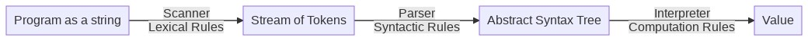

# Concrete and Abstract Syntax

## Practical Session - Week 4 PPL@BGU


In this session, we review:
* Syntax: Concrete vs Abstract
* Parsing S-Exp (Symbol Expressions) into Scheme expressions (add syntactic description for cond expressions)
* Rewriting ASTs to derive one syntactic construct into another (if into cond)
* Parsing a stream of Tokens into S-Exp

## Syntax: Concrete vs Abstract

Programming languages have two aspects of syntax: concrete and abstract. While the concrete syntax is part of the definition of the language, the abstract syntax is part of the definition of a particular implementation of a language (interpreter or compiler).

**Concrete Syntax**

The concrete syntax a programming language consists of a set of rules that determine how programs look like to the programmer. That is, it is intended to be read by humans. The rules are specified formally using a Backus-Naur Form (BNF) and include language keywords, delimiters, parentheses, etc.

The formal specification includes two types of rules:

* Lexical rules: determine how to tokenize sequences of characters into significant language tokens. The program which performs this operation is called scanner.
* Syntactic rules: determine how to combine tokens into hierarchical structures which form language expressions. This work is done by a parser.

**Abstract Syntax**

The abstract syntax of a programming language defines how programs look like to the interpreter or compiler. Abstract syntax defines a data type. The values of this data type are called abstract syntax trees (AST). These values are used to represent expressions so that they can be easily processed by meta-programs (interpreter or compiler).

Abstract syntax defines:

* Alternative kinds for expression categories (e.g., kinds of if-expressions),
* The components of composite elements (as well as the role, the category, and cardinality of each component).

## Formal definition

To define formally the syntax of Scheme, we adopt the notation below. This notation combines both the concrete syntax syntactic rules as BNF notation and for each rule, the corresponding abstract syntax type.

```scheme
;; <program> ::= (L1 <exp>+) // program(exps:List(exp))
;; <exp> ::= <define-exp> | <cexp>
;; <define-exp> ::= (define <var-decl> <cexp>) // def-exp(var:var-decl, val:cexp)
;; <cexp> ::= <num-exp> // num-exp(val:Number)
;;        | <bool-exp>  // bool-exp(val:Boolean)
;;        | <prim-op>   // prim-op(op:string)
;;        | <var-ref>   // var-ref(var:string)
;;        | (<cexp> <cexp>*) // app-exp(rator:cexp, rands:List(cexp))
;; <prim-op> ::= + | - | * | / | < | > | = | not
;; <num-exp> ::= a number token
;; <bool-exp> ::= #t | #f
;; <var-ref> ::= an identifier token
;; <var-decl> ::= an identifier token // var-decl(var:string)
```

The following diagram illustrates the steps through which a program is processed until it is evaluated by an interpreter. We focus in this session on Scanning and Parsing.





# Parsing a program string into S-Exp


Since Scheme is a language that is based on a general structure called the S-Expression (in short [S-exp](https://en.wikipedia.org/wiki/S-expression)), we will take a "shortcut" approach to transform our program as string to significant hierarchical structures.
This work will be done by an existing Node parser for S-Exp. Make sure you install it in your parser folder by running the command `npm install s-expression --save`.

Because the function "s-expression" exposes can return an error for incorrect inputs (such as `"(+ 1"`), we wrap s-expression's function in a function that returns a `Result<Sexp>` (more on `Result<T>` later).

For example

```typescript
import { parse as parseSexp } from "../shared/parser";
 
parseSexp("1"); // { tag: 'Ok', value: '1' }
parseSexp("(1 2)"); // { tag: 'Ok', value: [ '1', '2' ] }
parseSexp("(+ 1 (* 2 3))"); // { tag: 'Ok', value: [ '+', '1', [ '*', '2', '3' ] ] }
parseSexp("(define x 5)"); // { tag: 'Ok', value: [ 'define', 'x', '5' ] }
```

Therefore, the scanner in our course is not implemented by us, but by this ready-to-import Node module. This is possible since the language's concrete syntax is fairly simple, and thus S-Exps provide a sound basis.

The BNF of S-Exps is the following:

```scheme
;; <S-exp> ::= <AtomicSexp> | <CompoundSexp>              // Sexp
;; <AtomicSexp> ::= <number> | <boolean> | <string>       // Token
;; <CompoundSexp> ::= '(' <S-exp>* ')                     // CompoundSexp
```

The TypeScript type definition returned by the S-Exp parser was presented in lectures:

```typescript
declare module 's-expression' {
    export type SexpString = String;
    export type Token = string | SexpString;
    export type CompoundSexp = Sexp[];
    export type Sexp = Token | CompoundSexp;
 
    /*
        The types returned by the parser are:
        string - for any token which is not a string,
                 according to the tokenization rules of S-expressions.
        SexpString - for tokens of the form "..."
        Sexp[] - for S-expressions that contain sub-expressions
                 (of the form "(<s-expr1> ... <s-exprn>)")
    */
    export default function parse(x: string): Sexp;
}
```


## Parsing S-Exp into ASTs

We implement a parser in TypeScript that takes the output of the S-Exp parser and transforms it into ASTs of our language, as defined in the BNF above.
For example:

```typescript
bind(parseSexp("1"), parseL1Exp);
// Output: 
{ tag: 'Ok', value: { tag: 'NumExp', val: 1 } }
```

```typescript
bind(parseSexp("#t"), parseL1Exp);
// Output:
{ tag: 'Ok', value: { tag: 'BoolExp', val: true } }
```

```typescript
bind(parseSexp("(define x 1)"), parseL1Exp);
// Output:
{ tag: 'Ok',
  value: { tag: 'DefineExp',
           var: { tag: 'VarDecl', var: 'x' },
           val: { tag: 'NumExp', val: 1 } } }
```

```typescript
bind(parseSexp("(> x 1)"), parseL1Exp);
// Output:
{ tag: 'Ok',
  value: { tag: 'AppExp',
           rator: { tag: 'PrimOp', op: '>' },
           rands: [ { tag: 'VarRef', var: 'x' }, { tag: 'NumExp', val: 1 } ] } }
```

```typescript
// More examples - write the JSON values you expect to be returned by the parser:
bind(parseSexp("(> (+ x x) (* x x))"), parseL1Exp);
 
bind(parseSexp("(L1 (define x 1) (> (+ x 1) (* x x)))"), parseL1Exp);
```

* Notice how parsing S-Exps into ASTs removes details from the concrete syntax.
* The result ASTs are data values that can be easily processed by the interpreter.
* Parsing into AST is a step performed for all programming languages. This online tool helps you explore the ASTs of many languages: [astexplorer.net](https://astexplorer.net). Note how these ASTs are often complex, because these languages (JavaScript, SQL etc) have a more complex syntax than Scheme.


## Implementing ASTs in TypeScript for Scheme

ASTs are types that follow the Disjoint Union Types pattern. We implement such types in TypeScript using tagged maps and unions. Similarly, in Java, we would implement ASTs by defining a new class. This class would includes a constructor and all relevant procedures and would allow us to conveniently manipulate data values of the type we introduced.

In TypeScript, we can introduce Disjoint Union data types according to the following recipe:

* A constructor function named make and which takes as parameters each of the component values of the compound type
* A type predicate function named is.

**For example:**
```typescript
export interface NumExp {tag:"NumExp", val:number}; // The Num-Expression type
export const makeNumExp = (n: number):NumExp => ({tag:"NumExp", val:n}); // The value constructor for Num-Expression
export const isNumExp = (x:any): x is NumExp => x.tag === 'NumExp'; // The type predicate function of Num-Expression
```

**Remarks:**

* Notice the keyword export which allows the interface/function to be imported into other modules where it is needed (by using the keyword import) such as the interpreter.
* Notice as well the type expression x is NumExp which is Boolean. This type expression implies that the function isNumExp is actually a type predicate. Due to these kinds of type expressions that yield type predicates the type checker can do precise inference. As an example:

```typescript
describe("L1 Parsing", () => {
  it("parses AppExps correctly", () => {
    const result = bind(parseSexp("(> 1 2)"), parseL1CExp);
    if (isOkT(isAppExp)(result)) {
      // With the type predicate isAppExp, the type checker infers
      // that in this scope "result.value" is exactly of type AppExp
      // so it is safe to access properties that only exist on AppExp
      expect(result.value.rator).to.deep.equal(makePrimOp(">"));
    }
  });
});
```

The type of `result` at line 3 is the type of the return value of `parseL1CExp` which is `Result<NumExp | BoolExp | PrimOp | VarRef | AppExp>`. However, because `isAppExp` is a type predicate with return type `x is AppExp`, the type checker infers that `result.value` inside the scope of line 8 is exactly of the type `AppExp` and not the disjunction type `NumExp | BoolExp | PrimOp | VarRef | AppExp`.


A disjoint union type construct has the following shape: `type CExp = NumExp | BoolExp | PrimOp | VarRef | AppExp;` which is a union of disjoint types. Each disjoint type is defined as a tagged map. We use the convention of using the key "tag" to enforce the disjointness of these types. Any other key could be used, but we use this one consistently to express our intention of defining disjoint types. There is a constructor function for each disjoint type, but none for the union type. In this sense, we understand that the union type is a sort of abstract type over the disjoint types.


C-Exp (short for constituent expression – expression classes that can be part of a bigger one), has the following BNF:

```typescript
<cexp> ::= <num-exp> // num-exp(val:Number)
       | <bool-exp>  // bool-exp(val:Boolean)
       | <prim-op>   // prim-op(op:string)
       | <var-ref>   // var-ref(var:string)
       | (<cexp> <cexp>*) // app-exp(rator:cexp, rands:List(cexp))
```

**Question**: why are `define` expressions not considered constituent?

**Answer**: if they were constituent, they would appear in the `cexp` BNF, which means that they may be nested, but we disallow nesting of `define` expressions in our course. Define can only appear at the top level of programs.


A union type is abstract - which means it has no constructor (there are no values of type Exp - Exp is the union of concrete types). It still has a type predicate - which simply tests that a value belongs to one of the disjoint types:

```typescript
export const isExp = (x: any): x is Exp => isDefineExp(x) || isCExp(x);
export const isCExp = (x: any): x is CExp => isNumExp(x) || isBoolExp(x) || isPrimOp(x) ||
isVarRef(x) || isAppExp(x);
```


## Implementing the Parser

The following set of functions implement the parser.
 Parsing (which includes using the "shortcut" scanner) a program starts by a call to the function `parseL1` by giving it our program as string. For example, by calling `parseL1("(L1 (define x 5) (+ x 6))")`. Note that there are a few helpful functions we have omitted here, such as `isEmpty,isArray,isString`.

```typescript
import { Sexp, Token } from "s-expression";
import { parse as parseSexp, isToken, isCompoundSexp } from "../shared/parser";
import { all, find } from 'ramda';
import { format } from '../shared/format';

// combine Sexp parsing with the L1 parsing
export const parseL1 = (x: string): Result<Program> =>
    bind(parseSexp(x), parseL1Program);

// L1 concrete syntax
// <Program> -> (L1 <Exp>+)
// <Exp> -> <DefineExp> | <CExp>
// <DefineExp> -> (define <varDecl> <CExp>)
// <CExp> -> <AtomicExp> | <AppExp>
// <AtomicExp> -> <number> | <boolean> | <primOp>
// <AppExp> -> (<CExp>+)

// <Program> -> (L1 <Exp>+)
export const parseL1Program = (sexp: Sexp): Result<Program> =>
    sexp === "" || isEmpty(sexp) ? makeFailure("Unexpected empty program") :
    isToken(sexp) ? makeFailure(`Program cannot be a single token: ${sexp}`) :
    isCompoundSexp(sexp) ? 
        isNonEmptyList<Sexp>(sexp) ? parseL1GoodProgram(first(sexp), rest(sexp)) : 
        makeFailure(`Program cannot be a list of a single token: ${sexp}`) :
    sexp;

const parseL1GoodProgram = (keyword: Sexp, body: Sexp[]): Result<Program> =>
    keyword === "L1" && !isEmpty(body) ? mapv(mapResult(parseL1Exp, body), (exps: Exp[]) => 
                                              makeProgram(exps)) :
    makeFailure(`Program must be of the form (L1 <exp>+): ${format(keyword)}`);

// Exp -> <DefineExp> | <Cexp>
// <Sexp> = <CompoundSexp> | <Token>
export const parseL1Exp = (sexp: Sexp): Result<Exp> =>
    isEmpty(sexp) ? makeFailure("Exp cannot be an empty list") :
    isCompoundSexp(sexp) ? 
        isNonEmptyList<Sexp>(sexp) ? parseL1CompoundExp(first(sexp), rest(sexp)) :
        makeFailure(`Exp cannot be a list of single token: ${sexp}`) :
    isToken(sexp) ? parseL1Atomic(sexp) :
    sexp;
    
// Compound -> DefineExp | CompoundCExp
export const parseL1CompoundExp = (op: Sexp, params: Sexp[]): Result<Exp> => 
    op === "define"? parseDefine(params) :
    parseL1CompoundCExp(op, params);

// CompoundCExp -> AppExp
export const parseL1CompoundCExp = (op: Sexp, params: Sexp[]): Result<CExp> =>
    parseAppExp(op, params);

// DefineExp -> (define <varDecl> <CExp>)
export const parseDefine = (params: List<Sexp>): Result<DefineExp> =>
    isNonEmptyList<Sexp>(params) ?
        isEmpty(rest(params)) ? makeFailure(`define missing 1 arguments: ${format(params)}`) :
        (params.length > 2) ? makeFailure(`define has too many arguments: ${format(params)}`) :
        parseGoodDefine(first(params), second(params)) :
    makeFailure(`define missing 2 arguments: ${format(params)}`);

const parseGoodDefine = (variable: Sexp, val: Sexp): Result<DefineExp> =>
    ! isIdentifier(variable) ? makeFailure(`First arg of define must be an identifier: ${format(variable)}`) :
    mapv(parseL1CExp(val), (value: CExp) => 
         makeDefineExp(makeVarDecl(variable), value));

// CExp -> AtomicExp | CompondCExp
export const parseL1CExp = (sexp: Sexp): Result<CExp> =>
    isCompoundSexp(sexp) ?
        isNonEmptyList<Sexp>(sexp) ? parseL1CompoundCExp(first(sexp), rest(sexp)) :
        makeFailure(`L1CExp cannot be an empty list`) :
    isToken(sexp) ? parseL1Atomic(sexp) :
    sexp;

// Atomic -> number | boolean | primitiveOp
export const parseL1Atomic = (token: Token): Result<CExp> =>
    token === "#t" ? makeOk(makeBoolExp(true)) :
    token === "#f" ? makeOk(makeBoolExp(false)) :
    isString(token) && isNumericString(token) ? makeOk(makeNumExp(+token)) :
    isString(token) && isPrimitiveOp(token) ? makeOk(makePrimOp(token)) :
    isString(token) ? makeOk(makeVarRef(token)) :
    makeFailure(`Invalid atomic token: ${token}`);

export const isPrimitiveOp = (x: string): boolean =>
    ["+", "-", "*", "/", ">", "<", "=", "not"].includes(x)

// AppExp -> ( <cexp>+ )
export const parseAppExp = (op: Sexp, params: Sexp[]): Result<CExp> =>
    bind(parseL1CExp(op), (rator: CExp) =>
         mapv(mapResult(parseL1CExp, params), (rands: CExp[]) =>
              makeAppExp(rator, rands)));
```

## Using the Result Type for Error Processing

 The parser can result either a "good value" or an error when the input string does not belong to the language specified by the concrete syntax. To ease error handling, we use the `Result<T>` monad introduced in Assignment 1. A result is a disjoint union between an OK type `Ok<T>` and the Failure type which is returned in case of errors.

The benefit of using Result systematically in the code is that it allows us to write code mainly as the "happy path" – only write what happens when there are no errors. When functions return Result values, they can be composed using the `bind` operator - for example:

```typescript
bind(mapResult(parseL1Exp, body),
     (exps: Exp[]) => makeOk(makeProgram(exps)))
```

Without error handling, this code would be written as a simple composition:

```typescript
// Types: body: Sexp[];
//        parseL1Exp: Sexp => Exp
//        makeProgram: Exp[] => Program
makeProgram(map(parseL1Exp, body))
```

In this call, `parseL1Exp` can return either an Exp or a Failure for each element - hence it would be unsafe to write this simple composition. For simple functions, we test for errors and return a Failure value or else return an ok value - for example:

```typescript
// Atomic -> number | boolean | primitiveOp
export const parseL1Atomic = (token: Token): Result<CExp> =>
    token === "#t" ? makeOk(makeBoolExp(true)) :
    ...
    makeFailure("Invalid atomic token: " + token);
```

To compose functions that return a Result, we use the following Result-helper functions:

* `bind`
* `mapResult`

```typescript
// Instead of f2(f1(x)) - we write:
bind( <f1 returns a Result<T>>, 
      (y: T) => <f2 receives the result of f1 if it is ok> );
```

bind is used to chain calls of functions that return Result.

* Note that the order in which the functions appear in a bind is the order in which the functions are executed (`f1` then `f2`) - and not as in `f2(f1(x))` where the order is reversed (`f2` then `f1`).
* The second function in the chain receives a `T` parameter and not a `Result<T>` parameter - because it is only invoked when the call to `f1(x)` succeeds. When the call to `f1(x)` fails, `f2` is not invoked.

`mapResult` is used to apply a function that returns a `Result<T>` to an array of `T` values (`T[]`):

```typescript
mapResult(f:(x: T1) => Result<T2>, arr: T1[]) => Result<T2[]>
```

It is used exactly like the traditional `map` function, but if `f` fails on any one of the items in `arr`, then the function fails and returns the first Failure value - else it returns a `Result<T2[]>` (and not an array of Result values).


## Supporting `if` expressions

Recall that `if` expressions have the form `(if <test> <then> <else>)`. We would like our parser to support these expressions.

## Adding if to the concrete and abstract syntax

In order to add if in the concrete and abstract syntax, we must modify the syntactic rules we presented earlier as a BNF notation.

**Note:** Our modification of the concrete will determine how a if expression will look like to the programmer. This requires placing punctuation. Our modification of the abstract syntax will determine how the parser will transform if expressions into ASTs. The modified concrete and abstract syntax follows:

```typescript
<cexp> ::= <num-exp>               // num-exp(val:Number)
       | <bool-exp>                // bool-exp(val:Boolean)
       | <prim-op>                 // prim-op(op:string)
       | <var-ref>                 // var-ref(var:string)
       | (if <cexp> <cexp> <cexp>) // if-exp(test:cexp, then:cexp, else:cexp)
       | (<cexp> <cexp>*)          // app-exp(rator:cexp, rands:List(cexp))
```

## Modifying the parser to support *if* expressions


**Step-1**: We add a new type definition for if ASTs

```typescript
// Type definitions
export interface IfExp { tag: "IfExp"; test:CExp; then: CExp; alt: CExp; };
// Value constructors
export const makeIfExp = (test: CExp, then: CExp, alt: CExp): IfExp =>
    ({ tag: "IfExp", test: test, then: then, alt: alt }); 
// Type predicates:
export const isIfExp = (x: any): x is IfExp => x.tag === "IfExp";
```

**Step-2**: Update the cexp disjoint union type

```typescript
export type CExp = NumExp | BoolExp | PrimOp | VarRef | IfExp | AppExp;
export const isCExp = (x: any): x is CExp => isNumExp(x) || isBoolExp(x) || isPrimOp(x) ||
    isVarRef(x) || isIfExp(x) ||  isAppExp(x);
```

**Step-3**: Modify the relevant functions

```typescript
// CompoundCExp -> IfExp | AppExp
export const parseL1CompoundCExp = (op: Sexp, params: Sexp[]): Result<CExp> =>
    op === "if" ? parseIfExp(params) :
    parseAppExp(op, params);
 
// IfExp -> (if <CExp> <CExp> <CExp>)
export const parseIfExp = (params: Sexp[]): Result<IfExp> =>
    params.length !== 3 ? makeFailure("Incorrect number of expressions in if") :
    bind(mapResult(parseL1CExp, params),
         (cexps: CExp[]) => makeOk(makeIfExp(cexps[0], cexps[1], cexps[2])));
```

**Example:**

```typescript
// Scanning and reading (ie string -> S-Exp)
parseSexp("(if (= x 5) #t (* x x))");
// Output:
{ tag: 'Ok', value: [ 'if', [ '=', 'x', '5' ], '#t', [ '*', 'x', 'x' ] ] }
```

```typescript
// Parsing into AST:
const myIfExp = bind(parseSexp("(if (= x 5) #t (* x x))"), parseL1Exp);
console.log(JSON.stringify(myIfExp, null, 2))
// Output:
{
  "tag": "Ok",
  "value": {
    "tag": "IfExp",
    "test": {
      "tag": "AppExp",
      "rator": {
        "tag": "PrimOp",
        "op": "="
      },
      "rands": [
        {
          "tag": "VarRef",
          "var": "x"
        },
        {
          "tag": "NumExp",
          "val": 5
        }
      ]
    },
    "then": {
      "tag": "BoolExp",
      "val": true
    },
    "alt": {
      "tag": "AppExp",
      "rator": {
        "tag": "PrimOp",
        "op": "*"
      },
      "rands": [
        {
          "tag": "VarRef",
          "var": "x"
        },
        {
          "tag": "VarRef",
          "var": "x"
        }
      ]
    }
  }
}
```


## Supporting `cond` expressions

* We want our parser to support cond expressions.
* A cond expression is of the form `(<cond> (<cond-clause> ...))`
* Where each is either of the form `(<test> <then>)` or `(else <then>)`

**For example:**

```typescript
(define fib (lambda (n)
               (cond ((= n 0) 0)
                     ((= n 1) 1)
                     (else (+ (fib (- n 1)) 
                              (fib (- n 2)))))))
```

Pay attention! `cond` is a "special form": it is a compound expression which is not evaluated like regular (application) compound expressions.


## Computation Rule for `(cond (cond-clause …))`

1. Compute the expression in the first
2. If the value is not `#f`, compute the expression
3. Otherwise, continue with the next expression
4. If all expressions evaluate to `#f`, return the value of the last expression (the "else clause").


## Adding cond in the concrete and abstract syntax

```typescript
<cexp> ::= <num-exp>                // num-exp(val:Number)
       | <bool-exp>                 // bool-exp(val:Boolean)
       | <prim-op>                  // prim-op(op:string)
       | <var-ref>                  // var-ref(var:string)
       | (if <cexp> <cexp> <cexp>)  // if-exp(test:cexp, then:cexp, else:cexp)
       | (cond <cond-clauses>*)     // cond-exp(cond-clauses:List(cond-clause))
       | (<cexp> <cexp>*)           // app-exp(rator:cexp, rands:List(cexp))
<cond-clause> ::= (<cexp> <cexp>+)  // cond-clause(test:cexp, then:List(cexp))
                  |  (else <cexp>+ )
```


## Modifying the parser to support cond expressions

**Step-1**: We add a new type definition for cond ASTs

```typescript
// Type definitions
export interface CondClause { tag: "CondClause", test: CExp, then: CExp[]; }
export interface CondExp { tag: "CondExp", condclauses: CondClause[]; }
// Value constructors
export const makeCondClause = (test: CExp, then: CExp[]) : CondClause =>
    ({ tag: "CondClause", test: test, then: then });
export const makeCondExp = (condclauses: CondClause[]) : CondExp =>
    ({ tag: "CondExp", condclauses: condclauses });
// Type predicates:
export const isCondClause = (x:any): x is CondClause => x.tag === "CondClause";
export const isCondExp = (x:any): x is CondExp => x.tag === "CondExp";
```

**Step-2**: Update the cexp disjoint union type

```typescript
export type CExp = NumExp | BoolExp | PrimOp | VarRef | IfExp | CondExp | AppExp;
export const isCExp = (x: any): x is CExp => isNumExp(x) || isBoolExp(x) || isPrimOp(x) ||
    isVarRef(x) || isIfExp(x) || isCondExp(x) || isAppExp(x);
```

**Step-3**: Modify the relevant functions

```typescript
// CompoundCExp -> IfExp | CondExp | AppExp
export const parseL1CompoundCExp = (op: Sexp, params: Sexp[]): Result<CExp> =>
    op === "if" ? parseIf(params) :
    op === "cond" ? parseCond(params) :
    parseAppExp(op, params);
 
// CondExp -> (cond (<CExp> <CExp>+)+)
export const parseCondExp = (params: Sexp[]): Result<CondExp> => {
    if (!allT(isCompoundSexp, params)) {
        return makeFailure("Invalid cond clauses");
    } else {
        const clausesResult = mapResult((clause: Sexp[]) =>
            safe2((test: CExp, then: CExp[]) => makeOk(makeCondClause(test, then)))
                 (parseL1CExp(first(clause)), mapResult(parseL1CExp, rest(clause))), params);
        return bind(clausesResult, (clauses: CondClause[]) => makeOk(makeCondExp(clauses)));
    }
}
```

**Example:**

```typescript
// Scanning and reading (ie string -> S-Exp)
parseSexp("(cond (1 1) (else 3))");
// Output:
{ tag: 'Ok', value: [ 'cond', [ '1', '1' ], [ 'else', '3' ] ] }
```

```typescript
const myCondExp = bind(parseSexp("(cond (1 1) (else 3))"), parseL1Exp);
console.log(JSON.stringify(myCondExp, null, 2))
 
// Output:
{
  "tag": "Ok",
  "value": {
    "tag": "CondExp",
    "condClauses": [
      {
        "tag": "CondClause",
        "test": {
          "tag": "NumExp",
          "val": 1
        },
        "then": [
          {
            "tag": "NumExp",
            "val": 1
          }
        ]
      },
      {
        "tag": "CondClause",
        "test": {
          "tag": "VarRef",
          "var": "else"
        },
        "then": [
          {
            "tag": "NumExp",
            "val": 3
          }
        ]
      }
    ]
  }
}
```


## Remarks:

1. Note how the parser referred to `else` as a VarRef. This would raise an error when the interpreter processes the AST, as it will look for the value bound to `else`.
2. The "else-clause" should only occur as last clause in a cond expression. One way to enforce this is to change the syntax from:

```typescript
;; ( cond <cond-clause>* )                 / cond-exp(cond-clauses:List(cond-clause))
```

to: 

```typescript
;; ( cond <cond-clause>* <else-clause>? )  / cond-exp(cond-clauses:List(cond-clause))
```

This means that cexps can now include the token 'else`, which should be addressed by the parser. The question is: what is the corresponding AST that the parser should generate?

1. We could leave abstract syntax as `List(cond-clauses)`, and parse an else-clause to #t.
2. Or, we could change the abstract syntax to `cond-clauses:List(cond-clause), else-clause: else-clause` and leave handling else-clause to the interpreter.

The first option is preferable as it keeps the interpreter more simple.


## Rewriting If-exp ASTs into Cond-exp ASTs


If we consider the evaluation rule of if-exp ASTs and that of cond-exp ASTs, we observe that they could be reduced to equivalent forms. We could either rewrite if-exp into cond-exp or vice-versa.

When we apply such syntactic reduction (one form into another), we reduce the complexity of the operational semantics - since we only need to provide one evaluation rule for the two syntactic forms.

Let us illustrate how we map ASTs that contain if-exps into semantically equivalent ASTs that contain only cond-exp.

The basic rewriting step is to convert:

```typescript
(if <test> <then> <else>)
```

into: 

```typescript
(cond (<test> <then>)
      (else <else>))
```

```typescript
// Rewrite a single if expression as a semantically equivalent
// cond-exp form
const rewriteIf = (exp: IfExp): CondExp =>
    makeCondExp([
        makeCondClause(exp.test, [exp.then]),
        makeCondClause(makeBoolExp(true), [exp.alt])
    ]);
```

Example:

```typescript
let myIfExp = bind(parseSexp("(if 1 2 3)"), parseL1Exp);
if (isOkT(isIfExp)(myIfExp)) {
    console.log(JSON.stringify(bind(myIfExp, exp => makeOk(rewriteIf(exp))), null, 2));
}
 
// Output:
{
  "tag": "Ok",
  "value": {
    "tag": "CondExp",
    "condClauses": [
      {
        "tag": "CondClause",
        "test": {
          "tag": "NumExp",
          "val": 1
        },
        "then": [
          {
            "tag": "NumExp",
            "val": 2
          }
        ]
      },
      {
        "tag": "CondClause",
        "test": {
          "tag": "BoolExp",
          "val": true
        },
        "then": [
          {
            "tag": "NumExp",
            "val": 3
          }
        ]
      }
    ]
  }
}
```

We then need to make sure we transform all if-exp nodes in an AST wherever they occur. So we must rewrite all `if` expressions wherever the language permits their appearance.

```typescript
const rewriteAllIf = (e: CExp): CExp =>
    isBoolExp(e) ? e :
    isNumExp(e) ? e :
    isPrimOp(e) ? e :
    isVarRef(e) ? e :
    isVarDecl(e) ? e :
    isIfExp(e) ?  rewriteIf(makeIfExp(rewriteAllIf(e.test),
                                      rewriteAllIf(e.then),
                                      rewriteAllIf(e.alt))) :
    isCondExp(e) ? makeCondExp(
        map(clause => makeCondClause(rewriteAllIf(clause.test),
                                     map(rewriteAllIf, clause.then)),
            e.condClauses)) :
    isAppExp(e) ? makeAppExp(rewriteAllIf(e.rator), map(rewriteAllIf, e.rands)) :
    e;
```

Example:

```typescript
const rewrittenIf = bind(
  bind(parseSexp("(if (= 3 2) 5 (if (= 3 3) 12 27))"), parseL1CExp),
  exp => makeOk(rewriteAllIf(exp))
);
console.log(JSON.stringify(rewrittenResult, null, 2));
 
// Output:
{
  "tag": "Ok",
  "value": {
    "tag": "CondExp",
    "condClauses": [
      {
        "tag": "CondClause",
        "test": {
          "tag": "AppExp",
          "rator": {
            "tag": "PrimOp",
            "op": "="
          },
          "rands": [
            {
              "tag": "NumExp",
              "val": 3
            },
            {
              "tag": "NumExp",
              "val": 2
            }
          ]
        },
        "then": [
          {
            "tag": "NumExp",
            "val": 5
          }
        ]
      },
      {
        "tag": "CondClause",
        "test": {
          "tag": "BoolExp",
          "val": true
        },
        "then": [
          {
            "tag": "CondExp",
            "condClauses": [
              {
                "tag": "CondClause",
                "test": {
                  "tag": "AppExp",
                  "rator": {
                    "tag": "PrimOp",
                    "op": "="
                  },
                  "rands": [
                    {
                      "tag": "NumExp",
                      "val": 3
                    },
                    {
                      "tag": "NumExp",
                      "val": 3
                    }
                  ]
                },
                "then": [
                  {
                    "tag": "NumExp",
                    "val": 12
                  }
                ]
              },
              {
                "tag": "CondClause",
                "test": {
                  "tag": "BoolExp",
                  "val": true
                },
                "then": [
                  {
                    "tag": "NumExp",
                    "val": 27
                  }
                ]
              }
            ]
          }
        ]
      }
    ]
  }
}
```


## Parsing a string into S-Exp

We note that the method `parseSexp` we used as a shortcut that translates a string into an S-Exp can be easily implemented. It combines both actions of a **scanner** (which transforms a string into a stream of tokens) and a **reader** (which transforms a stream of tokens into S-Exp).

Provided here is a (Python) pseudocode of a possible implementation of such a method:

```python
def parse_sexp(string):
    """
    >>> parse_sexp("(+ 5 (+ 3 5))")
    [['+', '5', ['+', '3', '5']]]
    
    """
    sexp = [[]]
    word = ''
    in_str = False
    for char in string:
        if char is '(' and not in_str:
            sexp.append([])
        elif char is ')' and not in_str:
            if word:
                sexp[-1].append(word)
                word = ''
            temp = sexp.pop()
            sexp[-1].append(temp)
        elif char in (' ', '\n', '\t') and not in_str:
            if word:
                sexp[-1].append(word)
                word = ''
        elif char is '\"':
            in_str = not in_str
        else:
            word += char
    return sexp[0]
```

Notice the use of the methods `append (push)` and `pop` which emphasize the recursive nature of the task, which is logical since S-Expressions are formally defined using a BNF.

You can find more information about S-expressions [here](https://en.wikipedia.org/wiki/S-expression).
