<h1><b>Environment Model</b></h1>

<h2><b>Practical Session - Week #6</b></h2>

In this session, we will:
* ***Introduce the environment model***

* ***Understand how to evaluate Scheme expressions in this model***

* ***Learn how to draw environment diagrams and procedure calls***

* ***Distinguish different scoping policies***

<h3><b>Introduction</b></h3>
<b>Q:</b> we already learned about the "Substitution" evaluation model, why do we need another one?

The environment model is an optimization of the substitution applicative model of the operational semantics. 
It changes the way we map variables to their values.
* ***Instead of eagerly substituting variables by their values when we apply a closure, we leave the body of the closure untouched, and maintain an environment data structure on the side.***

* ***The current environment is passed when traversing expressions to evaluate them.***

* ***When we evaluate a procedure expression, we construct a closure value which saves the current env (at time of closure creation).***

* ***When we evaluate an application expression, we construct a new environment - which is made up of the closure environment extended by the mapping of params to args.***

* ***Environments are linked lists of frames.***

* ***An extended environment is constructed by adding a new frame to an existing environment.***


<h3><b>Q: Why do we need to nest environments?</b></h3>

We do not have a single frame that contains all the variables defined in the body of a closure - instead we may need to lookup
variables in other frames.  This is because we construct a new frame only when we enter a new scope.
A new scope is entered when the interpreter enters a let-exp or when it applies a closure.
At this point, the expression we execute in the current scope may refer to variables that come from the enclosing scope - according
to lexical scoping rules.

Consider this program:
```scheme
(let ((x 1))                ;; Enter scope E1
  (let ((y (+ x 1)))        ;; Enter scope E2
    (+ (* y y) x)))
```

When we compute the body of the inner-let <code>(+ (* y y) x)</code>, variable **y** is defined in the first frame accessible (head of E2),
and variable **x** is defined in the second frame accessible (head of E1). E1 has E2 as a tail.


Consider this program:
```scheme
(let ((x 1))                ;; Enter scope E1
  (let ((x (+ x 1)))        ;; Enter scope E2
    (+ x x)))    
```
when we compute the body of the inner-let the  variable **x** that was defined in E1 is hidden by the variable x that was defined in E2


<h3><b>Q: Why do we use the closure environment and not the current environment when applying a closure to obtain lexical scoping? </b></h3>

At every step of the computation of an expression, the evaluation function has access to a parameter env which represents the <b>current environment</b>.

When we apply a closure to arguments, we ignore the current environment, and instead evaluate the body of the closure in an environment which extends the 
environment stored in the closure with a frame that maps the parameters of the closure to the arguments on which it is applied.

Consider this snippet:
```scheme
(define make-adder
  (lambda (c)
    (lambda (x) (+ x c))))

(let ((a3 (make-adder 3)))  ;; E1
  (let ((c 1))              ;; E2
    (a3 2)))
```

We observe in this program a risk that the variable `c` which appears free in the body of the closure returned when computing <code>(lambda (x) (+ x c))</code>
could be captured in the `let` of E2.

<h4><b>How does this program work in the substitution model</b></h4>

```
applicative-eval[ (let ((a3 (make-adder 3)))
                     (let ((c 1))
                        (a3 2))] ==>

applicative-eval[ ((lambda (a3) (let ((c 1)) (a3 2))) (make-adder 3))] ==>

   applicative-eval[ (lambda (a3) (let ((c 1)) (a3 2))) ] ==>
      closure <a3> (let ((c 1)) (a3 2))) ==>

   applicative-eval[ (make-adder 3) ] ==>
      applicative-eval[ make-adder ] ==> <closure <c> (lambda (x) (+ x c))>
      applicative-eval[3] ==> 3
   ==>
   applicative-eval[(lambda (x) (+ x 3))] ==> <closure (x) (+ x 3)>

applicative-eval[(let ((c 1)) (<closure (x) (+ x 3)> 2))] ==>
applicative-eval[((lambda (c) (<closure (x) (+ x 3)> 2)) 1)] ==>
   
   applicative-eval[(lambda (c) (<closure (x) (+ x 3)> 2)] 
      ==> <closure (c) (<closure (x) (+ x 3)> 2)>
   applicative-eval[1]
      ==> 1
   ...
   applicative-eval[ (+ 2 3) ] ==>
      applicative-eval[+] ==> <prime-op +>
      applicative-eval[2] ==> 2
      applicative-eval[3] ==> 3
==> 5
```

<h4><b>How does it work in the environment model</b></h4>

```scheme
(let ((a3 (make-adder 3))) ;;E1
  (let ((c 1))             ;;E2
    (a3 2)))               ;;E3
```

when evaluating the body of the inner **let** <code>(a3 2)</code>:

If we use the current environment, we will use E2 to evaluate **c** in <code>(lambda (x) (+ x c))</code> and get <code>(+ 2 1)</code>

If we use the closure's environment, we will use E1 to evaluate **c** in <code>(lambda (x) (+ x c))</code> and get <code>(+ 2 3)</code>


<h3><b>Environment Diagrams</b></h3>

We exercise the drawing of environment diagrams in the box-env model presented in class.

<h4><b>Definitions</b></h4>

* <b>Frame:</b> mapping variables to values.  Displayed as a rectangle with bindings x:val.

* <b>Environment:</b> finite linked list of frames, where the last frame is the frame of the global 
environment (GE).

* <b>Enclosing environment of E:</b> E excluding its first frame.

* <b>Variable x's value in E:</b> the value of x in the first frame it is defined in.

When a define expression is evaluated, a new binding is added to the GE single frame.
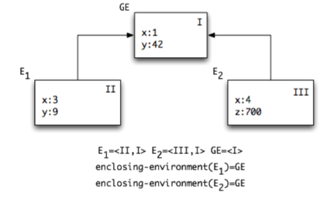

* <b>Closure:</b> a complex data structure, composed of parameters, body, and env at the time the lambda expression was evaluated.
Displayed as a double circle, with body and params written below, and second circle pointing to the env.

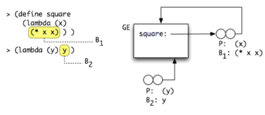

* <b>Procedure call:</b> when a closure f with parameters <code>x1...xn</code> is called with values <code>v1...vn</code>:

   * The evaluation algorithm extends the closure's env with a new frame including the mapping from 
   <code>x1...xn</code> to <code>v1...vn</code>. 
   
   * In the diagram, we assign a number to the environments to reflect the order in which they are created during the evaluation of the program. (Ei+1)
   
   * This new frame extends the env in the closure f (according to lexical scoping rule)
   
   * The new environment has a control link which indicates to which environment control returns when the evaluation of the body will complete.  This is marked with a dotted line.


<h4><b>Env Diagram Example 1: Recursion</b></h4>

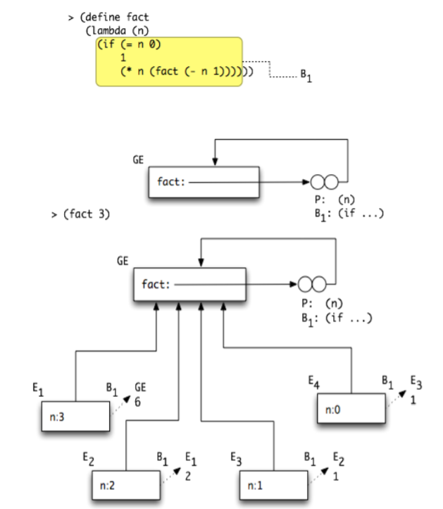

Notice how the closure is pointing to the GE, and so each call to this closure (including recursive ones) will extend the GE. The depth of the recursion is represented by the control links.
Successive recursive calls return in sequential order (Ei+1 control link points to Ei).

<h4><b>Env Diagram Example 2: Definition and application</b></h4>

Consider another example:

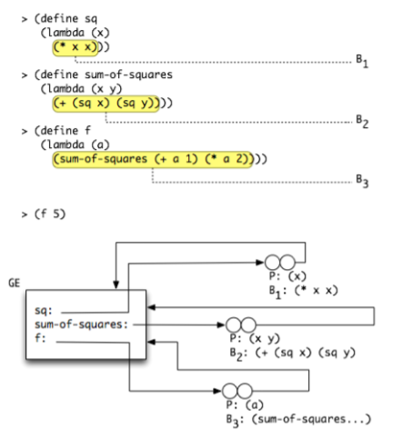

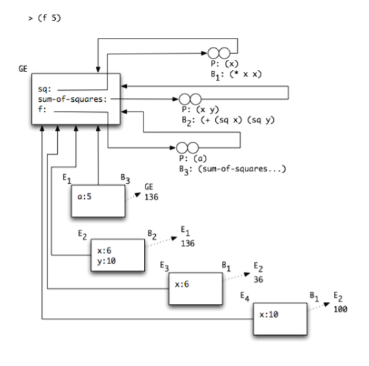

<h4><b>Env Diagram Example 3: Definition and Let</b></h4>

When we encounter a "let" expression, we can convert it to a lambda expression which we already know how to handle.

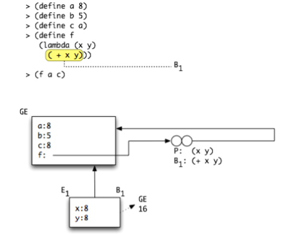

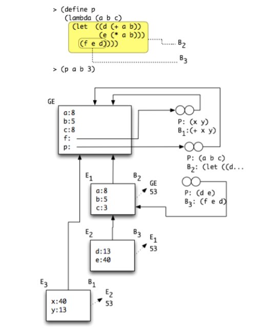

<b>Q: </b>which environments and which procedures will remain in the end of the evaluation?

The closures f and p will remain.
E3 will finish its evaluation and return to E2, which will finish and return to E1, which will finish and return to the GE.
E1, E2, E3 will disappear since no accessible data structure refers to them anymore.

<h4><b>Env Diagram Example 4: Inferring code from a diagram</b></h4>
What program will generate the following environment diagram?

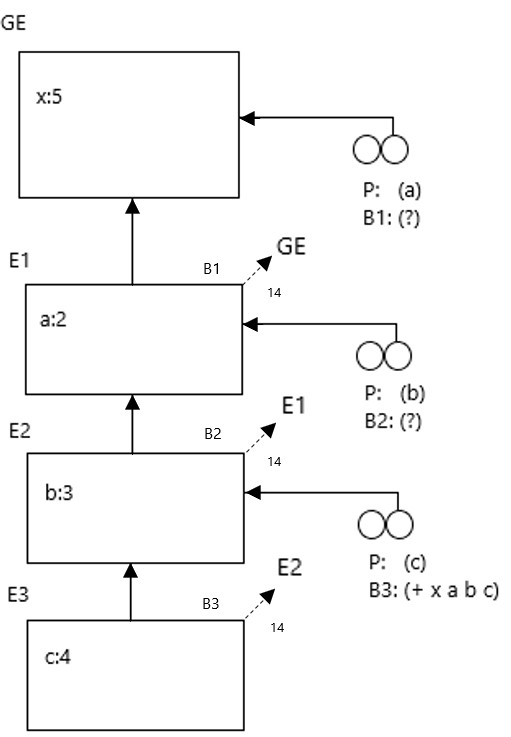

We can notice that the structure is serial, which implies nested applications of procedures.

Each environment extends the previous one.

The following code will produce the environment diagram from above:
```scheme
(define x 5)

(let ((a 2))
  (let ((b 3))
     (let ((c 4))
        (+ x a b c))))
```


<h3><b>Pair Data Structure using Closures</b></h3>

<h4><b>Env Diagram Example 4: lazy procedural pair implementation</b></h4>

<b>Part A:</b>

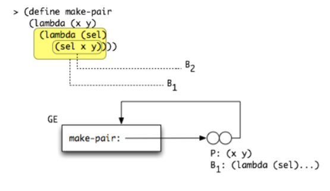

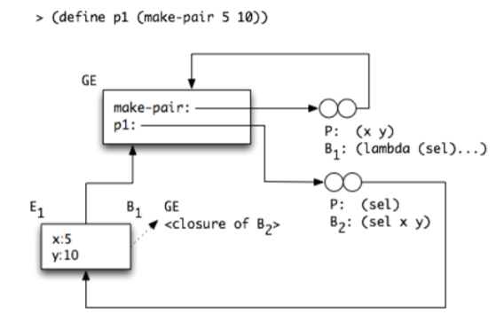

Notice p1 is a closure expecting a selector procedure. 
When we call p1, the env we extend will be E1, which is why we see x, y.

<b>Part B:</b>
We will display a call to p1 with a selector:


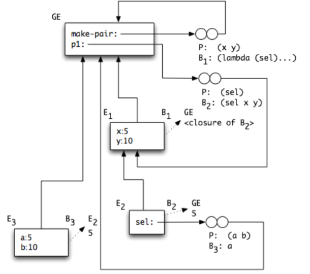

Watch the evaluation process:

* There is a new closure created, which is the value of "sel" in the new env "E2".

* The enclosing env of E2 is E1, which is why it was created by calling B2 - the only closure whose env is E1.

* Parameter names in the new env, E3, present the parameter names in the code we build.
furthermore, the fact that E3 points to the GE shows us this env was created in the GE (not in a lambda or Let expression).

What line of code needs to be added to produce this diagram?

Accordingly, the env diagram for this evaluation is:

```scheme
(p1 (lambda (a b) a)
```

<b>Q: </b>which env and closures will remain at the end of the evaluation?
<h3>set!</h3>

set! is a way to change the value of a variable.
for example : 

```scheme
>(define x 5)
>x
5
>(set! x 80)
>x
80
```

<h2><b>Box</b></h2>

Boxing in scheme is required to wrap a variable in a box, so we can access it through the box, but also change the value inside that box.
A natural way to look at boxes is like pointers, which we can access data through but the data inside can be changed.

In the <b>box environment model</b>, we use boxing to enable mutation.  We saw in the lecture why we needed mutation to properly model recursion (letrec) and 
model the global environment with forward usage of global variables and global mutual recursive procedures.

In the box environment model variables are bound to boxes that contain a value, instead of mapping variables directly to values.
In addition, the global environment is modeled in a special way that allows addition of a binding (with a method add-binding!).

Motivation: we want to support mutation in the language we implement.
Note that at this point, all the variables are immutable - we can create a new variable and bind it to a value, but we cannot change its value.
In some cases, we want to be able to change the value of an existing variable.

Example: a counter.

1) How do we do this in Scheme?

We use the box data type which has the following interface:
```scheme
(box v)
(box? x)
(unbox b)
(set-box! b v)
```

Box works like a pointer to an existing variable.

Example application - let us create a counter object.

```scheme
(define make-counter
  (lambda ()
    (let ((count (box 0)))
      (lambda (msg)
        (cond ((eq? msg 'get) (unbox count))
              ((eq? msg 'inc!) (set-box! count (+ 1 (unbox count))))
              ((eq? msg 'reset!) (set-box! count 0))
              (else (error "unknown message to counter")))))))
```

This counter works with the same pattern as the make-pair example we saw in class: it is a closure factory with a message dispatch body.
The functional interface of the counter is:

```scheme
;; Type: [Counter -> Number]
(define counter-get
  (lambda (counter) (counter 'get)))

;; Type: [Counter -> Void]
(define counter-inc!
  (lambda (counter) (counter 'inc!)))

;; Type: [Counter -> Void]
(define counter-reset!
  (lambda (counter) (counter 'reset!)))
```

How to use a counter in code:

```scheme
;; Count how many odd numbers there are in a given tree.
(define count-odds
  (lambda (tree)
    (let ((counter (make-counter)))
      (letrec ((loop (lambda (tree)
                       (cond ((empty? tree) (void))
                             ((pair? tree) (loop (car tree)) (loop (cdr tree)))
                             ((and (number? tree) (odd? tree)) (counter-inc! counter))))))
        (loop tree)
        (counter-get counter)))))
```

```scheme
;; Variant of the counter object: functional selector instead of message dispatch (lazy selector)

;; [Empty -> Counter]
;; Counter is implemented as: [(Box(Number) -> Any) -> Any]
(define make-counter-sel
  (let ((count (box 0)))
    (lambda (sel)
      (sel count))))

;; Implement counter interface:

(define counter-sel-get
  (lambda (counter-sel) 
    (counter-sel (lambda (b) (unbox b)))))

(define counter-sel-inc!
  (lambda (counter-sel) 
    (counter-sel (lambda (b) (set-box! b (+ 1 (unbox b)))))))

(define counter-sel-reset!
  (lambda (counter-sel) 
    (counter-sel (lambda (b) (set-box! b 0)))))
```

<h2><b>Adding set! to our language</b></h2>

There are 3 steps we should take to add set! to our language: 
* Add set! in the syntax: Should we consider set! a special form? Explain.
* Add set! to the parser
* Add set! to the env-eval algorithm

<b>Syntax definition:</b>

```
<cexp> ::= ... | ( set! <var> <cexp>)            // SetExp(var: varRef, val: CExp)
```

<b> Adding type definitions for ***set!***: </b>

```typescript
export interface SetExp {tag: "SetExp", var: VarRef; val: CExp; }

export const makeSetExp = (v: VarRef, val: CExp): SetExp =>
    ({tag: "SetExp", var: v, val: val});

export const isSetExp = (x: any): x is SetExp => x.tag === "SetExp";
```

<b> Update the Compound disjoint union type: </b>

```typescript
export type CompoundExp = AppExp | IfExp | ProcExp | LetExp | LitExp | LetrecExp | SetExp;

export const isCompoundExp = (x: any): x is CompoundExp =>
    isAppExp(x) || isIfExp(x) || isProcExp(x) || isLitExp(x) || isLetExp(x) ||
    isLetrecExp(x) || isSetExp(x);
```

<b> Modify the function ***parseL4SpecialForm***</b>

```typescript
export const parseL4SpecialForm = (op: Sexp, params: Sexp[]): Result<CExp> =>
    isEmpty(params) ? makeFailure("Empty args for special form") :
    op === "if" ? parseIfExp(params) :
    op === "lambda" ? parseProcExp(first(params), rest(params)) :
    op === "let" ? parseLetExp(first(params), rest(params)) :
    op === "quote" ? parseLitExp(first(params)) :
    op === "letrec" ? parseLetrecExp(first(params), rest(params)) :
    op === "set!" ? parseSetExp(params) :
    makeFailure("Never");
```

<b> Add the parsing functions for ***SetExp***</b>

```typescript
const parseSetExp = (params: Sexp[]): Result<SetExp> =>
    isEmpty(params) ? makeFailure("set! missing 2 arguments") :
    isEmpty(rest(params)) ? makeFailure("set! missing 1 argument") :
    ! isEmpty(rest(rest(params))) ? makeFailure("set! has too many arguments") :
    parseGoodSetExp(first(params), second(params));

const parseGoodSetExp = (variable: Sexp, val: Sexp): Result<SetExp> =>
    ! isIdentifier(variable) ? makeFailure("First arg of set! must be an identifier") :
    bind(parseL4CExp(val), (val: CExp) => makeOk(makeSetExp(makeVarRef(variable), val)));
```

<b>***env-eval***</b>

```typescript
const evalSet = (exp: SetExp, env: Env): Result<void> =>
    safe2((val: Value, bdg: FBinding) => makeOk(setFBinding(bdg, val)))
        (applicativeEval(exp.val, env), applyEnvBdg(env, exp.var.var));
```
