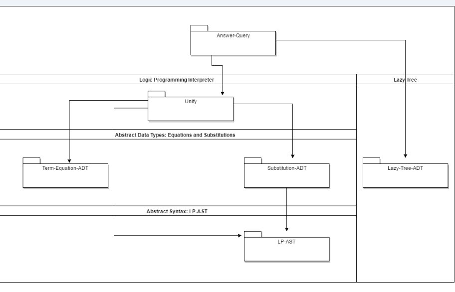

Prolog Interpreter in Scheme (Racket)

# How to run
* Clone this in a folder
* Launch DrRacket
* Load the file "answer-query-test.rkt"
* Run the tests - it should print
```
6 tests passed.
5 tests passed.
9 tests passed.
```

# How to read the code
* LP-ast.rkt: AST for Logic Programming
* LP-ast-tests.rkt: AST tests and examples
* LP-rename.rkt: variable renaming
* substitution-ADT.rkt: Substitution ADT
* substitution-adt-tests.rkt: Substitution tests
* lazy-tree-ADT.rkt: Lazy tree ADT
* lazy-tree-ADT-tests.rkt: lazy tree tests
* auxiliary.rkt: auxiliary functions
* utils.rkt: Utility functions
* unify.rkt: unification algorithm
* term-equation-adt.rkt: term equation ADT (pair of terms)
* unify-tests.rkt: unification tests
* answer-query.rkt: answer-query algorithm
* answer-query-test.rkt: answer query tests

More details in [5.3 Logic Program Interpreter](https://bguppl.github.io/interpreters/class_material/5.3LPInterpreter.html) of the PPL Course Notes.


